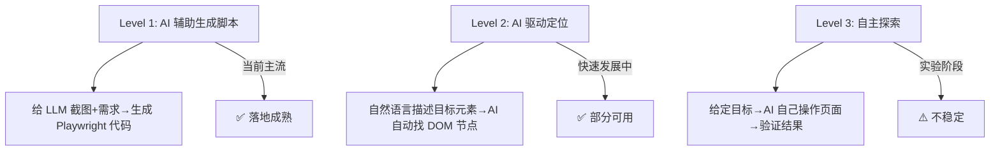
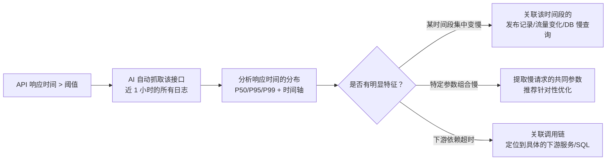
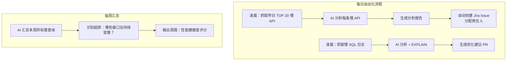

大模型在写代码、写文档上的能力已经被充分讨论，但在另一个高频场景——**测试与研发效能**上的应用，讨论还比较分散。这篇系统梳理 AI 如何介入测试用例生成、UI 自动化、接口测试，以及慢 API / 慢 SQL 的发现与治理。

<!-- more -->

# AI 能做测试的什么，不能做什么

先划清边界。大模型在测试领域的优势在于**生成和理解**：

| 能做 | 举例 | 不能做（至少现在还不行） | 举例 |
|------|------|------------------------|------|
| 从需求文档生成测试用例 | 把 PRD 转成结构化的 case | 替代人工判断用例是否有价值 | 生成的冗余 case 需要人筛 |
| 从页面截图理解 UI 结构 | 识别按钮、输入框并生成操作序列 | 在真实设备上稳定执行 | 需要 Selenium/Playwright 做执行层 |
| 分析代码逻辑生成单元测试 | 给函数自动写测试 | 确保覆盖率有意义 | 高覆盖率 ≠ 好测试 |
| 解释失败的测试原因 | 分析日志和 diff | 修复需要改代码的 bug | 只能改测试本身，改不了被测代码 |

一句话：**AI 是测试的"加速器"，不是"自动驾驶"**。它在生成、分析、解释这三个环节能大幅提效，但执行层的稳定性、判断层的价值取舍，仍然需要人。

# 测试用例生成

## 从 PRD / 接口文档生成用例

这是当前落地最成熟的场景。把需求文档或 API 文档喂给 LLM，让它输出结构化的测试用例：

**Prompt 示例**：

```
你是一个资深测试工程师。请根据以下接口文档，生成完整的测试用例。

接口：POST /api/order/create
描述：创建订单
请求体：
{
  "user_id": "string (必填)",
  "items": [{ "product_id": "string", "quantity": "int" }],
  "coupon_code": "string (可选)"
}

请用表格输出，包含：用例编号、测试场景、输入数据、预期结果、优先级。
```

**LLM 输出示例**：

| 编号 | 场景 | 输入 | 预期结果 | 优先级 |
|------|------|------|----------|--------|
| TC001 | 正常创建 | 合法 user_id + 1 件商品 | 200, 返回 order_id | P0 |
| TC002 | 多件商品 | 合法 user_id + 3 件商品 | 200, total 正确 | P0 |
| TC003 | 缺少 user_id | 不传 user_id | 400, "user_id required" | P0 |
| TC004 | 空商品列表 | items=[] | 400, "items empty" | P1 |
| TC005 | 无效优惠券 | coupon_code="INVALID" | 400, "coupon not found" | P1 |
| TC006 | 数量为 0 | quantity=0 | 400, "quantity must > 0" | P1 |
| TC007 | 超大数量 | quantity=99999 | 400 或降级处理 | P2 |
| TC008 | 并发创建 | 同一 user 同时发 5 个请求 | 幂等，不重复扣款 | P0 |
| TC009 | user_id 不存在 | user_id="nonexistent" | 404 | P1 |
| TC010 | SQL 注入 | user_id="'; DROP TABLE--" | 400，参数校验通过 | P0 |

一次 prompt 就能产出 10+ 条用例，覆盖正常路径、边界值、异常输入、安全攻击面。人工需要 20 分钟的事，模型 10 秒完成。

## 从代码生成单元测试

对于纯函数和工具类方法，LLM 生成单测的准确率已经很高：

```python
# 输入：被测函数
def calculate_discount(price: float, user_level: str) -> float:
    """根据用户等级计算折扣后价格"""
    ...

# 让 LLM 生成 pytest 单测
# Prompt: "为上面这个函数生成完整的 pytest 测试，覆盖正常、边界、异常情况"
```

**关键实践**：

1. **给 LLM 看上下文**——不只是函数签名，还要给它看相关的类型定义、常量、依赖接口
2. **明确框架和风格**——"用 pytest + parametrize" 比 "写单元测试" 产出质量高很多
3. **增量生成**——改了一个函数只让它生成这个函数的新增用例，而不是每次全量重新生成
4. **覆盖率不是目标**——LLM 容易生成大量"走过场"的用例（测了但没意义），人工 review 哪些场景真正有价值

# UI 自动化测试

## 传统方式的痛点

Selenium / Playwright 脚本写起来有三痛：元素定位烦（CSS selector / XPath 抄来抄去）、用例维护累（页面改版找元素全挂）、断言写不准确（"这个弹窗出现"该怎么判断）。

## AI 介入的三个层次



### Level 1：AI 生成 UI 脚本

把页面截图和操作描述给 LLM，让它生成 Playwright 脚本：

```
你是一个 UI 自动化工程师。以下是一个登录页面的 HTML 结构和截图描述。

目标：用 Playwright 实现以下用例：
1. 输入用户名 "admin"，密码 "123456"
2. 点击"登录"按钮
3. 验证跳转到首页，页面包含 "欢迎回来"

请输出可直接运行的 Playwright Python 代码。
```

LLM 生成的脚本通常**能跑但不够健壮**。它倾向于用脆弱的 selector（`#login-btn`），而不考虑这个 ID 会不会变。需要人在生成后补充等待策略（`waitForSelector`）、添加 data-testid 等更稳定的定位方式。

### Level 2：自然语言驱动元素定位

传统写法：

```python
page.locator("#app > div:nth-child(3) > button.submit-btn").click()
```

AI 驱动写法：

```python
# LLM 理解 "点击提交按钮" → 分析 DOM → 找到最匹配的元素
ai.click("点击页面底部的蓝色提交按钮")
```

这层的核心是**视觉+语义双重定位**。实现方案：
- 把 DOM 树（或截图）和用户的自然语言描述一起发给 LLM
- LLM 返回目标元素的定位策略（推荐用 data-testid 或稳定的 CSS path）
- Playwright 执行定位和操作

Browserbase、Anthropic Computer Use 都在这层做尝试。可用的场景：目标元素有清晰的语义（"搜索框"、"登录按钮"），不可用的场景：界面复杂、存在多个相似元素。

### Level 3：自主探索式测试

目标是"给一个 URL 和一个目标，智能体自己操作页面直到目标达成"。

```
任务：在电商网站搜索"蓝牙耳机"，加入购物车，验证购物车里有该商品。

智能体自主执行：
Step 1: 找到搜索框（视觉定位），输入"蓝牙耳机"
Step 2: 找到搜索按钮，点击
Step 3: 在结果列表中找到第一个商品，点击"加入购物车"
Step 4: 跳转到购物车页面，验证商品存在
```

WebVoyager、OS-Copilot 等研究项目证明了这条路可行，但成功率和稳定性远达不到 CI/CD 的要求。核心卡点：
- LLM 看截图容易"眼花"——把两个长得像的按钮搞混
- 页面加载时机不可控——LLM 不知道什么时候该等
- 成本——每一步都要调一次模型，一个复杂场景可能要 20~30 次调用

目前的实用妥协是**半自主**：人定义关键步骤的检查点，AI 负责填充步骤间的操作细节。

# 接口自动化测试

接口测试是 AI 最容易发挥的场景——输入输出都是结构化的 JSON，没有 UI 的不确定因素。

## 从抓包数据生成测试脚本

把 Charles / Fiddler 抓到的请求导出为 HAR 文件，让 AI 生成测试脚本：

```
以下是一个 HAR 文件中的请求序列（用户下单流程）。
请生成 pytest + requests 的接口测试脚本，包含：
1. 正常流程串联
2. 每个接口的异常参数测试
3. 断言覆盖状态码、关键字段、数据库变更
```

## 智能断言

传统接口测试的断言很"死"——`assert response.status_code == 200`。AI 可以做到**语义级断言**：

```python
# 传统断言
assert response.json()["data"]["status"] == "success"

# AI 驱动断言
ai_assert(response.json(), "订单状态应该是待支付，且包含订单号和时间戳")
```

`ai_assert` 背后是让 LLM 判断"这个 JSON 是否满足这句自然语言描述的条件"，返回 True/False + 解释。适合接口返回值结构复杂、字段含义需要业务理解的场景。代价是每次断言调一次模型，延迟和成本都比代码断言高 100 倍——所以只用在关键业务校验点，不要每条都用。

## 回归测试的智能筛选

代码改了 10 个文件，应该跑哪些测试？传统做法要么全跑（慢），要么凭感觉选（漏）。AI 可以分析代码 diff，推荐受影响的测试用例：

```python
# Prompt:
# 以下是一个 Git diff，请分析哪些测试用例需要重新运行。
# Diff: ...
# 可用的测试用例列表: ...

# LLM 输出:
# 高风险: TC012 (修改了订单金额计算逻辑)
# 中风险: TC008, TC015 (修改了优惠券相关的工具函数)
# 低风险: TC001-TC007 (仅修改了日志格式，不涉及业务逻辑)
```

Google 的 TLM（Test Likelihood Model）和 Meta 的 Sapienz 都在探索这个方向。核心挑战是**不遗漏**——宁可多跑几个不必要的测试，也不能漏掉一个该跑的。所以 AI 的推荐通常偏保守（广撒网），真正的价值在于给高风险用例排优先级。

# 研发效能：慢 API 与慢 SQL 治理

测试之外，研发效能的另一个大块头是**线上质量的可观测性和治理**。慢 API 和慢 SQL 是两大最常见但也最容易"视而不见"的问题。

## 慢 API 的发现与归因

日志系统（ELK / Splunk / Datadog）每秒钟产生大量 API 调用记录。人工排查慢 API 的方式是"看到一个告警 → 手动翻日志 → 凭经验猜原因"。AI 可以把这条链路自动化：



**实现方式**：

```
你是一个 SRE 工程师。以下是一个 API 在过去 1 小时的调用日志。

API: GET /api/products/search
正常 P95: 200ms
当前 P95: 3500ms

请分析：
1. 变慢是从什么时间开始的？（精确到分钟）
2. 慢请求的查询参数有什么共同特征？
3. 调用了哪些下游服务？哪个下游的耗时占比最高？
4. 给出最可能的根因和排查建议。
```

LLM 的输出不会是完美的根因分析，但它能把排查方向从"看几百条日志"压缩到"验证 2~3 个假设"。

## 慢 SQL 的自动治理

慢 SQL 的排查有一个固定套路：**抓到 SQL → 看执行计划（EXPLAIN） → 判断是全表扫描还是索引失效 → 给出优化建议**。这条路 LLM 非常擅长走，因为 SQL 是结构化文本，优化规则是明确的知识。

```sql
-- 输入：慢查询日志中的一条 SQL
SELECT o.*, u.name, p.title 
FROM orders o
LEFT JOIN users u ON o.user_id = u.id
LEFT JOIN products p ON o.product_id = p.id
WHERE o.created_at > '2026-01-01'
  AND o.status = 'completed'
ORDER BY o.created_at DESC
LIMIT 100;

-- 耗时：8.2s
-- 扫描行数：2,340,000
```

让 AI 分析：

```
以下是一条慢 SQL 及其 EXPLAIN 结果。请分析原因并给出优化建议。

EXPLAIN 结果：
orders: type=ALL, rows=2340000 (全表扫描)
users: type=eq_ref, rows=1
products: type=eq_ref, rows=1
Extra: Using where; Using filesort

执行计划解读：orders 表进行了全表扫描（234 万行），
且排序使用了 filesort（磁盘排序）。
```

LLM 的典型分析和建议：

| 问题 | 根因 | 建议 |
|------|------|------|
| 全表扫描 | `orders` 表 `created_at` 和 `status` 缺少联合索引 | `CREATE INDEX idx_orders_time_status ON orders(created_at, status)` |
| filesort | `ORDER BY created_at DESC` 不能利用索引排序 | 同上联合索引即可解决（索引天然有序） |
| 回表开销 | `SELECT o.*` 使得即使走索引也需要回表查完整行 | 考虑只查必要字段，或用覆盖索引 |

这比 DBA 手动写的建议更规范、更完整——因为 LLM 不会"跳步"，它会把每一条 EXPLAIN 线索都翻译成对应的建议。

## AI 驱动的日常效能看板

把这些能力集成到日常流程中：



关键不是"AI 分析一次"，而是**自动化、定期跑、积累趋势**。一条 SQL 今天慢 2 秒下周慢 4 秒——这个趋势人很难注意到，但 AI + 定时任务天然能做。

# 工具与落地路径

| 场景 | 推荐工具/方案 | 成熟度 |
|------|-------------|--------|
| 用例生成 | LLM + prompt engineering | ⭐⭐⭐⭐⭐ |
| 单测生成 | Copilot / Cursor / Codium | ⭐⭐⭐⭐⭐ |
| UI 脚本生成 | LLM + Playwright + DOM 上下文 | ⭐⭐⭐⭐ |
| UI 自主探索 | WebVoyager / OS-Copilot | ⭐⭐ |
| 接口测试 | LLM + HAR 解析 + pytest | ⭐⭐⭐⭐ |
| 慢 API 分析 | LLM + 日志系统 API | ⭐⭐⭐⭐ |
| 慢 SQL 治理 | LLM + EXPLAIN + 自动 PR | ⭐⭐⭐⭐ |

建议的落地顺序：

1. **先做最成熟的**：从用例生成和单测生成开始，这是投入产出比最高的——一个 prompt 出 20 条用例，立竿见影
2. **再做有基础的**：如果你的团队已经在写 Playwright 脚本，加上 LLM 生成能提速 3~5 倍
3. **最后做需要集成的**：慢 API/SQL 分析需要打通日志系统、监控系统、项目管理工具，工程量大但长期收益最高
4. **永远保留人工 gate**：AI 生成的每一条用例、每一行测试代码、每一条优化建议，都要经过人 review。AI 负责"生成"，人负责"判断"

# 小结

AI 在测试和研发效能上的价值，不是"取代测试工程师"，而是**把机械重复的事自动化，让人聚焦在判断和设计上**：

- 用例/脚本生成的机械活 → AI 出草稿，人审改
- 慢 API/慢 SQL 的排查 → AI 做第一轮分析，人验证
- 回归用例的选择 → AI 推荐优先级的候选列表，人拍板
- UI 元素定位 → AI 给你稳定的定位策略，Playwright 执行

这条路不缺需求——每个项目都在被慢查询和回归测试的维护成本折磨。缺的是把 AI 嵌入现有流程的工程化能力。
