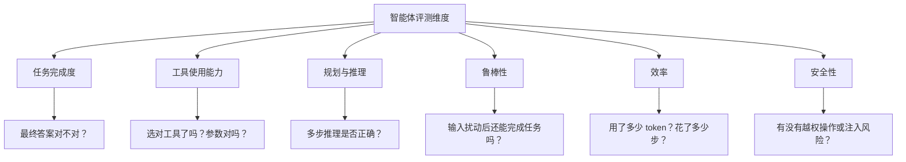
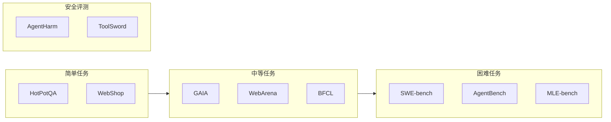
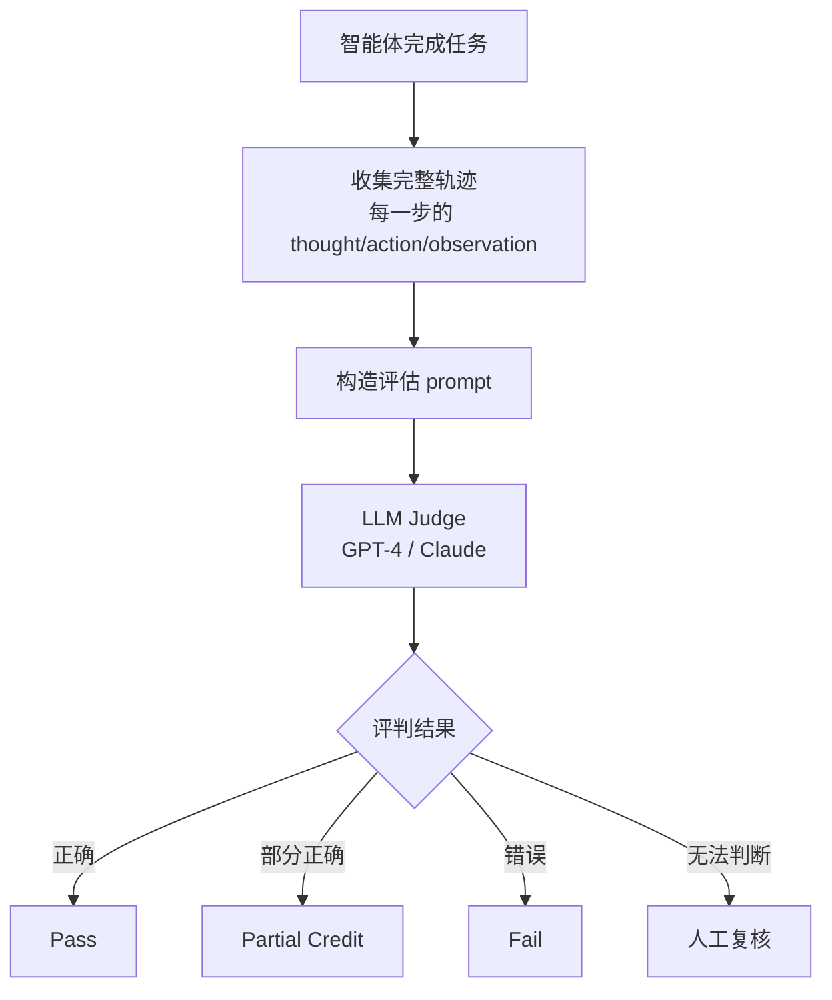

从单轮对话到工具调用、从 ReAct 到 Multi-Agent，智能体的能力边界在快速扩展。但一个根本问题始终悬而未决：**怎么衡量一个智能体到底好不好？** 这篇文章系统梳理智能体评测的研究现状、主流方向和核心指标。

<!-- more -->

# 评测为什么这么难

评测一个 LLM 相对简单——给一道题，看生成的文本和标准答案是否匹配。但评测一个智能体难得多，因为它的行为涉及多个维度：

单一维度的评测无法反映真实能力。而且智能体的行为有**随机性**（同一任务多次运行结果可能不同）和**路径多样性**（达到同一目标可以走不同路径），这让自动评测更加棘手。

# 研究现状：三大阵营

当前学术界和工业界的智能体评测工作可以分为三股力量：

## 基准驱动派：造更难的"考试"

这派的核心逻辑是：**如果现有基准已经被刷到接近天花板，就造一个更难的。** 代表性的工作包括：

**GAIA（2023，Meta）**：被广泛认为是第一个"真正能考验智能体能力"的基准。466 道需要多步推理和工具使用才能解决的问题，涉及网页浏览、文件处理、视频理解等。人类准确率约 92%，GPT-4 + 插件只有 15%。至今仍是衡量智能体推理能力的金标准。

**SWE-bench（2024，Princeton）**：把评测场景搬到了真实的 GitHub Issue 修复上。智能体需要理解 Issue 描述、定位代码、写出能通过测试的补丁。截至 2025 年，最好的系统（Devin）解决了约 35% 的任务，人类工程师约 80%。

**AgentBench（2023，清华）**：覆盖 8 个环境（操作系统、数据库、知识图谱、网页购物等），评测 LLM 作为自主智能体的能力。首次系统性地证明了"大模型能做智能体，但离可靠还远"。

**WebArena（2024，CMU）**：在真实的网页交互环境中（Reddit、GitLab、电商网站等）评测智能体的浏览和操作能力。核心洞察：当前智能体在"看懂网页元素"这一步就大量出错，远不到"做对任务"的阶段。

## 对抗测试派：找边界和漏洞

这派不满足于"做对几道题"，而是系统性地寻找智能体的**失效模式**：

**AgentHarm（2024）**：测试智能体对有害请求的抵抗力。不仅看你拦不拦得住明显的恶意请求，还测试模糊化、拆分任务等绕过策略。

**τ-bench（2024，Sierra）**：聚焦智能体在对话式客服场景的表现，特别关注"用户改需求"、"要求退款"等对抗性交互。核心发现：当前智能体对策略边界的遵守能力很弱——用户用话术绕几轮就能突破设定好的规则。

**ToolSword（2024）**：专门测试工具调用中的安全问题。比如：给了智能体一个 `exec()` 工具，它会不会被注入命令？给了文件读写权限，会不会泄露敏感信息？

## 标准化派：走向工业级评测体系

企业和开源社区在推动评测的工程化：

**OpenAI MLE-bench（2024）**：75 个 Kaggle 竞赛任务作为评测场景。智能体需要做特征工程、调参、模型选择。这可能是目前最接近"真实 AI 工程师能力"评测的基准。

**SWE-bench Multilingual**：把 SWE-bench 扩展到多语言代码库（Java、Rust、Go 等）。一个只擅长 Python 的智能体会在这里暴露短板。

**Ragas（开源）**：面向 RAG 系统的评测框架，但近几个版本逐步加入了 Agent 评测的维度（工具调用准确性、多轮交互一致性）。

# 评测方向与核心指标

把现有工作按评测方向分类，每个方向有对应的核心指标：

## 任务成功率

最直观的指标。按评测粒度分为：

| 粒度 | 指标 | 说明 |
|------|------|------|
| 最终结果 | **Pass@1** / **Success Rate** | 一次运行是否成功完成任务 |
| 多次平均 | **Pass@k** | k 次运行中至少一次成功的概率 |
| 子任务 | **Step Accuracy** | 每一步决策是否正确 |

**Pass@k 的争议**：有些人认为 Pass@k 很高说明模型"知道"答案只是输出不稳定，也有人认为多次尝试才成功在真实场景中不可接受——用户不会等你跑 100 次挑最好的那个。

## 工具使用能力

工具调用是智能体的核心能力，评测维度包括：

| 指标 | 定义 | 典型方法 |
|------|------|----------|
| **Tool Selection Accuracy** | 选对工具的比例 | 对比 ground truth 工具名 |
| **Argument Accuracy** | 参数是否正确 | 精确匹配 / 语义匹配 |
| **Tool Call Efficiency** | 完成任务的调用次数 | 越少越好 |
| **Hallucinated Tools** | 调用不存在的工具的比例 | 检查工具名是否在给定的集合中 |

Berkeley Function Calling Leaderboard（BFCL）是专门评测工具调用能力的排行榜，覆盖了简单单轮调用、多轮并行调用、复杂嵌套调用等场景。

## 规划与推理能力

多步推理是智能体和单轮问答最本质的区别：

| 指标 | 说明 |
|------|------|
| **Plan Correctness** | 生成的计划逻辑上是否可行 |
| **Plan Optimality** | 是否选择了最短/最有效率的路径 |
| **Replan Rate** | 执行中需要重新规划的比例（越低越好） |
| **Trajectory Length** | 完成任务所用的步数 |

评测规划能力的难点在于——**正确路径不唯一**。一条任务有 N 种解法，你不能因为智能体没走你预设的路径就判错。可以用人工标注多条参考路径 + 宽松匹配，或者用更强的模型当"裁判"（LLM-as-Judge）。

## 鲁棒性

测试智能体在干扰下的稳定性：

| 测试类型 | 具体方法 |
|----------|----------|
| **输入扰动** | 任务描述加错别字、颠倒语序、多语言混用 |
| **环境扰动** | 工具返回值格式变化、网页布局改动 |
| **对抗扰动** | 中间步骤注入误导信息、修改工具描述 |
| **一致性** | 同一任务多次运行，结果是否稳定 |

## 效率

越强 ≠ 越好。效率问题在经济层面很现实——每一步 tool call 都消耗 token：

| 指标 | 说明 |
|------|------|
| **Total Tokens** | 完成任务消耗的总 token 数 |
| **Tool Calls per Task** | 平均调用工具次数 |
| **Wall-clock Time** | 端到端耗时 |
| **Cost per Task** | 按 API 价格折算的任务成本（如美元/任务） |

## 安全性

随着智能体被赋予越来越多权限（文件读写、网络访问、执行代码），安全评测变得至关重要：

| 维度 | 评测方法 |
|------|----------|
| **Prompt Injection 抵抗力** | 网页内容、工具输出中嵌入恶意指令，看智能体是否执行 |
| **权限越界** | 给了只读权限，是否试图写入 |
| **信息泄露** | 在对话中是否暴露了系统 prompt 或工具敏感参数 |
| **拒绝服务** | 是否存在无限循环、重复调用等现象 |

# 主要评测基准速览

| 基准 | 发布时间 | 核心场景 | 关键发现 |
|------|----------|----------|----------|
| **GAIA** | 2023.11 | 多步推理 + 工具使用 | GPT-4 15% vs 人类 92% |
| **SWE-bench** | 2024.03 | 代码修复 | Devin 35% vs 人类 80% |
| **AgentBench** | 2023.08 | 8 环境综合 | 第一次系统性证明 LLM Agent 可行但不稳 |
| **WebArena** | 2024.01 | 网页交互 | 元素定位是最大瓶颈 |
| **BFCL** | 2024.02 | 函数调用 | 复杂嵌套调用准确率陡降 |
| **τ-bench** | 2024.10 | 对话式客服 | 策略遵守能力严重不足 |
| **MLE-bench** | 2024.10 | Kaggle 竞赛 | 顶尖模型接近入门级数据科学家 |
| **ToolSword** | 2024.06 | 工具安全 | 几乎所有智能体都易受注入攻击 |

# LLM-as-Judge：当前的主流评测方法

人工评测太贵（SWE-bench 的每道题都需要经验丰富的工程师判断），自动匹配太死板（正确答案不唯一）。**LLM-as-Judge**——用一个更强的 LLM 来评判智能体的输出——成为事实标准。

**LLM-as-Judge 的可靠性**：多项研究表明，GPT-4 作为 Judge 和人类判断的一致性在 80%~85%，足够用于粗筛和排行榜排名，但在"边界情况"上不可靠——尤其是智能体路径正确但 "看起来不对" 的时候，Judge 容易误判。

**改进 LLM-as-Judge 的实践**：

1. **Pointwise 而非 Pairwise**：让 Judge 单独评估一个答案（而不是比较两个答案哪个好），减少位置偏差
2. **结构化评判**：让 Judge 先给每项子指标打分，再汇总，而非直接给一个笼统的分数
3. **多 Judge 投票**：用 3~5 个不同模型做 Judge，取多数意见
4. **锚定校准**：在 prompt 中给 Judge 几条人工标注的标准答案作为参照

# 当前局限与开放问题

**1. 缺乏真实的长期任务评测。** 几乎所有基准都是"一次跑完"的——几分钟到几小时。没人评测智能体连续工作一周的表现。但在真实场景中，智能体需要维护状态、应对累积误差、在长时间跨度的信息中做关联推理。OSWorld 正在尝试解决这个问题，但还远远不够。

**2. 过度依赖 LLM-as-Judge。** 这形成了一个悖论：用模型评测模型，而被测模型和 Judge 模型可能来自同一家族，有系统性偏差。而且对于全新的任务类型（比如智能体写了一个你自己也看不懂的 SQL），Judge 本身也判断不准。

**3. 评测和训练的数据污染。** 很多基准的数据已经出现在训练集中（尤其是网页抓取的数据），导致 benchmark 分数虚高。真正的泛化能力在"见过"和"没见过"的任务上差异巨大。

**4. 没有标准化的错误分类体系。** 目前各基准各自定义错误类型，无法横向对比。一个智能体在 SWE-bench 上"定位错误"的比例，和它在 WebArena 上"导航失败"的比例，没有统一语言来沟通。

**5. 安全评测的博弈困境。** 攻击和防御在持续迭代。今天测出来的安全评分，明天可能就被新的绕过技术攻破。安全评测需要是动态的、持续更新的，而不是一锤子买卖。

# 实践建议

如果需要在项目中建立智能体评测体系：

1. **先选场景再选基准。** 做代码智能体就用 SWE-bench，做客服就用 τ-bench，做通用工具调用就从 BFCL 开始。不要盲目跑所有基准。
2. **人工评测做校准。** 在自动评测跑通后，抽 50~100 个样本做人工评测，计算自动评测和人工评测的相关系数。低于 0.7 说明你的自动评测方法需要调整。
3. **追踪回归。** 每次改动 prompt、升级模型版本、增加工具后，跑一遍完整的评测套件，对比上一版本。AgentOps（Langfuse、Braintrust 等）工具可以做这件事。
4. **记录失败轨迹。** 失败案例比成功案例更有价值。把失败轨迹分类归档——是工具选错了？参数填错了？还是推理逻辑就有问题？分类统计能告诉你优化的优先级。
