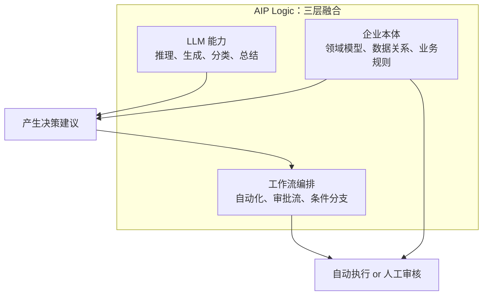
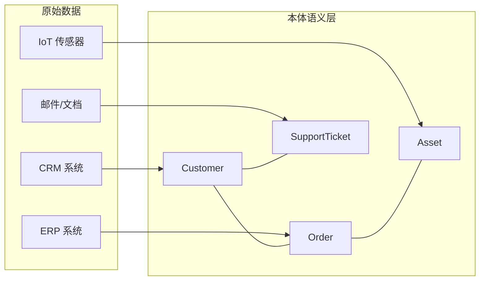

"企业 AI 落地难"是老生常谈。难的往往不是模型能力不够，而是如何把 LLM 嵌入已有的业务系统、连接真实数据、施加权限控制、保证输出质量。Palantir 的 AIP Logic 提供了一套完整的设计思路：**用无代码的 LLM 函数，打通本体数据和企业工作流**。这篇文章不局限于介绍产品，更关注它背后的设计范式——这种"LLM + 本体 + 编排"的模式正成为企业 AI 的基础骨架。

<!-- more -->

# AIP Logic 是什么

AIP Logic 是 Palantir AIP（Artificial Intelligence Platform）中的核心模块，定位是：**一个无代码的 LLM 函数开发环境**。它让业务人员不用写代码就能构建 AI 驱动的函数——接收本体数据作为输入，通过 LLM 做分析和决策，输出结果或直接修改本体。

但"无代码的 LLM 函数"这个描述还不够。AIP Logic 真正的创新在于它把三个东西拧在了一起：



传统方法把模型、数据、流程当成三套独立的系统，中间靠 API 胶合。AIP Logic 的做法是把它们放在同一个画布上，让 LLM 直接"看到"本体里的对象和关系。

# Logic 函数：像搭乐高一样搭 AI

AIP Logic 的基本单元叫 **Logic Function（逻辑函数）**。一个函数就是一个独立的 AI 处理单元，和写代码的函数没什么两样——有输入、有处理、有输出——区别在于处理过程是用 Blocks（模块积木）搭起来的，而不是写代码。

```
输入（本体对象 + 文本）→ [Block 1] → [Block 2] → ... → [Block N] → 输出（决策/编辑）
```

核心的 Block 类型：

| Block | 作用 | 类比 |
|-------|------|------|
| **Use LLM** | 调用 LLM 执行推理/生成/分类 | 一个带 system prompt 的 API 调用 |
| **Query Objects** | 从本体中检索相关数据 | 带着 JOIN 的 SELECT |
| **Transform** | 数据格式转换 | Python 脚本或 JSON 转换 |
| **Condition** | 条件分支 | if/else |
| **Edit Ontology** | 直接修改本体对象 | UPDATE 语句 |

一个实际的例子：**客户邮件自动处理函数**。

```
输入：邮件本体对象（包含发件人、标题、正文）

Block 1: Query Objects
  → 查找到发件人关联的历史工单、合同信息、服务等级

Block 2: Use LLM
  → Prompt: "分析以下邮件内容，结合历史工单和合同信息，
     判断：1. 紧急程度（低/中/高） 2. 是否需要人工处理
     3. 推荐的处理方案"
  → 工具：可查询知识库和相似历史邮件

Block 3: Condition
  → 如果紧急程度为"高"：自动创建工单并分配
  → 如果紧急程度为"中"：推荐方案 + 等待人工确认
  → 如果紧急程度为"低"：自动回复模板

输出：本体编辑（工单创建） + 推荐方案 + 决策日志
```

这里最关键的能力是 **Use LLM 可以附带工具**——不仅仅是让 LLM 看一段 prompt 然后自由发挥。它可以通过 Query Objects 工具去本体里查数据、通过 Action 工具去触发操作。这套"LLM + 工具"的模式和 OpenAI 的 function calling、LangChain 的 agent + tool 完全是一回事——只是封装成了无代码形式。

# 本体（Ontology）：AIP Logic 的核心基础设施

AIP Logic 能跑起来，根基不是 LLM，而是**本体**。Palantir 的本体（Ontology）不是哲学概念，而是一个**企业级的数据语义层**——把散落在各个系统中的数据统一映射为有意义的业务对象（客户、订单、设备、供应链节点）和它们之间的关系。



有了这层本体，AIP Logic 里的 LLM 就不是在"看一段文本"，而是在**操作有意义的业务对象**。它知道 "Customer A" 不只是一个字符串，而是有合同历史、有服务等级、有相关资产的实际客户。LLM 做推理时，上下文不再是人工从多个系统拼凑的碎片，而是本体里天然连接的整张关系网。

**这就是企业 AI 和通用聊天 AI 的根本区别**：后者在"通用世界知识"上推理，前者在"企业专有知识图谱"上推理。

# 测试、评估与安全

企业场景下，"AI 偶尔出错"不是一个可以接受的回答。AIP Logic 在这方面的设计值得关注：

**内置测试框架**：每个 Logic 函数都可以配置测试用例——给定输入，验证输出是否符合预期。测试用例可以批量运行，函数修改后做回归测试。这套流程和软件工程里的单元测试没有本质区别，但对象是 LLM 的输出。

**评估（Evaluation）**：LLM 的输出不像传统函数的返回值——结果是否正确往往是"语义正确"而非"精确匹配"。AIP Logic 的评估支持：

- 人工评估：标记输出是否正确
- 自动评估：用更强的 LLM 评判输出质量（LLM-as-Judge）
- A/B 对比：两个版本的 prompt 或模型同时跑，对比效果

**安全与权限**：这是企业 AI 最容易被忽略但致命的问题。AIP Logic 的安全性不是"AI 安全"（对抗 prompt injection），而是**数据访问安全**。LLM 只能访问函数被授权访问的那部分本体数据——它不能"顺便"查一下其他客户的信息，也不能"好奇"修改不该改的数据。权限模型和平台其他部分统一，而不是单独给 AI 开一个宽松的门。

# 和 LangChain / AutoGPT 有什么不同

| 维度 | LangChain / AutoGPT | AIP Logic |
|------|---------------------|-----------|
| 目标用户 | 开发者 | 业务分析师 + 开发者 |
| 数据连接 | 代码中手动集成 | 继承已有本体——数据天然连通 |
| 工具调用 | 自己写 tool function | 本体已有 Query/Action 能力，直接复用 |
| 权限控制 | 开发者自行实现 | 平台统一权限模型 |
| 部署 | 需要自行部署和维护 | 平台内一键发布、自动扩缩 |
| 适合场景 | 原型验证、灵活探索 | 企业级生产环境、合规要求高 |

没谁更好——**场景决定工具**。AIP Logic 的价值主张是：如果你的企业已经有了 Palantir 平台和本体基础设施，那构建 AI 功能的成本几乎为零。反之，如果要从零搭本体、建数据管道，前期投入不小。

# 这种模式的启示：通用范式而非专属产品

跳出 Palantir 这个具体产品，AIP Logic 背后的设计范式有更广泛的意义：

**1. 本体是 LLM 在企业落地的"最后一座桥"。** LLM 很聪明，但它不知道你的业务里什么叫"客户"、什么叫"高优先级工单"。本体把这层语义翻译好了，LLM 才能在企业数据上做有意义的推理。

**2. 无代码不是目标，是副产品。** AIP Logic 的无代码特性不是为了"让非程序员也能用"——而是因为用本体+模块化编排来描述 AI 逻辑，本身就是最自然的方式。用代码写反而要处理大量的 plumbing（数据获取、对象转换、权限检查），而这些在本体层已经解决了。

**3. 函数是 AI 在企业的"原子单元"。** 微服务把业务逻辑拆成了小函数，AIP Logic 把 AI 逻辑也拆成了小函数。一个 Logic 函数负责一件事（分析邮件紧急程度），输入输出明确，可以独立测试、独立发布、独立监控。比一个庞大的 "AI 系统" 更容易治理。

**4. 评估和安全不是"做完了补上"的事，而是和 prompt 设计同步进行的。** 在 AIP Logic 里，写 prompt 和写测试用例是在同一个界面里交替进行的——这是企业 AI 工程应有的样子。

# 对企业 AI 架构师的参考价值

即使你不会真正使用 AIP Logic，这套设计思想也值得参考：

- **把 LLM 函数化**：每个 AI 功能封装成独立的函数，有明确的输入契约和输出契约
- **用本体做语义胶水**：让 LLM 操作的是"客户"而不是"customer_id"，语义层让 LLM 的推理更准确
- **评估先于部署**：在函数上线前，先跑完测试用例和评估，而不是上线后靠用户反馈来发现 AI 的幻觉
- **权限内建于平台**：不要单独给 AI 写一套权限逻辑，复用已有的数据权限体系

# 小结

AIP Logic 做的事其实很简单：**把一个 LLM 调用，变成一个有输入、有输出、可测试、可审计、权限可控的函数。** 简单的背后是 Palantir 十几年在数据集成和本体建模上的积累。

通用范式可以浓缩成一句话：**当 LLM 的上下文不是一段 prompt，而是一张企业的知识图谱时，AI 就从"会聊天的助手"变成了"能做事的功能模块"。** 这是企业 AI 从 Demo 到 Production 的关键一步。
