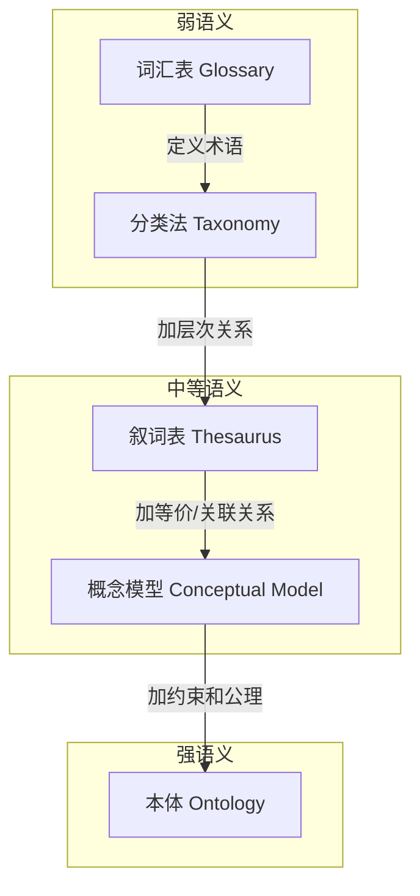
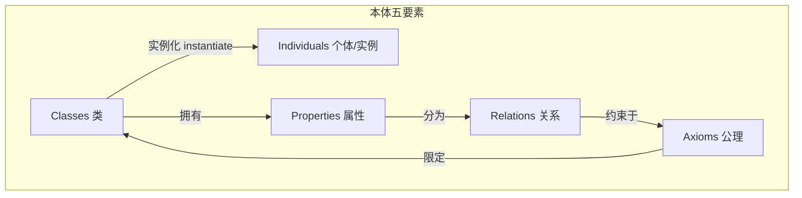
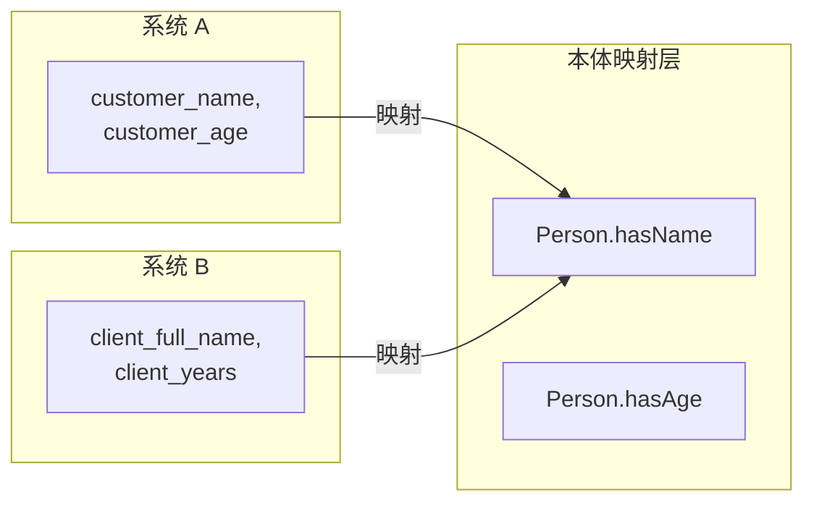

"本体"（Ontology）这个词听起来很学术，但它的核心思想在日常开发中无处不在——任何需要"定义概念、理清关系"的场景，本质上都在做本体建模。这篇文章系统梳理本体的理论基础、建模方法、语言工具和工程实践。

<!-- more -->

# 什么叫"本体"，它和分类体系有什么区别

本体是对**某个领域共享概念模型的形式化、显式规约**。拆开这句话：

- **共享**：不是一个人自说自话，是领域内共识
- **概念模型**：抽象出领域中的实体、属性、关系
- **形式化**：机器可读、可推理
- **显式规约**：白纸黑字写清楚，不自带隐含假设

它和常见的知识组织方式有本质区别：



用一个医疗领域的例子直观感受各级别的差异：

| 层级 | 能表达什么 | 例子 |
|------|-----------|------|
| 词汇表 | "发烧"是身体温度升高的术语 | `发烧 = 体温 > 37.3℃` |
| 分类法 | "病毒感染"是"疾病"的子类 | `病毒感染 is-a 疾病` |
| 叙词表 | "发热"和"发烧"是同义词 | `发热 = 发烧` |
| 概念模型 | 疾病由病原体引起，有症状表现 | `疾病 -[引起]-> 症状` |
| **本体** | **所有病毒感染必须由某种病毒引起；病毒不是细胞生物** | `病毒感染 ⊑ ∃hasCausativeAgent.Virus` |

本体的关键区别在最后一行——它不仅描述"是什么"，还通过**公理和约束**规定了"必须怎样"和"不可能怎样"。

# 本体的核心组件

一个本体由以下要素构成，缺一不可：



| 要素 | 定义 | 医疗本体例子 |
|------|------|-------------|
| **类（Class）** | 领域中的概念集合 | `Disease`, `Symptom`, `Drug` |
| **个体（Individual）** | 类的具体实例 | `COVID-19`（属于 Disease 类） |
| **属性（Property）** | 描述类或个体的特征 | `hasName`, `hasIncubationPeriod` |
| **关系（Relation）** | 连接两个个体的二元谓词 | `treats(Drug, Disease)` |
| **公理（Axiom）** | 必须遵守的逻辑约束 | `Drug treats some Disease` |

## 关系（Object Property）vs 属性（Data Property）

这是初学者最容易混淆的点：

- **Object Property**：连接两个个体。`病人 -(hasDisease)→ 流感`，箭头两端都是实体
- **Data Property**：连接个体到字面量。`病人 -(hasAge)→ 35`，箭头一端是数字/字符串

在 OWL 中分别用 `owl:ObjectProperty` 和 `owl:DatatypeProperty` 区分。

## 关系的特性

本体中的关系可以声明额外的逻辑特性，推理机利用这些特性自动推导新知识：

| 特性 | 含义 | 例子 |
|------|------|------|
| **传递性（Transitive）** | A→B 且 B→C 则 A→C | `isPartOf`：轮子 isPartOf 车，车 isPartOf 车队，则轮子 isPartOf 车队 |
| **对称性（Symmetric）** | A→B 则 B→A | `isSiblingOf` |
| **函数性（Functional）** | 每个个体最多有一个值 | `hasBiologicalMother`：一个人只能有一个生母 |
| **逆关系（Inverse）** | A→B 等价于 B→A' | `hasChild` 的逆是 `hasParent` |

推理机的核心价值就体现在这里：你只需声明"轮子是车的一部分，车是车队的一部分"，加上 `isPartOf` 的传递性，推理机自动得出"轮子是车队的一部分"——你不用手动维护所有间接关系。

# 本体描述语言

## OWL 的三个子语言

本体的繁荣始于 W3C 2004 年的 OWL（Web Ontology Language）标准。OWL 不是一种语言，而是**三种表达能力依次递减的子语言**：

| 子语言 | 表达能力 | 推理复杂度 | 适用场景 |
|--------|----------|------------|----------|
| **OWL Full** | 最强，完全兼容 RDF | 不可判定（推理可能不停） | 理论研究 |
| **OWL DL** | 强，基于描述逻辑 | 可判定（指数级复杂度） | 需推理保证的领域本体 |
| **OWL Lite** | 弱 | 最低（多项式级） | 简单分类体系 |

**OWL 2 的三个 Profile**（2009 年发布，更实用的划分）：

| Profile | 设计目标 | 推理复杂度 | 典型推理机 |
|---------|----------|------------|-----------|
| **OWL 2 EL** | 大规模类层次（医疗、生命科学） | 多项式 | ELK（处理 SNOMED CT 只需数秒） |
| **OWL 2 QL** | 数据库查询重写 | NLogSpace | Ontop（本体+关系数据库） |
| **OWL 2 RL** | 规则系统友好 | 多项式 | RDFox（内存推理，极高吞吐） |

选择 Profile 的原则：**不是越强越好，是最适合你的推理需求和规模才好。** SNOMED CT 医学术语集包含 35 万个概念，用 OWL DL 做推理需要数小时；用 OWL 2 EL + ELK 推理机，同样规模只需数秒。

## 一个完整的 OWL 实例

```xml
<!-- 用 OWL 2 定义一个简单的疾病本体 -->
<rdf:RDF xmlns:owl="http://www.w3.org/2002/07/owl#"
         xmlns:rdf="http://www.w3.org/1999/02/22-rdf-syntax-ns#"
         xmlns:xsd="http://www.w3.org/2001/XMLSchema#"
         xml:base="http://example.org/medical#">

    <!-- 1. 定义类 -->
    <owl:Class rdf:about="Disease"/>
    <owl:Class rdf:about="InfectiousDisease">
        <rdfs:subClassOf rdf:resource="Disease"/>
    </owl:Class>
    <owl:Class rdf:about="ViralDisease">
        <rdfs:subClassOf rdf:resource="InfectiousDisease"/>
        
        <!-- 关键公理：所有病毒性疾病必须有某种病毒作为病原体 -->
        <rdfs:subClassOf>
            <owl:Restriction>
                <owl:onProperty rdf:resource="hasCausativeAgent"/>
                <owl:someValuesFrom rdf:resource="Virus"/>
            </owl:Restriction>
        </rdfs:subClassOf>
    </owl:Class>

    <!-- 2. 定义属性 -->
    <owl:ObjectProperty rdf:about="hasCausativeAgent">
        <rdfs:domain rdf:resource="Disease"/>
        <rdfs:range rdf:resource="Pathogen"/>
    </owl:ObjectProperty>
    
    <owl:DatatypeProperty rdf:about="incubationPeriod">
        <rdfs:domain rdf:resource="InfectiousDisease"/>
        <rdfs:range rdf:resource="xsd:integer"/>
    </owl:DatatypeProperty>

    <!-- 3. 声明不相交（Disjoint）——核心约束 -->
    <owl:AllDisjointClasses>
        <owl:members rdf:parseType="Collection">
            <rdf:Description rdf:about="Bacteria"/>
            <rdf:Description rdf:about="Virus"/>
            <rdf:Description rdf:about="Fungus"/>
        </owl:members>
    </owl:AllDisjointClasses>
</rdf:RDF>
```

这段 OWL 里最核心的是三件事：
1. **类层次**：`ViralDisease ⊑ InfectiousDisease ⊑ Disease`
2. **公理约束**：每种 `ViralDisease` 必须至少有一个 `Virus` 作为病原体
3. **Disjoint 声明**：细菌、病毒、真菌是互斥的——一个病原体不能同时属于两类

推理机读到这三条后，如果你错误地把一个 `Bacteria` 实例设为某个 `ViralDisease` 的病原体，推理机会自动标记为**不一致（Inconsistency）**——它在帮你检查本体质量的逻辑错误。

# 本体建模方法论

建一个稍微有点规模的本体不是"打开 Protégé 就画图"。业界有几种成熟的方法论：

## Methontology：最经典的方法论

```
规格说明书 → 知识获取 → 概念化 → 集成 → 实现 → 评估 → 文档化
    ↓                         ↓        ↓      ↓      ↓
  领域范围                  概念表   现有本体  代码  专家评审
  用户需求                  关系表   合并复用  测试  一致性检查
  使用场景                  公理表
```

Methontology 的核心思想是**在写代码之前，先把概念、关系、公理用自然语言或表格说清楚**。这个阶段叫做"概念化"（Conceptualization），产出物是**概念字典**和**关系表**：

**概念字典示例（医疗领域）**：

| 概念名 | 自然语言定义 | 属性 | 父类 |
|--------|-------------|------|------|
| Disease | 由病原体或内部失调引发的异常生理状态 | name, ICDCode, hasSymptom | Thing |
| InfectiousDisease | 由病原微生物引起的疾病 | hasCausativeAgent, incubationPeriod | Disease |
| Symptom | 疾病的外在表现 | name, severity, bodyLocation | Thing |

**关系表示例**：

| 关系名 | 定义域 | 值域 | 特性 |
|--------|--------|------|------|
| hasCausativeAgent | InfectiousDisease | Pathogen | — |
| hasSymptom | Disease | Symptom | — |
| treats | Drug | Disease | Transitive? |
| isCausedBy | Disease | Pathogen | Inverse of hasCausativeAgent |

把这些表格套进 OWL 的类/属性/公理框架里，就是形式化的本体。

## 其他方法论速览

| 方法论 | 特色 | 适用场景 |
|--------|------|----------|
| **NeOn** | 强调本体复用和模块化 | 多本体协作的大项目 |
| **On-To-Knowledge** | 以应用目标驱动 | 企业知识管理 |
| **DILIGENT** | 分布式、迭代式协同构建 | 多人长期协作的领域本体 |
| **eXtreme Design** | 测试驱动，每个需求对应一个测试用例 | 敏捷开发团队 |

实际项目中很少有人严格遵循某一种方法论。但方法论的价值在于**给你一张 checklist**——在做"概念化"之前你不会忘记定义公理，在做"实现"之前不会临时拍脑袋补关系。

# 核心工具

## Protégé：本体编辑的 VS Code

Protégé 是斯坦福大学开发的免费开源本体编辑器，相当于本体建模领域的 VS Code。它的核心能力：

- **图形化编辑**：拖拽创建类、属性、个体，实时显示类层次树
- **多格式支持**：OWL/RDF、OBO、Manchester Syntax
- **内置推理机**：直接运行 HermiT/Pellet/ELK，实时显示推理结果
- **插件生态**：OntoGraf 可视化、OWLViz 图形导出、SPARQL 查询面板

打开 Protégé 做本体的日常流程：

```
创建类层次 → 定义 Object Property → 加 Domain/Range 约束
→ 声明 Disjoint → 运行推理机 → 看 Inferred Hierarchy
→ 如果有红色标记 → 定位不一致 → 修改公理 → 重新推理
→ SPARQL 查询验证 → 导出 OWL/RDF
```

## 推理机

| 推理机 | 特点 | 适合的 Profile |
|--------|------|---------------|
| **HermiT** | Protégé 默认，基于 Hypertableau | OWL 2 DL |
| **Pellet** | 商业级，支持 SWRL 规则 | OWL 2 DL |
| **ELK** | 极快，专为大规模类层次设计 | OWL 2 EL |
| **RDFox** | 内存推理，支持增量更新 | OWL 2 RL |
| **Openllet** | Pellet 的开源分支 | OWL 2 DL |

选推理机的原则：**先用 HermiT 开发调试（错误信息清晰），上线根据规模选对应 Profile 的推理机。**

## SPARQL：本体的 SQL

OWL 文件建好了，怎么查？SPARQL 是 W3C 标准的 RDF 查询语言，本质就是**图模式匹配**：

```sparql
# 查询所有病毒性疾病及其潜伏期
PREFIX med: <http://example.org/medical#>

SELECT ?disease ?period
WHERE {
    ?disease rdfs:subClassOf med:ViralDisease .
    ?disease med:incubationPeriod ?period .
    FILTER(?period <= 14)
}
ORDER BY ?period
```

SPARQL 的 `SELECT` 部分看起来和 SQL 很像，但 `WHERE` 里的三元组模式匹配是图数据库独有的——你可以用 `?var1 relation ?var2 . ?var2 relation ?var3` 这样的模式在图中走多跳。

# 本体的工程价值

## 应用 1：知识图谱的基础

知识图谱 ≈ **本体（Schema 层）** + **实例（Data 层）**。本体定义"人、公司、职位、地点"这些概念以及它们之间的合法关系，实例填充"张三、腾讯、工程师、深圳"这些具体数据。

Google 知识图谱、DBpedia、Wikidata 的底层 Schema 都是本体。知识图谱的查询和推理能力，根本来自于本体的约束和公理。

## 应用 2：数据集成与互操作

不同系统对同一事物用不同的名字——系统 A 叫 `customer_name`，系统 B 叫 `client_full_name`——本体充当了**全局的语义映射层**：



这个模式在医疗数据交换（HL7 FHIR）、生物信息学（Gene Ontology）等领域是标准做法。

## 应用 3：推理与一致性检查

本体最有价值的能力不是"存储知识"，而是**"发现你存储的知识中的矛盾"**。一个手工维护的数据库里有 100 万条数据，你不知道里面有多少逻辑错误。推理机可以做到：

- 如果你声明"COVID-19 是 Virus"，又声明"COVID-19 是 Bacteria"，而 Virus 和 Bacteria 被声明为 Disjoint → 推理机报告不一致
- 如果你声明"每个 Patient 必须有 hasPrimaryDoctor"，但某个 Patient 实例没有填这个属性 → 推理机报告数据不完整

## 应用 4：大模型时代的角色变化

大模型可以生成知识、进行推理——那本体还有价值吗？有，但角色变了：

| 传统角色 | 现在的角色 |
|----------|-----------|
| 知识的唯一存储 | **知识的质量把关**——LLM 可以生成候选知识，本体约束自动验证 |
| 人工构建 | 人机协作——LLM 生成初版本体，人修正公理 |
| 推理的唯一引擎 | 混合推理——本体做确定性推理，LLM 做模糊推理 |

一个正在出现的工作模式：**LLM 阅读大量领域文档 → 提取概念和关系 → 生成本体草稿 → 推理机做一致性检查 → 发现矛盾后 LLM 修正 → 迭代收敛 → 人工最终确认。**

# 小结

本体建模的本质可以浓缩为一句话：**把"领域共识"从人的脑子里搬出来，写成机器能理解和推理的形式化规则。**

核心知识点速查：

| 层级 | 内容 |
|------|------|
| 构成要素 | 类(Class) → 个体(Individual) → 属性(Property) → 关系(Relation) → 公理(Axiom) |
| 表达能力 | Taxonomy < Thesaurus < Conceptual Model < **Ontology** |
| 核心语言 | OWL 2（EL/QL/RL 三种 Profile） |
| 核心推理 | 一致性检查、蕴含推导、分类（Subsumption） |
| 核心工具 | Protégé（编辑）、HermiT/ELK（推理）、SPARQL（查询） |
| 方法论 | Methontology（概念化表格→形式化实现） |

本体的学习曲线说陡也陡——因为它是逻辑+哲学+工程的交叉学科。但只要你建过一次哪怕只有 20 个类的小本体，就再也不会把"数据库 Schema"和"本体"混为一谈。
