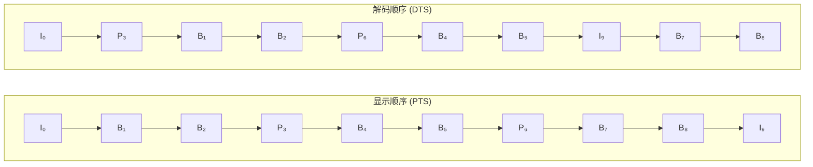
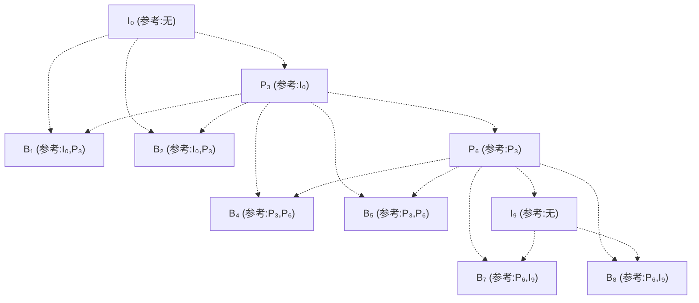

视频能被压到原始数据的几十分之一，靠的不仅是"把一张图压小"（帧内），更关键的是"借前一张图来预测这一张"（帧间）。本文聚焦视频压缩里最容易被混淆的一组概念：**I/P/B 三种帧、PTS 与 DTS 的不同步、以及错误传播与 IDR 帧**，用推导、拆解和图示把关系彻底理清。

<!-- more -->

# 一、I/P/B 帧：视频压缩的核心机制

帧间预测的朴素前提：**相邻两帧之间，画面绝大部分像素是相同的**。这种"时间冗余"远大于单帧内部的"空间冗余"。I、P、B 三种帧，就是这套"参考—预测—记差异"机制的不同档位。

## 1.1 三种帧类型对比表

| 类型 | 全称 | 预测方式 | 是否参考其他帧 | 相对码率（同质量） | 可作随机访问点 |
|------|------|----------|----------------|-------------------|---------------|
| **I 帧** | Intra-coded Picture（帧内编码帧） | 仅帧内预测，**不**参考任何其他帧，自包含 | 否 | 最高（≈基准 1.0） | ✅ 是 |
| **P 帧** | Predictive-coded Picture（前向预测帧） | 前向预测，参考**前面**最近的 I/P 帧 | 是（单向，向前） | 中（约为 I 的 1/2 ~ 1/5） | ❌ 否 |
| **B 帧** | Bi-predictively coded Picture（双向预测帧） | 双向预测，参考**前后**的 I/P 帧 | 是（双向） | 最低（约为 I 的 1/5 ~ 1/10） | ❌ 否 |

> 表中"相对码率"为量级示意，实际取决于内容运动量、分辨率、码率控制策略。核心结论恒定：**同质量下 B < P < I**。

**为什么 I 帧最大？** 因为它不参考任何东西，必须把自己完整"画"出来（类似一张 JPEG）。而 P/B 帧只需记"相对参考帧的差异"，差异越小，码率越低。

## 1.2 P 帧编码全过程深度拆解

用一套符号把 P 帧编码彻底拆开。设当前要编码的帧为 $F_t$，它参考的前一帧（已**重建**版本）为 $\tilde{F}_{t-1}$。

### 第一步：拷贝参考帧作为"底图"

解码端手里只有 $\tilde{F}_{t-1}$（注意是**重建帧**，不是原始帧——两端必须共用同一份参考，否则误差会累积）。编码器也维护着同一份重建帧，于是直接把它当作当前帧的"底图"预测：

$\hat{F}_t^{(0)} = \tilde{F}_{t-1}$

这一步什么都没发送，纯粹是"借"参考帧当起点。

### 第二步：分块搜索，计算运动矢量（MV）

把当前帧切成规则的块——早期 H.264 用 **宏块（Macroblock, 16×16）**，H.265/HEVC 起用可递归的 **CTU/CU（最大 64×64）**。

对每个块，在参考帧的一个**搜索窗口**内尝试各种位移 $(\Delta x, \Delta y)$，找出让"当前块"和"参考帧里被移位后的块"最像的那个位移。衡量"像不像"通常用 **SAD（绝对差之和）**：

$$SAD(\Delta x,\Delta y) = \sum_{i,j} \left| F_t(i,j) - \tilde{F}_{t-1}(i+\Delta x,\; j+\Delta y) \right|$$

让 SAD 最小的位移，就是该块的**运动矢量 MV = $(\Delta x^*, \Delta y^*)$**。这一步叫**运动估计（Motion Estimation）**。

> 直觉：一个向右移了 5 像素的球，它的块在参考帧里"左边 5 像素处"最匹配，于是 MV = (-5, 0)。

### 第三步：计算残差（Residual）

拿着 MV 把参考帧的对应块"搬"过来，得到预测块 $\hat{B}$，再用真实块减它，得到**残差块**：

$$R(i,j) = F_t(i,j) - \hat{B}(i,j)$$

如果物体只是整体平移、没变形也没遮挡，那么 $\hat{B}$ 几乎等于 $F_t$，于是残差 $R$ 处处接近 **0**。这正是压缩的关键——**0 是好压缩的代名词**（熵编码对一长串 0 极其高效）。

### 第四步：扔掉底图，只存"说明书"

编码器**不发送**完整的预测帧 $\hat{F}_t$，而是只发送：

1. 运动矢量 `MV`（每个块一个，整数或亚像素精度）
2. 量化后的残差 `Q(R)`（对残差做变换 + 量化）
3. 预测模式等少量辅助信息

解码端据此"照说明书重建"：

$$\tilde{F}_t = \text{Warp}(\tilde{F}_{t-1},\; MV) + Q^{-1}\!\big(Q(R)\big)$$

**存"说明书"远小于存"整张画"**——这就是 P 帧压缩的来源。可以把它类比成：与其拍下整面墙，不如说"和昨天那面墙一样，只是右上角移走了一幅画"。

## 1.3 B 帧双向预测详解

P 帧只看"过去"，B 帧还能看"未来"——它同时参考**前一帧和后一帧**两个锚点（都是 I/P 帧）。

- 前向预测：$\hat{B}_{fwd} = \text{Warp}(\tilde{F}_{t-1}, MV_{fwd})$
- 后向预测：$\hat{B}_{bwd} = \text{Warp}(\tilde{F}_{t+1}, MV_{bwd})$
- 双向（插值）预测：取二者平均（或加权）

$$\hat{B} = \frac{1}{2}\left(\hat{B}_{fwd} + \hat{B}_{bwd}\right)$$

残差变为：

$$R = F_t - \hat{B}$$

为什么 B 帧压得最狠？因为"过去"和"未来"两个方向一起夹击，预测值 $\hat{B}$ 比单看一边更接近真实画面，残差更小，存的 bit 更少。代价是：解码 B 帧必须等它"后面的"参考帧先解出来，这直接引出了下一章的 PTS/DTS 问题。

### 常见误区澄清：P 帧不只是"存变化的部分"

一个流传很广的说法是："P 帧只存和上一帧变化的部分。"

**这句话不准确，容易误导。** 准确表述是：P 帧存的是"**运动矢量 + 运动补偿后的残差**"。

- 真正"没变"的区域：MV 指向原处、残差≈0，几乎不花码率——但这靠的是**运动补偿**，不是"直接存变化"。
- **变化很大**的区域（如突然出现的物体、运动物体的边缘、被遮挡处）：光靠 MV 搬不过来，残差并不小，依然要编码大量残差数据。

所以"变化的部分"谈不上被"存"下来——恰恰相反，变化大的地方残差大、反而更费码率；帧间预测省下的，是**静止/平移区域**的码率。把 P 帧理解成"残差 + 运动信息"，才和编码器的真实行为对得上。

# 二、PTS vs DTS：解码和显示为什么不同步？

## 2.1 两个时间戳的定义

由于 B 帧要等"后面的"参考帧先解码，于是出现一个反直觉的现象：**帧被解码出来的顺序，和它该被显示出来的顺序，不是一回事。**

为此每个帧带两个时间戳：

| 时间戳 | 英文 | 含义 | 回答的问题 |
|--------|------|------|-----------|
| **DTS** | Decoding Time Stamp | 解码时间戳 | "这一帧**何时解码**？" |
| **PTS** | Presentation Time Stamp | 显示时间戳 | "这一帧**何时上屏显示**？" |

- 没有 B 帧的流：解码即显示，PTS == DTS，顺序完全一致。
- 有 B 帧的流：**解码顺序靠前、显示顺序靠后**的帧，满足 $\text{DTS} < \text{PTS}$。

举个例子（一个 GOP）：

- **显示顺序**：`I₀  B₁  B₂  P₃  B₄  B₅  P₆  B₇  B₈  I₉`
- **解码顺序**：`I₀  P₃  B₁  B₂  P₆  B₄  B₅  I₉  B₇  B₈`

原因：B₁、B₂ 参考 I₀ 和 P₃，所以 **P₃ 必须先于 B₁、B₂ 解码**。于是 P₃ 被提前到 B₁、B₂ 之前解码，但 P₃ 的 PTS（显示时刻）却晚于它们——这就出现了 DTS < PTS。

## 2.2 解码器的重排序缓冲区（Reorder Buffer / DPB）

解码器解出一帧后**不会立刻上屏**，而是先放进 **DPB（Decoded Picture Buffer，解码图像缓存，也称重排序缓冲区）**，等该帧的 PTS 时刻到了，再按显示顺序吐出。

这也解释了两个日常现象：

- **起播缓冲（Buffering…）**：播放器要先攒够若干帧填满 DPB，才能正确重排出流畅的显示顺序，所以开播要等一下。
- **直播延迟**：B 帧越多、GOP 越长，DPB 需要攒的帧越多，端到端延迟越大（直播常因此减少 B 帧、缩短 GOP）。

## 2.3 播放器卡顿问题的定位思路

"卡顿"本质是**渲染跟不上显示时钟（PTS）**。按概率从高到低逐层排查：

1. **网络带宽不足** → 码流喂不进解码器，DPB **饥饿（buffer underflow）** → 周期性卡顿/转圈。看播放器缓冲水位即可判断。
2. **解码性能不足** → CPU/GPU 解不及，帧被丢弃（dropped frames）→ 画面跳变。看解码占用率、丢帧计数。
3. **音视频不同步（AV-sync）** → 音频和视频 PTS 漂移，嘴形对不上。看 PTS 偏移。
4. **B 帧 / GOP 过大** → DPB 压力大、延迟高，弱网下易触发重排失败。

定位口诀：**先查缓冲水位（网络），再查解码占用（性能），最后查 PTS 漂移（同步）**。

# 三、错误传播与 IDR 帧

## 3.1 参考帧丢失导致的错误传播链

视频流是一条**链式依赖**：Pₙ 依赖 Pₙ₋₁，Pₙ₋₁ 依赖 Pₙ₋₂……一旦链中某一帧（比如一个 P 帧的数据包）损坏或丢失，它的重建就错了；而后续所有**依赖它**的帧，用的都是"错的参考帧"，误差会**逐帧累积放大**——这叫**时间错误传播（temporal error propagation）**。

链条会一直错下去，直到遇到一个**不依赖任何前序帧**的帧，链才断。

## 3.2 IDR 帧与普通 I 帧的区别

两者都是 I 帧（帧内编码，自包含），但地位不同：

| | 普通 I 帧 | IDR 帧（Instantaneous Decoder Refresh） |
|--|-----------|----------------------------------------|
| 是否帧内编码 | ✅ 是 | ✅ 是 |
| 后续帧能否参考它之前的帧 | ⚠️ **可以**（依赖关系可能跨越它） | ❌ **不可以** |
| 遇到时解码器动作 | 正常解码 | **立即清空参考帧缓存（DPB / 参考列表）** |
| 能否作为随机访问点 | 受限 | ✅ 干净的随机访问点 |

关键点：**IDR 帧是一种特殊 I 帧，解码器一旦碰到它，会立刻清空参考帧列表**，此后所有帧只能参考该 IDR 及其之后出现的帧。

一句话记忆：**所有 IDR 都是 I 帧，但并非所有 I 帧都是 IDR。**

IDR 的用途：
- 提供**干净的随机访问点**（拖动进度条 seek、切换清晰度、直播重同步都靠它落地）
- **切断错误传播链**（见下）

## 3.3 直播花屏后突然变清晰的原因

这正是 3.1 + 3.2 的合力结果：

1. 直播流会**周期性插入 IDR 帧**（由 GOP 长度决定，例如每 2 秒一个）。
2. 某段网络抖动导致 **GOP 内部丢包** → 从丢包点起，到下一个 IDR 之前，画面一直花（错误沿参考链传播）。
3. 当**下一个 IDR 到达**，参考帧缓存被清空重置，依赖链重新对齐 → 画面**瞬间变清晰**。

所以"花一阵子、突然好"，不是网络瞬间恢复了，而是 IDR 周期性地把错误链"斩断"了。

# 四、一图总结：显示顺序 vs 解码顺序 vs 依赖关系

以一个 GOP `I B B P B B P B B I` 为例（下标为显示序号）。



依赖关系（谁参考谁）——注意 **B 帧只指向 I/P，绝不指向其他 B 帧**：



依赖关系对照表：

| 帧 | 能参考谁 | 能被谁参考 | 随机访问 |
|----|---------|-----------|---------|
| **I** | 无 | 任何后续 P/B | ✅ |
| **P** | 前面最近的 I/P | 后续 P/B | ❌ |
| **B** | 前后的 I/P（**不参考 B**） | **不被任何帧参考** | ❌ |

> **破除"套娃"误解**：B 帧之间互不依赖，它们都只指向同一个（或相邻两个）I/P 锚点。解码 B₁、B₂ 时所需的参考帧（I₀、P₃）已经就绪，无需"先解出另一个 B 帧"。因此**不存在 B 依赖 B 的无限套娃**。

# 五、音频 / 视频处理全链路示意图

把前面所有概念放进端到端流水线，看清每个环节在做什么。

## 音频处理全链路


## 视频处理全链路


对照可见：**视频链比音频链多出"YUV 转换""帧间预测""DPB 重排序"三道独有工序**，而 PTS/DTS、错误传播、IDR 等问题，正是在"视频解码 + 重排序"这道工序里产生的。

# 六、总结：一张图理清所有关系

把全文主线收束成一句话网络：

```
时间冗余 ──► 帧间预测 ──► 三种帧(I/P/B)
                              │
              I/P：前向参考 ──┤
              B  ：双向参考  │
                              ▼
          解码顺序 ≠ 显示顺序 ──► PTS/DTS + DPB 重排序
                              │
              链式依赖 ──► 错误传播 ──► IDR 斩断链条
```

**记住三件事就够了：**

1. **I/P/B 是"参考档位"**：I 自包含、P 看过去、B 看两边；同质量码率 B < P < I。
2. **PTS ≠ DTS**：因为 B 帧要等"未来"的参考帧，解码顺序和显示顺序被拧开了，靠 DPB 重排回来。
3. **IDR 是"重启键"**：清空参考帧缓存，既提供干净的随机访问点，也斩断错误传播——直播花屏后突然清晰，就是它在起作用。

---

## 参考资料

- [ITU-T H.264 (AVC) 建议书](https://www.itu.int/rec/T-REC-H.264) — 帧类型、Slice、参考帧管理的权威标准
- [ITU-T H.265 (HEVC) 建议书](https://www.itu.int/rec/T-REC-H.265) — CTU/CU 结构与更高效率的帧间预测
- [Wikipedia: Video compression picture types](https://en.wikipedia.org/wiki/Video_compression_picture_types) — I/P/B 帧概念总览
- [Wikipedia: Presentation timestamp](https://en.wikipedia.org/wiki/Presentation_timestamp) — PTS/DTS 定义与重排序
- [FFmpeg Documentation](https://ffmpeg.org/documentation.html) — 实际编码参数（GOP、IDR 间隔、B 帧数）的实战入口
- [Apple HLS Authoring Specification](https://developer.apple.com/documentation/http-live-streaming) — 流媒体中 PTS/DTS、IDR 间隔的工程约束
