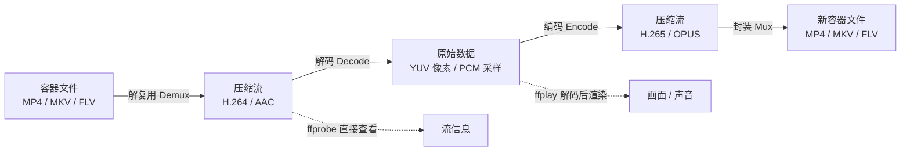
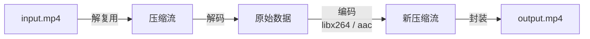

很多人对音视频处理的印象是"很高深、要写很多 C 代码"。其实不完全是这样。FFmpeg 已经把"解复用、解码、编码、封装"这些底层能力封装成了一组命令行工具，你不需要写一行代码，就能亲手把视频拆开、解码、重新压缩、再打包回去，直观看到整个流程。

本文目标很明确：**手把手把 FFmpeg 环境搭好，再用几个最常用的命令，让你"感受"一遍解复用 → 解码 → 编码 → 封装的完整链路。** Windows 下我们统一使用 BtbN 提供的 `-shared` 版本（下面会解释为什么选它）。最后附上官方和社区推荐的测试视频资源，方便你立刻上手练。

<!-- more -->

# 先搞懂四个核心概念

在敲命令之前，先建立一张"心智地图"。一个视频文件（MP4/MKV/FLV 等）本质是一个**容器（Container）**，里面装着已经被压缩过的**视频流**和**音频流**。播放、转码、剪辑这些操作，归根结底都是在和这四件事打交道。

要理解"封装 / 解复用"到底在操作什么，先看下一个容器文件（以 MP4 为例）的内部骨架：

```
┌───────────────────────────────────────────────┐
│             容器文件（如 .mp4）               │
├───────────────────────────────────────────────┤
│  Header（文件头）                              │
│  ├─ 文件类型标识（ftyp box）                 │
│  ├─ 时长、码率等元数据                        │
│  ├─ 音视频流的编码格式（H.264 / AAC）        │
│  └─ 每一帧的索引表（PTS / DTS / 偏移量）      │
├───────────────────────────────────────────────┤
│  Data（数据块）                               │
│  ├─ 视频流数据块 1（H.264 NAL 单元）         │
│  ├─ 音频流数据块 1（AAC 帧）                 │
│  ├─ 视频流数据块 2                           │
│  ├─ 音频流数据块 2                           │
│  └─ ...                                        │
└───────────────────────────────────────────────┘
```

这样读这张图：

- **Header 是"目录"**：记录里面有哪些流、各是什么编码、每帧在时间轴上的位置（索引表）。`ffprobe` 读的就是它，所以秒出结果。
- **Data 是"货"**：视频和音频的压缩数据块**交错存放**，按播放时间一片片排布。
- **解复用（Demux）** 就是顺着 Header 的索引，把交错的视频块、音频块分别挑出来；**封装（Mux）** 则反过来，把两路流按时间交错写回 Data，并补好 Header。

| 概念 | 英文 | 一句话理解 | 数据形态变化 |
|------|------|------------|--------------|
| **解复用** | Demux | 把容器"拆开"，取出里面的音视频流 | 容器文件 → 独立的压缩流 |
| **解码** | Decode | 把压缩流"解压"成原始数据 | 压缩流（H.264/AAC）→ 原始数据（YUV/PCM） |
| **编码** | Encode | 把原始数据"重新压缩"成压缩流 | 原始数据（YUV/PCM）→ 压缩流（H.265/OPUS） |
| **封装** | Mux | 把流"装回"容器 | 独立的压缩流 → 容器文件 |

用一张图把这条链路串起来：



把四件事串成一条流水线，就是本文要带你亲手跑完的全过程：

```
容器文件 ──解复用──▶ 压缩流 ──解码──▶ 原始数据 ──编码──▶ 压缩流 ──封装──▶ 新容器文件
  (MP4)          (H.264/AAC)  (YUV/PCM)        (H.265/OPUS)          (MKV)
```

几个有用的直觉：

- **ffprobe** 站在"解复用"这一侧，它只解析容器和流的元信息，不解码画面，所以速度极快，用来"看一眼文件里有什么"。
- **ffplay** 站在"解码 + 渲染"这一侧，它把压缩流解码成画面和声音直接播放，用来"感受一下能不能播"。
- **ffmpeg** 是真正干活的：它把上面的四步自由组合，可以只做其中一步（比如只解复用），也可以一气呵成走完全程（转码）。

# 环境搭建

## Windows：BtbN 提供的 `-shared` 版本（本文主线）

FFmpeg 官方不提供 Windows 的预编译二进制，社区里最常用、更新最及时的构建来自 GitHub 用户 **BtbN** 维护的自动化构建工程。

> 资源地址：<https://github.com/BtbN/FFmpeg-Builds/releases>

打开 Releases 页面，你会看到一组命名很有规律的文件。我们重点关注后缀里的两个词：**`shared` 和 `static`**。

| 版本 | 特点 | 适用场景 |
|------|------|----------|
| `*-win64-gpl-shared.zip` | 可执行文件 + 一堆独立的 `.dll`（核心库拆出来） | **本文选用**：体积小；且今后想用 FFmpeg 的库（libavformat 等）做二次开发时，这套 DLL 直接可用 |
| `*-win64-gpl-static.zip` | 所有功能打包进单个 `.exe`，无 DLL 依赖 | 只想当命令行工具、且不想操心依赖时 |

为什么本文主推 `-shared`？两点原因：

1. **省体积**：核心编解码库（avcodec、avformat、avutil、swscale 等）被拆成 DLL，三个可执行文件共用，整体更小。
2. **可平滑过渡到开发**：`-shared` 版本自带这些动态库，哪天你想用 C/C++/Python 调用 FFmpeg 能力，这套环境不用重装。

> 初次上手不必纠结 GPL 和 LGPL 的区别。**`gpl` 版本功能最全**（包含 x265、libmp3lame 等我们在实战里要用到的编码器），直接下 `gpl-shared` 即可。

**安装步骤：**

1. 下载 `ffmpeg-master-latest-win64-gpl-shared.zip`（"Latest" 标签下的最新构建）。
2. 解压到任意目录，建议路径不含中文和空格，例如 `D:\ffmpeg\`。解压后目录里会有一个 `bin` 文件夹，里面是：
   - `ffmpeg.exe`、`ffprobe.exe`、`ffplay.exe`（三个主程序）
   - 一大堆 `.dll` 文件（`avcodec-*.dll`、`avformat-*.dll` 等核心库）
3. **关键一步**：把 `D:\ffmpeg\bin` 加入系统环境变量 `PATH`。
   - 设置方式：开始菜单搜索"环境变量" → 编辑系统环境变量 → 环境变量 → 在"系统变量"里找到 `Path` → 新建 → 填入 `D:\ffmpeg\bin` → 一路确定。
   - 也可以不配 PATH，每次 `cd D:\ffmpeg\bin` 后再运行命令，但配一次 PATH 一劳永逸。
4. 打开**新的**命令行窗口（必须新开，环境变量才生效），验证：

```bash
ffmpeg -version
ffprobe -version
ffplay -version
```

能正常打印出版本号（出现 `ffmpeg version ...` 和配置信息）就说明装好了。`-shared` 版本如果**只把 `ffmpeg.exe` 单独复制走、不带那些 DLL**，运行时就会报"找不到 xxx.dll"——记住：**`bin` 文件夹要整体保留在一起**。

## macOS / Linux 简要

其他平台一般不用手动下 BtbN 包，包管理器更直接：

```bash
# macOS（需先装 Homebrew）
brew install ffmpeg

# Ubuntu / Debian
sudo apt update && sudo apt install ffmpeg
```

> 提示：系统源里的 `ffmpeg` 版本可能偏旧。对命令行实战影响不大；若要用到最新编码器，仍可回到 BtbN 风格的非官方最新构建或自行编译。

装完同样用 `ffmpeg -version` 验证即可。

# 准备测试素材

后面所有命令都基于一个输入文件。建议新建一个工作目录（如 `D:\ffmpeg-lab\`），把一个测试视频放进去并统一命名为 `input.mp4`，这样命令更易读。

你可以从本文第十节列出的资源站下载任意一个 MP4（比如 Blender 的《Big Buck Bunny》或《Tears of Steel》）。下载好后目录大概长这样：

```
D:\ffmpeg-lab\
├── input.mp4      ← 你的测试视频
├── video.h264     ← 待会解复用出来的视频裸流
├── audio.aac      ← 待会解复用出来的音频裸流
└── ...            ← 其他产物
```

下面所有命令都假设你在 `D:\ffmpeg-lab\` 目录下执行，且输入文件就叫 `input.mp4`。

# Step 1：解复用（Demux）——把容器拆开

先看看文件里到底有什么。用 `ffprobe` 一秒看全貌：

```bash
ffprobe input.mp4
```

输出里重点关注 `Stream #0:0` 和 `Stream #0:1`：前者通常是视频流（如 `h264 (High), yuv420p, 1280x720, 25 fps`），后者是音频流（如 `aac, 48000 Hz, stereo`）。这就是容器里"装"着的两路压缩流。

接下来真正"拆"：

```bash
# 拆出视频裸流（H.264 的 Annex B 格式）
ffmpeg -i input.mp4 -map 0:v:0 -c copy -bsf:v h264_mp4toannexb video.h264

# 拆出音频裸流（AAC）
ffmpeg -i input.mp4 -map 0:a:0 -c copy audio.aac
```

要点解读：

- `-map 0:v:0` 指定取第 0 个输入文件的第 0 路视频流，`-map 0:a:0` 同理取音频。
- `-c copy` 是灵魂：**不重新编码，只搬运压缩数据（packet 级拷贝）**。所以这一步极快、且无损。
- `-bsf:v h264_mp4toannexb` 是"比特流过滤器"，把 MP4 里的 H.264 改成标准裸流格式，便于单独存储/后续处理。

此时 `video.h264` 和 `audio.aac` 已经脱离了 MP4 容器，是纯粹的"压缩流"了。

# Step 2：解码（Decode）——把压缩数据变成原始数据

解复用的产物还是压缩的。解码则是把它变成"播放器/编辑器能直接用的原始数据"：视频是 YUV 像素，音频是 PCM 采样。

**方式一：解码成原始 YUV（体会"原始"有多大）**

```bash
ffmpeg -i input.mp4 -c:v rawvideo -pix_fmt yuv420p raw.yuv
```

`raw.yuv` 是未压缩的原始视频，体积会非常惊人（约 `宽 × 高 × 1.5 × 帧数` 字节）。它直观地告诉你：**压缩技术到底帮你省了多少空间**。这个文件肉眼打不开，但它是后续编码的"原料"。

**方式二：解码成 PNG 序列（直观看到每一帧画面）**

```bash
ffmpeg -i input.mp4 -vf fps=1 -frames:v 5 frame_%03d.png
```

这条命令把视频解码后，每秒抽 1 帧、共抽 5 帧，存成 `frame_001.png` ... `frame_005.png`。打开这些图，你就"看见"了解码的结果。

**方式三：解码音频成 WAV（无损 PCM）**

```bash
ffmpeg -i input.mp4 audio.wav
```

WAV 里装的是未压缩的 PCM 采样，相当于音频的"原始数据"。用播放器放一下，确认和解码前是同一个声音。

# Step 3：编码（Encode）——把原始数据重新压回去

解码出来的是"大块头"，要回到可传输、可存储的形态，就得再编码。FFmpeg 自带业界主流编码器。

**重新编码成 H.264（最通用）**

```bash
ffmpeg -i input.mp4 -c:v libx264 -crf 23 -preset medium -c:a aac -b:a 128k out_h264.mp4
```

几个关键参数：

- `-c:v libx264`：用 x264 编码器压成 H.264。
- `-crf 23`：**恒定质量模式**，取值 0–51，越小质量越高、文件越大。18–28 是常用区间，23 是默认值，性价比高。
- `-preset medium`：编码速度与压缩率的权衡，`ultrafast` 最快但体积大，`veryslow` 最慢但压得最小。
- `-c:a aac -b:a 128k`：音频用 AAC 编码，码率 128k。

**尝试更高效的 H.265（x265，GPL 版自带）**

```bash
ffmpeg -i input.mp4 -c:v libx265 -crf 28 -c:a copy out_hevc.mp4
```

同样画质下 H.265 通常比 H.264 再小 30%~50%。注意 H.265 的 CRF 量级与 H.264 不同，28 左右约等同于 H.264 的 23。

**把音频单独压成 MP3**

```bash
ffmpeg -i input.mp4 -vn -c:a libmp3lame -b:a 192k audio.mp3
```

`-vn` 表示"不要视频"，只要音频；`libmp3lame` 是高质量的 MP3 编码器。

# Step 4：封装（Mux）——把流装回容器

前面我们拆出了 `video.h264` 和 `audio.aac`。现在把它们重新"装"回一个 MP4：

```bash
ffmpeg -i video.h264 -i audio.aac -c copy output.mp4
```

- 两个 `-i` 表示输入两路流。
- `-c copy` 再次表示不重新编码，纯粹做"封装/混合（mux）"。这一步也极快。

打开 `output.mp4`，声音画面齐全——你已经亲手完成"解复用 → 封装"的闭环了。FFmpeg 在封装 MP4 时会自动补上必要的比特流信息（把 Annex B 的 H.264 转回 MP4 需要的格式），所以直接用即可。

# 一条命令走完四步：端到端转码

理解了每一步，你会发现在实际工作里它们常常被串成一条流水线。最经典的"转码"命令其实就是四步合一：

```bash
ffmpeg -i input.mp4 -c:v libx264 -crf 23 -preset veryfast -c:a aac -b:a 128k output.mp4
```

把它拆开对照，正好对应前面四个概念：



- `输入 → 解复用`：读取 `input.mp4` 容器，分离音视频流。
- `解复用 → 解码`：把 H.264/AAC 解成 YUV/PCM 原始数据（这一步对你透明）。
- `原始数据 → 编码`：用 `libx264`（视频）和 `aac`（音频）重新压缩。
- `编码 → 封装`：把新压缩流写进 `output.mp4`。

掌握这一条命令，你就已经能完成 80% 的日常转码需求了。

# 常用命令速查表

把下面这些存好，遇到常见需求直接套：

| 需求 | 命令 |
|------|------|
| 查看文件信息 | `ffprobe input.mp4` |
| 播放测试 | `ffplay input.mp4` |
| 只提取视频（不重编码） | `ffmpeg -i input.mp4 -vcodec copy -an video.mp4` |
| 只提取音频 | `ffmpeg -i input.mp4 -vn -c:a copy audio.m4a` |
| 格式转换（如 AVI→MP4） | `ffmpeg -i input.avi output.mp4` |
| 截取某一帧画面 | `ffmpeg -i input.mp4 -ss 00:00:03 -vframes 1 shot.png` |
| 裁剪一段（10s~20s） | `ffmpeg -i input.mp4 -ss 00:00:10 -to 00:00:20 -c copy clip.mp4` |
| 修改分辨率 | `ffmpeg -i input.mp4 -vf scale=1280:720 out.mp4` |
| 压缩体积（CRF 调大） | `ffmpeg -i input.mp4 -c:v libx264 -crf 28 -c:a copy small.mp4` |
| 合并多个文件 | 先建 `list.txt`（`file '1.mp4'` 每行一个），再 `ffmpeg -f concat -i list.txt -c copy merged.mp4` |

> `-ss` 放在 `-i` 之前是"快速定位"（跳到关键帧附近再解），放在输出参数附近是"精确裁剪但更慢"，按需要选择。

# 测试视频资源（官方与社区推荐）

动手练离不开素材。下面这些资源都是公开、可自由下载的，放心用。

## 🌟 开发者测试视频集锦（官方推荐）

**FFmpeg 社区官方推荐了一个专门用来测试的样本库，里面包含各种编码格式和封装格式的视频文件。**

> **资源地址：<https://samples.ffmpeg.org>**

**亮点：** 这里的视频就是为了测试解码器、封装格式等功能而准备的，是你学习和开发过程中非常可靠的测试素材。无论你想验证某个冷门编码、某个特殊封装，还是想找不同分辨率的样本，基本都能在这里找到。

## 🌐 常见免费视频资源网站

此外，互联网上还有许多公开的、免版权的视频素材网站，下载也很方便，非常适合日常练习。

- **Blender 基金会**：一个非常好的资源。他们制作的几部开源电影（如《钢之泪 Tears of Steel》）经常被用作全球视频开发者的测试素材。
  > **下载地址：<https://download.blender.org/demo/movies/>**

- **Test-Videos.co.uk**：这个网站专门提供各种分辨率、编码和格式的测试视频，可以满足不同的测试需求。
  > **访问地址：<https://test-videos.co.uk/>**

> 小建议：第一次练习用 Blender 的短片最省心——文件不大、编码标准、几乎任何解码器都能播，适合用来验证环境是否真的跑通。

# 小结

走到这里，你已经完成了一次完整的音视频处理闭环：

1. **搭好环境**：Windows 用 BtbN 的 `-shared` 版本，配好 PATH，用 `ffmpeg -version` 验证；
2. **解复用**：`ffmpeg -i in.mp4 -c copy ...` 把容器拆成压缩流；
3. **解码**：`rawvideo` / PNG / WAV 让你看见"原始数据"的样子；
4. **编码**：`libx264` / `libx265` / `libmp3lame` 把原始数据重新压成压缩流；
5. **封装**：`-c copy` 把流重新装回 MP4；
6. **端到端**：一条转码命令把四步一气呵成。

"解复用、解码、编码、封装"不再是四个抽象名词，而是你刚刚亲手跑过的命令。接下来，可以试着改改 CRF、换个编码器、调调分辨率，观察输出文件大小和画质的变化——那才是真正把这套工具"用起来"的开始。
