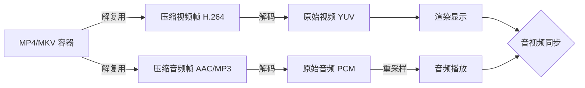
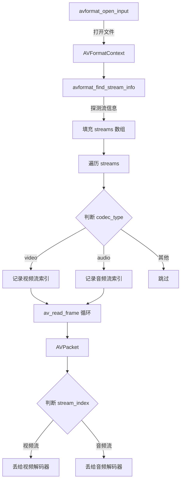

FFmpeg 命令行用熟了之后，下一步自然就是写代码。播放器本质上就是把解复用→解码→渲染这条链路用 C 代码串起来，这篇从第一环开始：**用 FFmpeg C API 打开视频文件，把里面的音视频流拆出来**。

<!-- more -->



# 容器不是"一个文件格式"

很多人说"我有个 MP4 文件"——严格来说，MP4 是一个**容器格式（Container Format）**，不是编码格式。一个 MP4 文件里可以装着 H.264 视频流 + AAC 音频流，也可以装着 H.265 + Opus，甚至可以有字幕流、章节信息。

容器的内部骨架大概是这样的：

```
┌───────────────────────────────────────────────┐
│             容器文件（如 .mp4）               │
├───────────────────────────────────────────────┤
│  Header（头信息）                              │
│  ├─ 文件类型（ftyp box）                      │
│  ├─ 时长、码率等元数据                        │
│  ├─ 各流的编码格式（video: H.264 / audio: AAC）│
│  └─ 帧索引（PTS / DTS / 文件偏移量）           │
├───────────────────────────────────────────────┤
│  Data（数据块）                               │
│  ├─ 视频帧 1（压缩的 H.264 NAL 单元）         │
│  ├─ 音频帧 1（压缩的 AAC 帧）                 │
│  ├─ 视频帧 2                                  │
│  ├─ 音频帧 2                                  │
│  └─ ...                                       │
└───────────────────────────────────────────────┘
```

**"解复用"（Demuxing）就是把交织在一起的音视频帧拆开，分别交给各自的解码器。** 这次我们用代码来做这件事。

# 第一步：打开文件，获取上下文

FFmpeg 处理文件的过程，可以理解为一个"漏斗"：最上层是容器层（`AVFormatContext`），往下是流层（`AVStream`），再往下才是编解码层（`AVCodecContext`）。

整个解复用流程如下：



先看打开文件这一步最简代码：

```c
#include <libavformat/avformat.h>
#include <stdio.h>

int main(int argc, char *argv[]) {
    const char *filename = "test.mp4";
    
    // 1. 分配 AVFormatContext
    AVFormatContext *fmt_ctx = NULL;
    
    // 2. 打开文件并解析头部信息
    int ret = avformat_open_input(&fmt_ctx, filename, NULL, NULL);
    if (ret < 0) {
        fprintf(stderr, "无法打开文件: %s\n", filename);
        return -1;
    }
    
    // 3. 探测流信息（这一步会读一部分数据来获取编码参数）
    ret = avformat_find_stream_info(fmt_ctx, NULL);
    if (ret < 0) {
        fprintf(stderr, "无法获取流信息\n");
        avformat_close_input(&fmt_ctx);
        return -1;
    }
    
    // ... 接下来遍历流 ...
    
    avformat_close_input(&fmt_ctx);
    return 0;
}
```

三个步骤，每一步都有它的职责：

**`avformat_open_input`** 做了三件事：打开文件、识别容器格式（通过文件头魔数判断是 MP4 还是 MKV 还是 FLV）、解析容器头部。这一步结束后，`fmt_ctx->nb_streams` 会告诉我们文件里有多少条流，但此时 `AVStream` 里的编码参数还不完整。

**`avformat_find_stream_info`** 会实际读一些数据包，探测每条流的编码器类型、分辨率、帧率、码率等信息。这就是为什么调完它之后我们才能拿到准确参数——容器头部不一定包含所有细节。

**`avformat_close_input`** 负责清理，释放 `AVFormatContext` 及其内部资源。

# 第二步：遍历音视频流，提取详细参数

打开文件后，`fmt_ctx->streams` 数组里每个元素都是一个 `AVStream`。我们需要从中筛选出视频流和音频流，并打印它们的参数。

```c
int video_stream_idx = -1;
int audio_stream_idx = -1;

for (int i = 0; i < fmt_ctx->nb_streams; i++) {
    AVStream *stream = fmt_ctx->streams[i];
    AVCodecParameters *codecpar = stream->codecpar;
    
    if (codecpar->codec_type == AVMEDIA_TYPE_VIDEO) {
        video_stream_idx = i;
        
        // 视频流详细信息
        printf("========== 视频流 #%d ==========\n", i);
        printf("  编码格式: %s\n", avcodec_get_name(codecpar->codec_id));
        printf("  分辨率: %d x %d\n", codecpar->width, codecpar->height);
        printf("  像素格式: %s\n", av_get_pix_fmt_name(codecpar->format));
        printf("  码率: %ld kbps\n", codecpar->bit_rate / 1000);
        
        // 帧率从 AVStream 获取（更准确）
        AVRational fps = av_guess_frame_rate(fmt_ctx, stream, NULL);
        printf("  帧率: %.2f fps (%d/%d)\n", 
               av_q2d(fps), fps.num, fps.den);
        printf("  时长: %.2f 秒\n", 
               stream->duration * av_q2d(stream->time_base));
               
    } else if (codecpar->codec_type == AVMEDIA_TYPE_AUDIO) {
        audio_stream_idx = i;
        
        // 音频流详细信息
        printf("========== 音频流 #%d ==========\n", i);
        printf("  编码格式: %s\n", avcodec_get_name(codecpar->codec_id));
        printf("  采样率: %d Hz\n", codecpar->sample_rate);
        printf("  声道数: %d\n", codecpar->ch_layout.nb_channels);
        printf("  码率: %ld kbps\n", codecpar->bit_rate / 1000);
        printf("  采样格式: %s\n", 
               av_get_sample_fmt_name(codecpar->format));
    }
}

// 打印容器级别的信息
printf("\n========== 容器信息 ==========\n");
printf("  容器格式: %s\n", fmt_ctx->iformat->long_name);
printf("  总时长: %.2f 秒\n", (double)fmt_ctx->duration / AV_TIME_BASE);
printf("  流总数: %d\n", fmt_ctx->nb_streams);
```

几个关键点需要解释一下：

**编码格式 vs 像素格式**：`codecpar->codec_id` 告诉你这条流用什么编码器（`AV_CODEC_ID_H264`、`AV_CODEC_ID_HEVC`），而 `codecpar->format` 告诉你压缩前的像素格式是什么（`AV_PIX_FMT_YUV420P` 等）。前者决定用哪个解码器，后者决定解码后数据长什么样。

**码率来自哪里**：`codecpar->bit_rate` 的值来源于容器头部的元数据。但并不是所有文件都会写这个字段——有些文件返回 0，这时候可以通过统计所有包的大小和时长来估算。

**时间基（time_base）**：`AVStream->time_base` 是一个 `AVRational`（分数），表示该流的时间单位。例如 `{1, 90000}` 表示以 1/90000 秒为一个 tick。`stream->duration` 是这个流的 tick 数，乘以 `time_base` 得到秒数。**注意**：`AVFormatContext->duration` 使用的时间基是 `AV_TIME_BASE`（固定 1/1000000 秒），和 `AVStream` 的不是同一个！

**帧率的获取技巧**：`av_guess_frame_rate` 比直接读 `stream->avg_frame_rate` 更可靠，因为它会综合容器信息、编码信息等多个来源来推算真实帧率。

# 第三步：循环读取数据包

有了流索引之后，核心循环就是不断调用 `av_read_frame`：

```c
AVPacket *pkt = av_packet_alloc();

while (av_read_frame(fmt_ctx, pkt) >= 0) {
    if (pkt->stream_index == video_stream_idx) {
        // 这是一个视频包，后续交给视频解码器
        printf("视频帧: pts=%lld, dts=%lld, size=%d, flags=%d\n",
               pkt->pts, pkt->dts, pkt->size, pkt->flags);
    } else if (pkt->stream_index == audio_stream_idx) {
        // 这是一个音频包，后续交给音频解码器
        printf("音频帧: pts=%lld, dts=%lld, size=%d\n",
               pkt->pts, pkt->dts, pkt->size);
    }
    
    av_packet_unref(pkt);  // 每次循环后释放包内数据
}

av_packet_free(&pkt);
```

关于 `AVPacket` 的几个关键字段：

| 字段 | 含义 |
|------|------|
| `pts` | Presentation Time Stamp，该帧应该在什么时刻**显示/播放** |
| `dts` | Decode Time Stamp，该帧应该在什么时刻**被解码** |
| `flags` | 标志位，`AV_PKT_FLAG_KEY` 表示这是关键帧 |
| `stream_index` | 属于哪条流 |
| `size` | 压缩数据大小（字节） |

**PTS 和 DTS 为什么可能不相等？** 因为 B 帧的存在。一个典型的 GOP 顺序可能是：

```
显示顺序（PTS）: I₀  B₁  B₂  P₃
编码/解码顺序（DTS）: I₀  P₃  B₁  B₂
```

`P₃` 需要先于 `B₁`、`B₂` 被解码（因为 B 帧参考前后的帧），所以它的 DTS 小于自己的 PTS。

# 第四步：找到并打开解码器

在实际播放器中，拿到 `AVPacket` 之后下一步是丢给解码器。先把解码器找到并打开：

```c
// 找到视频解码器
const AVCodec *video_codec = avcodec_find_decoder(
    fmt_ctx->streams[video_stream_idx]->codecpar->codec_id);
AVCodecContext *video_ctx = avcodec_alloc_context3(video_codec);
avcodec_parameters_to_context(video_ctx, 
    fmt_ctx->streams[video_stream_idx]->codecpar);
avcodec_open2(video_ctx, video_codec, NULL);

// 音频同理
const AVCodec *audio_codec = avcodec_find_decoder(
    fmt_ctx->streams[audio_stream_idx]->codecpar->codec_id);
AVCodecContext *audio_ctx = avcodec_alloc_context3(audio_codec);
avcodec_parameters_to_context(audio_ctx,
    fmt_ctx->streams[audio_stream_idx]->codecpar);
avcodec_open2(audio_ctx, audio_codec, NULL);
```

`avcodec_parameters_to_context` 是 FFmpeg 3.x+ 引入的，用来替代直接拷贝 `stream->codec`。`avcodec_find_decoder`（带 const 返回）是 4.x+ 的新 API，更老的版本用非 const 版本。

# 完整的解复用 Demo

把上面的代码串起来，一个完整的"拆包"程序：

```c
/**
 * demux_demo.c - 解复用演示：打开文件并打印所有流的参数
 * 
 * 编译命令（以 MSYS2 环境为例）:
 *   gcc -o demux_demo demux_demo.c -lavformat -lavcodec -lavutil
 */

#include <libavformat/avformat.h>
#include <libavcodec/avcodec.h>
#include <libavutil/avutil.h>
#include <stdio.h>

int main(int argc, char *argv[]) {
    if (argc < 2) {
        fprintf(stderr, "用法: %s <视频文件>\n", argv[0]);
        return 1;
    }
    
    const char *filename = argv[1];
    AVFormatContext *fmt_ctx = NULL;
    
    if (avformat_open_input(&fmt_ctx, filename, NULL, NULL) < 0) {
        fprintf(stderr, "错误: 无法打开 %s\n", filename);
        return 1;
    }
    
    if (avformat_find_stream_info(fmt_ctx, NULL) < 0) {
        fprintf(stderr, "错误: 无法获取流信息\n");
        avformat_close_input(&fmt_ctx);
        return 1;
    }
    
    // 打印 FFmpeg 版本和文件信息
    printf("FFmpeg: %s\n", av_version_info());
    printf("文件: %s\n", filename);
    printf("容器: %s\n", fmt_ctx->iformat->long_name);
    printf("时长: %.2f 秒\n", (double)fmt_ctx->duration / AV_TIME_BASE);
    printf("流数: %d\n\n", fmt_ctx->nb_streams);
    
    int video_idx = -1, audio_idx = -1;
    
    for (int i = 0; i < fmt_ctx->nb_streams; i++) {
        AVStream *st = fmt_ctx->streams[i];
        AVCodecParameters *cp = st->codecpar;
        
        if (cp->codec_type == AVMEDIA_TYPE_VIDEO) {
            video_idx = i;
            
            printf("━━━ 视频流 #%d ━━━\n", i);
            printf("  编码器: %s (id=%d)\n", 
                   avcodec_get_name(cp->codec_id), cp->codec_id);
            printf("  分辨率: %d × %d\n", cp->width, cp->height);
            printf("  像素格式: %s\n", av_get_pix_fmt_name(cp->format));
            
            if (cp->bit_rate > 0)
                printf("  码率: %ld kbps\n", cp->bit_rate / 1000);
            
            AVRational fps = av_guess_frame_rate(fmt_ctx, st, NULL);
            printf("  帧率: %.2f fps\n", av_q2d(fps));
            
            printf("  时间基: %d/%d\n", 
                   st->time_base.num, st->time_base.den);
            
            if (st->duration != AV_NOPTS_VALUE)
                printf("  流时长: %.2f 秒\n", 
                       st->duration * av_q2d(st->time_base));
            
            printf("  总帧数: %lld\n\n", st->nb_frames);
            
        } else if (cp->codec_type == AVMEDIA_TYPE_AUDIO) {
            audio_idx = i;
            
            printf("━━━ 音频流 #%d ━━━\n", i);
            printf("  编码器: %s\n", avcodec_get_name(cp->codec_id));
            printf("  采样率: %d Hz\n", cp->sample_rate);
            printf("  声道数: %d\n", cp->ch_layout.nb_channels);
            printf("  采样格式: %s\n", 
                   av_get_sample_fmt_name(cp->format));
            
            if (cp->bit_rate > 0)
                printf("  码率: %ld kbps\n", cp->bit_rate / 1000);
            printf("\n");
        }
    }
    
    // 尝试读取前 10 个包，展示 PTS/DTS
    if (video_idx >= 0 || audio_idx >= 0) {
        printf("━━━ 读取前 10 个数据包 ━━━\n");
        AVPacket *pkt = av_packet_alloc();
        int count = 0;
        
        while (count < 10 && av_read_frame(fmt_ctx, pkt) >= 0) {
            const char *type = (pkt->stream_index == video_idx) 
                ? "视频" 
                : (pkt->stream_index == audio_idx) ? "音频" : "其他";
            
            printf("#%d [%s] pts=%lld dts=%lld size=%d key=%d\n",
                   count, type, pkt->pts, pkt->dts,
                   pkt->size,
                   (pkt->flags & AV_PKT_FLAG_KEY) ? 1 : 0);
            
            av_packet_unref(pkt);
            count++;
        }
        
        av_packet_free(&pkt);
    }
    
    avformat_close_input(&fmt_ctx);
    return 0;
}
```

运行效果大概长这样：

```
FFmpeg: 6.1.1
文件: sample.mp4
容器: QuickTime / MOV
时长: 120.50 秒
流数: 2

━━━ 视频流 #0 ━━━
  编码器: h264 (id=27)
  分辨率: 1920 × 1080
  像素格式: yuv420p
  码率: 5000 kbps
  帧率: 30.00 fps
  时间基: 1/90000
  流时长: 120.50 秒
  总帧数: 3615

━━━ 音频流 #1 ━━━
  编码器: aac (id=86018)
  采样率: 44100 Hz
  声道数: 2
  采样格式: fltp
  码率: 192 kbps

━━━ 读取前 10 个数据包 ━━━
#0 [视频] pts=0 dts=0 size=45230 key=1
#1 [音频] pts=0 dts=0 size=384 key=1
#2 [视频] pts=3000 dts=6000 size=8234 key=0
#3 [音频] pts=1024 dts=1024 size=412 key=1
...
```

# 关键概念 PTS/DTS/Time Base 全家桶

对于刚接触 FFmpeg 的人来说，这三个概念经常搅在一起。我们用一句话理清：

```
真实时间（秒） = PTS × time_base
```

其中 `time_base` 是一个分数，分子和分母分别存储在 `AVRational` 的 `num` 和 `den` 里。FFmpeg 提供了 `av_q2d` 把分数转成浮点数，也可以直接用 `av_rescale_q` 在不同 time_base 之间做无损转换：

```c
// 把 PTS 从流的时间基转换到毫秒
int64_t pts_ms = av_rescale_q(pkt->pts, 
    fmt_ctx->streams[pkt->stream_index]->time_base,
    (AVRational){1, 1000});
```

**为什么 FFmpeg 搞这么复杂？** 因为不同编码标准的历史时间单位不一样。MPEG 传统上使用 90kHz 时钟（`{1, 90000}`），而 AAC 一帧严格是 1024 个采样点，所以它的 time_base 是 `{1, sample_rate}`。用分数而非浮点数存储，可以避免累积误差——`av_rescale_q` 用的是 64 位整数运算，零精度损失。

# 小结

本文完成了播放器 Pipeline 的第一环：**打开容器 → 识别流 → 提取参数 → 读取数据包**。核心 API 就这几个：

| API | 作用 |
|-----|------|
| `avformat_open_input` | 打开文件，识别容器格式 |
| `avformat_find_stream_info` | 探测流参数 |
| `av_read_frame` | 循环读取 AVPacket |
| `av_packet_unref` | 释放包内数据 |
| `avcodec_find_decoder` | 根据 codec_id 找解码器 |
| `avcodec_alloc_context3` / `avcodec_open2` | 初始化解码上下文 |

现在你手里已经有了**每条流的完整参数**和**一帧一帧的压缩数据**。但 AVPacket 里装的还是 H.264 NAL 单元和 AAC 压缩帧——屏幕没法直接显示，喇叭也没法直接播放。下一篇，我们把这些包**喂给解码器**，拿到真正的原始像素和 PCM 音频数据，然后画到屏幕上。
