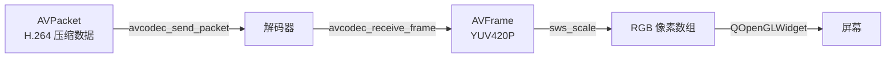
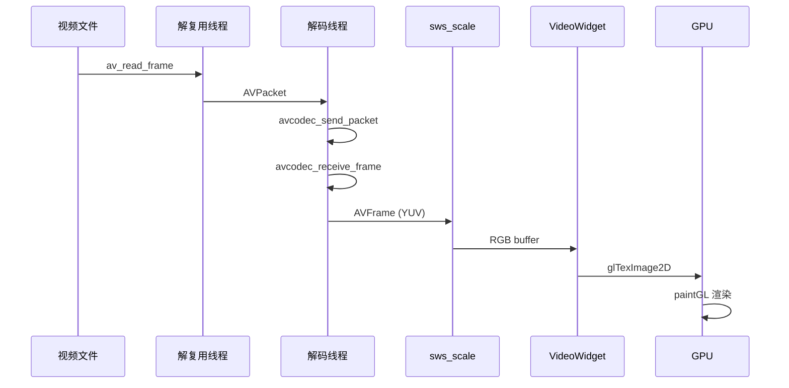

[上一篇](/2026/07/20/本地播放器开发（1）：容器与解复用/) 我们把视频文件拆开了——拿到了 H.264 压缩包（`AVPacket`）和每条流的详细参数。但压缩包里的 NAL 单元离屏幕上的像素还差着十万八千里。这一篇，我们把中间的两步补上：**解码出原始像素**，然后**画到屏幕上**。

<!-- more -->



# 解码模型：生产者-消费者

FFmpeg 的编解码 API 从 3.x 开始统一成了一套**发送-接收**模型：

```
send_packet  →  [解码器内部队列]  →  receive_frame
```

你往解码器里塞压缩包（`AVPacket`），解码器内部缓冲、解码、重排序，然后你往外拿原始帧（`AVFrame`）。这个设计有两个好处：

1. **解耦输入输出**：一个 `send` 不一定对应一个 `receive`。B 帧场景下一次 `send` 可能要等后面的包到了才能吐出帧；反过来，一次 `send` 也可能吐出多帧（比如音频解码器）。
2. **异步友好**：后续做硬件解码时，这个模型天然支持流水线。

用代码表示就是：

```c
// 送一个压缩包进去
int ret = avcodec_send_packet(codec_ctx, pkt);

// 收一帧原始数据出来（可能要多收几次直到 EAGAIN）
while (ret >= 0) {
    ret = avcodec_receive_frame(codec_ctx, frame);
    if (ret == AVERROR(EAGAIN) || ret == AVERROR_EOF)
        break;
    // frame 里就是解码后的数据，拿去处理
}
```

关键返回值：

| 返回值 | 含义 |
|--------|------|
| `0` | 成功，`frame` 中有一帧可用的数据 |
| `AVERROR(EAGAIN)` | 需要继续喂包才能产出帧 |
| `AVERROR_EOF` | 解码器已清空，不会再有输出 |

# 从解复用到解码的完整循环

把上一篇的 `av_read_frame` 和这里的解码衔接起来：

```c
// 前提：fmt_ctx 和 video_codec_ctx 已经初始化好
AVPacket *pkt = av_packet_alloc();
AVFrame *frame = av_frame_alloc();

while (av_read_frame(fmt_ctx, pkt) >= 0) {
    if (pkt->stream_index != video_stream_idx) {
        av_packet_unref(pkt);
        continue;   // 跳过音频包，本篇只处理视频
    }

    // 送入解码器
    int ret = avcodec_send_packet(video_codec_ctx, pkt);
    av_packet_unref(pkt);   // send 之后就可以释放了
    
    if (ret < 0) {
        fprintf(stderr, "send_packet 失败\n");
        break;
    }

    // 尝试取出解码后的帧
    while (ret >= 0) {
        ret = avcodec_receive_frame(video_codec_ctx, frame);
        if (ret == AVERROR(EAGAIN) || ret == AVERROR_EOF)
            break;
        if (ret < 0) {
            fprintf(stderr, "receive_frame 失败\n");
            goto cleanup;
        }

        // ====== frame 里是解码后的 YUV 数据 ======
        printf("解码一帧: pts=%lld, %dx%d, format=%s\n",
               frame->pts, frame->width, frame->height,
               av_get_pix_fmt_name(frame->format));
        
        // TODO: 这里把 YUV 转成 RGB 然后渲染
    }
}

// 缓冲冲洗：塞一个空包告诉解码器"没更多数据了"
avcodec_send_packet(video_codec_ctx, NULL);
while (avcodec_receive_frame(video_codec_ctx, frame) >= 0) {
    // 处理解码器缓冲中剩余的帧
}

cleanup:
av_frame_free(&frame);
av_packet_free(&pkt);
```

**缓冲冲洗**是很容易漏的一步。解码器内部有缓冲（B 帧重排序、多线程解码延迟），读完文件后你送了 `n` 个包，但 decode 可能还扣着几帧没吐出来。塞一个 `NULL` 包相当于告诉解码器"散场了，把兜里的都交出来"。

# YUV 是什么，为什么需要转 RGB

解码出来的 `AVFrame->data` 里存的不是 RGB 像素，而是 YUV 格式。绝大部分视频的 YUV 是 **YUV420P**，它的内存布局长这样：

```
Y 平面（W×H）:   YYYYYYYY   ← 每个像素一个亮度值
U 平面（W/2×H/2）: UUUU     ← 每 2×2 个像素共享一个色度
V 平面（W/2×H/2）: VVVV
```

也就是说一个 1920×1080 的 YUV420P 帧，总字节数是：

```
1920×1080 + 960×540 + 960×540 = 3,110,400 字节 ≈ 3 MB
```

而同样的帧存成 RGB24 是 `1920×1080×3 = 6,220,800` 字节。YUV420P 省了一半空间，这也是为什么视频编码都在 YUV 域操作——人眼对亮度敏感、对色度迟钝，压缩色度不会明显影响观感。

但屏幕只认 RGB。所以解码之后必须做一次色彩空间转换。FFmpeg 用 `libswscale` 干这件事：

```c
#include <libswscale/swscale.h>

// 1. 创建转换上下文
SwsContext *sws_ctx = sws_getContext(
    codec_ctx->width, codec_ctx->height, codec_ctx->pix_fmt,  // 源：YUV420P
    codec_ctx->width, codec_ctx->height, AV_PIX_FMT_RGB24,    // 目标：RGB24
    SWS_BILINEAR,   // 缩放算法
    NULL, NULL, NULL
);

// 2. 准备目标缓冲
int rgb_size = av_image_get_buffer_size(AV_PIX_FMT_RGB24, 
                                         codec_ctx->width, codec_ctx->height, 1);
uint8_t *rgb_buffer = (uint8_t *)av_malloc(rgb_size);

// 3. 构造目标 AVFrame（或直接用 linesize 数组）
uint8_t *dst_data[4] = { rgb_buffer, NULL, NULL, NULL };
int dst_linesize[4] = { codec_ctx->width * 3, 0, 0, 0 };  // RGB24 每像素 3 字节

// 4. 执行转换
sws_scale(sws_ctx,
    (const uint8_t *const *)frame->data,    // 源：YUV 三平面
    frame->linesize,                         // 源：每行步长
    0,                                       // 从第 0 行开始
    codec_ctx->height,                       // 处理全部行
    dst_data,                                // 目标：RGB 一维数组
    dst_linesize);                           // 目标：每行步长
```

`linesize` 是个容易踩的坑。它的值**可能大于** `width × 字节数`——FFmpeg 为了内存对齐会补 padding。比如 1918 像素宽的 YUV 帧，`linesize[0]` 可能是 1920（对齐到 32 的倍数）。**始终用 `frame->linesize[]` 而不是自己算**，否则画面会出现诡异的斜条纹。

`sws_getContext` 的缩放算法选择：

| 算法 | 速度 | 质量 | 适用场景 |
|------|------|------|----------|
| `SWS_FAST_BILINEAR` | 极快 | 一般 | 实时预览 |
| `SWS_BILINEAR` | 快 | 尚可 | 播放器默认选择 |
| `SWS_BICUBIC` | 中 | 好 | 缩放较大时 |
| `SWS_LANCZOS` | 慢 | 最好 | 非实时转码 |

播放器场景一律用 `SWS_BILINEAR` 或 `SWS_FAST_BILINEAR`，画质差异肉眼不可见但 CPU 消耗差不少。

# 渲染：把 RGB 像素推到屏幕上

有了 RGB 像素数组，最后一步是让它出现在窗口里。Qt 的 `QOpenGLWidget` 是最灵活的方式——直接用 OpenGL 纹理上传，绕过了 CPU 侧的数据拷贝。

核心思路：**把 RGB 像素上传到 OpenGL 纹理，然后用一个全屏四边形把纹理贴出来。**

```cpp
// video_widget.h
#include <QOpenGLWidget>
#include <QOpenGLFunctions>
#include <QOpenGLShaderProgram>

class VideoWidget : public QOpenGLWidget, protected QOpenGLFunctions {
    Q_OBJECT
public:
    explicit VideoWidget(QWidget *parent = nullptr);
    
    // 外部喂入一帧 RGB 数据
    void updateFrame(const uint8_t *rgbData, int width, int height);

protected:
    void initializeGL() override;
    void resizeGL(int w, int h) override;
    void paintGL() override;

private:
    GLuint m_texture = 0;
    uint8_t *m_frameData = nullptr;
    int m_frameWidth = 0;
    int m_frameHeight = 0;
    bool m_frameReady = false;
    QMutex m_mutex;
    
    QOpenGLShaderProgram *m_program = nullptr;
    GLuint m_vao = 0, m_vbo = 0, m_ebo = 0;
};
```

```cpp
// video_widget.cpp
#include "video_widget.h"

VideoWidget::VideoWidget(QWidget *parent) : QOpenGLWidget(parent) {}

void VideoWidget::initializeGL() {
    initializeOpenGLFunctions();
    
    // 创建纹理
    glGenTextures(1, &m_texture);
    glBindTexture(GL_TEXTURE_2D, m_texture);
    glTexParameteri(GL_TEXTURE_2D, GL_TEXTURE_MIN_FILTER, GL_LINEAR);
    glTexParameteri(GL_TEXTURE_2D, GL_TEXTURE_MAG_FILTER, GL_LINEAR);
    glTexParameteri(GL_TEXTURE_2D, GL_TEXTURE_WRAP_S, GL_CLAMP_TO_EDGE);
    glTexParameteri(GL_TEXTURE_2D, GL_TEXTURE_WRAP_T, GL_CLAMP_TO_EDGE);
    
    // 最简单的 shader：顶点 + 纹理采样
    const char *vertexShader = R"(
        #version 330 core
        layout(location = 0) in vec2 aPos;
        layout(location = 1) in vec2 aTexCoord;
        out vec2 vTexCoord;
        void main() {
            gl_Position = vec4(aPos, 0.0, 1.0);
            vTexCoord = aTexCoord;
        }
    )";
    
    const char *fragmentShader = R"(
        #version 330 core
        in vec2 vTexCoord;
        out vec4 FragColor;
        uniform sampler2D uTexture;
        void main() {
            FragColor = texture(uTexture, vTexCoord);
        }
    )";
    
    m_program = new QOpenGLShaderProgram(this);
    m_program->addShaderFromSourceCode(QOpenGLShader::Vertex, vertexShader);
    m_program->addShaderFromSourceCode(QOpenGLShader::Fragment, fragmentShader);
    m_program->link();
    
    // 全屏四边形的顶点数据（NDC 坐标 + 纹理坐标）
    float vertices[] = {
        // pos      // texCoord
        -1.0f,  1.0f,  0.0f, 0.0f,   // 左上
         1.0f,  1.0f,  1.0f, 0.0f,   // 右上
         1.0f, -1.0f,  1.0f, 1.0f,   // 右下
        -1.0f, -1.0f,  0.0f, 1.0f,   // 左下
    };
    unsigned int indices[] = { 0, 1, 2, 0, 2, 3 };
    
    glGenVertexArrays(1, &m_vao);
    glGenBuffers(1, &m_vbo);
    glGenBuffers(1, &m_ebo);
    
    glBindVertexArray(m_vao);
    glBindBuffer(GL_ARRAY_BUFFER, m_vbo);
    glBufferData(GL_ARRAY_BUFFER, sizeof(vertices), vertices, GL_STATIC_DRAW);
    glBindBuffer(GL_ELEMENT_ARRAY_BUFFER, m_ebo);
    glBufferData(GL_ELEMENT_ARRAY_BUFFER, sizeof(indices), indices, GL_STATIC_DRAW);
    
    // 顶点属性
    glVertexAttribPointer(0, 2, GL_FLOAT, GL_FALSE, 4 * sizeof(float), (void*)0);
    glEnableVertexAttribArray(0);
    glVertexAttribPointer(1, 2, GL_FLOAT, GL_FALSE, 4 * sizeof(float), (void*)(2 * sizeof(float)));
    glEnableVertexAttribArray(1);
}

void VideoWidget::resizeGL(int w, int h) {
    glViewport(0, 0, w, h);
}

void VideoWidget::paintGL() {
    glClear(GL_COLOR_BUFFER_BIT);
    
    QMutexLocker locker(&m_mutex);
    if (!m_frameReady || !m_frameData) return;
    
    // 上传 RGB 数据到纹理
    glBindTexture(GL_TEXTURE_2D, m_texture);
    glTexImage2D(GL_TEXTURE_2D, 0, GL_RGB, 
                 m_frameWidth, m_frameHeight, 0,
                 GL_RGB, GL_UNSIGNED_BYTE, m_frameData);
    
    // 绑定 shader 并绘制全屏四边形
    m_program->bind();
    glBindVertexArray(m_vao);
    glDrawElements(GL_TRIANGLES, 6, GL_UNSIGNED_INT, 0);
    
    m_frameReady = false;
}

void VideoWidget::updateFrame(const uint8_t *rgbData, int width, int height) {
    QMutexLocker locker(&m_mutex);
    
    int size = width * height * 3;  // RGB24
    if (m_frameWidth != width || m_frameHeight != height) {
        delete[] m_frameData;
        m_frameData = new uint8_t[size];
        m_frameWidth = width;
        m_frameHeight = height;
    }
    
    memcpy(m_frameData, rgbData, size);
    m_frameReady = true;
    locker.unlock();
    
    // 触发重绘（必须在主线程调用）
    QMetaObject::invokeMethod(this, "update", Qt::QueuedConnection);
}
```

几个值得提的点：

**QMutex 防护**：`updateFrame` 通常从解码线程调用，`paintGL` 在 GUI 线程，不加速画面会撕裂。这里用互斥锁保护帧缓冲是最简单的方案。追求更低的延迟可以用双缓冲（两个 buffer 交替写入/显示）。

**QMetaObject::invokeMethod + QueuedConnection**：`update()` 方法只能在主线程调用，解码线程跨线程调度必须走 Qt 的事件队列。

**纹理尺寸不变时不重新分配**：解码过程中分辨率不会变，所以只在首帧或分辨率切换时分配内存，避免反复 `new/delete`。

# 跑起来的完整流程

把前面的零件组装起来：



在实际实现中，解复用和解码不一定拆成两个线程，但解码和渲染**必须**在不同线程——OpenGL 操作必须跑在 Qt 主线程（GUI 线程）。

# 性能考量

1080p@30fps 的解码 + YUV 转 RGB + 纹理上传，CPU 消耗大概在 15%~30%（取决于 CPU 型号和是否开启硬件解码）。几个优化方向：

**1. 用 `SWS_FAST_BILINEAR`**：播放场景下 `SWS_BILINEAR` 和 `SWS_FAST_BILINEAR` 肉眼无差，但后者快不少。

**2. 直接渲染 YUV**：RGB 转换可以完全绕开 CPU。在 shader 里把 YUV 三个平面分别上传为三张纹理，在 fragment shader 中做 YUV→RGB 转换：

```glsl
// 在 GPU 端做 YUV→RGB 转换，省掉 sws_scale
uniform sampler2D uTextureY;
uniform sampler2D uTextureU;
uniform sampler2D uTextureV;

void main() {
    float y = texture(uTextureY, vTexCoord).r;
    float u = texture(uTextureU, vTexCoord).r - 0.5;
    float v = texture(uTextureV, vTexCoord).r - 0.5;
    
    float r = y + 1.402 * v;
    float g = y - 0.344136 * u - 0.714136 * v;
    float b = y + 1.772 * u;
    
    FragColor = vec4(r, g, b, 1.0);
}
```

这样 CPU 端完全跳过 `sws_scale`，只需要做三次 `glTexImage2D`（Y、U、V 三个平面）。对 4K 视频效果尤为明显。

**3. 硬件解码**：用 `avcodec_find_decoder_by_name("h264_cuvid")`（NVIDIA）或 `h264_d3d11va`（Windows 原生）把解码也搬到 GPU。但这属于进阶话题，另文展开。

**4. 用 PBO（Pixel Buffer Object）做异步纹理上传**：默认 `glTexImage2D` 是同步的，传大纹理时 GPU 管线会 stall。PBO 可以让数据传输异步化，解码线程写到 PBO，渲染线程再从 PBO 读到纹理。

# 小结

本文串起了视频解码和渲染的完整链路：

| 步骤 | API | 输入 | 输出 |
|------|-----|------|------|
| 喂包 | `avcodec_send_packet` | `AVPacket`（H.264 NAL） | — |
| 收帧 | `avcodec_receive_frame` | — | `AVFrame`（YUV） |
| 色转 | `sws_scale` | YUV 三平面 | RGB 一维数组 |
| 上传 | `glTexImage2D` | RGB buffer | GPU 纹理 |
| 显示 | `paintGL` | 纹理 | 屏幕 |

有了画面之后，播放器还缺最后一块拼图——声音。下一篇处理音频解码和播放。
