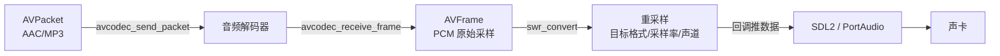
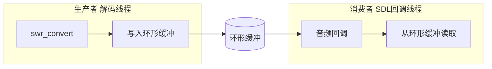

[上一篇](/2026/07/20/本地播放器开发（2）：视频解码与渲染/) 把画面搞定了。但一个没有声音的播放器，跟看默片差不多。这篇把音频链路补上：**解码音频包 → 重采样 → 推给声卡播放**。

<!-- more -->



# 音频解码：同一套 API，不同的细节

音频解码和视频解码共用 `avcodec_send_packet` / `avcodec_receive_frame` 那套接口，但有两个本质区别：

**第一，一个 AVPacket 可能解码出多个 AVFrame。** 视频里这只会发生在 B 帧重排序时；音频则几乎每个包都能解出多帧——AAC 一包通常装 1024 个采样点，MP3 一包 1152 个采样点，解码器一次吐一帧给你。

**第二，AVFrame 的 data 布局完全不同。** 视频是平面结构（Y、U、V 分开），音频根据采样格式分为 packed 和 planar 两种：

```
Packed（交错）:     LRLRLRLR...     ← 所有声道交错排列
Planar（平面）:     LLLLL... RRRR... ← 每个声道独立一段
```

FFmpeg 解码器默认输出的是 **planar** 格式（`AV_SAMPLE_FMT_FLTP`），而声卡通常要 **packed** 格式（`AV_SAMPLE_FMT_S16`）。这就是 libswresample 要解决的核心问题之一。

解出 PCM 数据的代码：

```c
AVCodecContext *audio_ctx;   // 已初始化的音频解码器上下文
AVFrame *frame = av_frame_alloc();

while (1) {
    int ret = avcodec_receive_frame(audio_ctx, frame);
    if (ret == AVERROR(EAGAIN) || ret == AVERROR_EOF)
        break;
    if (ret < 0) {
        fprintf(stderr, "音频解码失败\n");
        break;
    }

    // frame 里的关键字段：
    printf("PCM 帧: %d 个采样点, %d Hz, %d 声道, 格式=%s\n",
           frame->nb_samples,      // 这一帧有多少个采样点
           frame->sample_rate,     // 采样率
           frame->ch_layout.nb_channels,  // 声道数
           av_get_sample_fmt_name(frame->format));

    // 每个声道的数据在 frame->data[ch] 里
    // 每个采样点的字节数 = av_get_bytes_per_sample(frame->format)
}
```

`frame->nb_samples` 是理解音频帧的钥匙。视频帧以"一张完整的画面"为单位，音频帧以"一段连续的采样点"为单位。解码器每次吐出一段采样点，播放器要做的就是把这些采样点按正确的节奏（采样率时钟）喂给声卡。

# libswresample：音频数据格式的"万向接头"

解码出来的 PCM 数据格式千奇百怪：采样率可能是 44100、48000、96000，采样格式可能是 FLTP、S16P、S32P，声道可能是单声道、立体声、5.1。声卡只认 S16（16 位有符号整数）打包格式，所以必须做重采样。

```c
#include <libswresample/swresample.h>

// 1. 创建重采样上下文
SwrContext *swr = swr_alloc();
av_opt_set_int(swr, "in_channel_count",    audio_ctx->ch_layout.nb_channels, 0);
av_opt_set_int(swr, "in_sample_rate",      audio_ctx->sample_rate, 0);
av_opt_set_sample_fmt(swr, "in_sample_fmt", audio_ctx->sample_fmt, 0);
av_opt_set_int(swr, "out_channel_count",   2, 0);             // 输出立体声
av_opt_set_int(swr, "out_sample_rate",     44100, 0);         // 输出 44.1kHz
av_opt_set_sample_fmt(swr, "out_sample_fmt", AV_SAMPLE_FMT_S16, 0);  // 输出 S16 packed
swr_init(swr);

// 2. 分配输出缓冲
// 一帧最多输出多少采样点 = 输出采样率 × 一帧时长
// 保守起见取输入帧大小的两倍
int max_out_samples = frame->nb_samples * 2;
uint8_t *out_buffer = NULL;
av_samples_alloc(&out_buffer, NULL, 2, max_out_samples,
                 AV_SAMPLE_FMT_S16, 0);

// 3. 执行重采样
int out_samples = swr_convert(swr,
    &out_buffer, max_out_samples,            // 输出
    (const uint8_t **)frame->data, frame->nb_samples);  // 输入

// out_samples 是实际输出的采样点数量
// 输出数据的总字节数 = out_samples × 声道数 × 每采样字节数
int out_size = out_samples * 2 * av_get_bytes_per_sample(AV_SAMPLE_FMT_S16);

printf("输入 %d 采样点 → 重采样后 %d 采样点, %d 字节\n",
       frame->nb_samples, out_samples, out_size);
```

`swr_convert` 返回的值**可能不等于输入采样点数量**。比如 48000→44100 降采样时，输出的采样点数会比输入少。所以必须用返回值计算实际输出的数据长度，不能直接用输入值推算。

为什么输出格式选 `AV_SAMPLE_FMT_S16`？因为它是几乎所有声卡 API 都能直接消费的格式：
- SDL2 的音频回调默认就是 S16
- PortAudio 的 `paInt16` 也对应 S16
- Windows 的 WaveOut / WASAPI 都原生支持

如果想追求更高音质，可以用 `AV_SAMPLE_FMT_S32`（32 位），但大多数播放场景 S16 足够了——CD 音质就是 44.1kHz / 16bit。

# 方案一：SDL2 音频播放

SDL2 是最简单的方案，几行代码就能让声音响起来。核心思路是：**SDL 开一个音频回调线程，定时问你要数据，你把解码好的 PCM 填进去。**

```c
#include <SDL2/SDL.h>

// ──── 全局缓冲（音频回调和生产者的共享区）────
#define AUDIO_BUF_SIZE (192000)  // 约 2 秒的 48kHz 立体声 S16
static uint8_t audio_buf[AUDIO_BUF_SIZE];
static int audio_buf_write_pos = 0;  // 生产者写入位置
static int audio_buf_read_pos  = 0;  // 消费者读取位置
static SDL_mutex *audio_mutex = NULL;

// ──── SDL 音频回调（跑在独立线程）────
void audio_callback(void *userdata, Uint8 *stream, int len) {
    SDL_LockMutex(audio_mutex);
    
    // 计算可读取的数据量
    int available = audio_buf_write_pos - audio_buf_read_pos;
    if (available < 0) available += AUDIO_BUF_SIZE;
    
    int copy_len = (len < available) ? len : available;
    
    if (copy_len > 0) {
        // 环形缓冲拷贝（一次读取不跨越末尾）
        int first_chunk = copy_len;
        if (audio_buf_read_pos + first_chunk > AUDIO_BUF_SIZE)
            first_chunk = AUDIO_BUF_SIZE - audio_buf_read_pos;
        
        memcpy(stream, audio_buf + audio_buf_read_pos, first_chunk);
        if (copy_len > first_chunk)
            memcpy(stream + first_chunk, audio_buf, copy_len - first_chunk);
        
        audio_buf_read_pos = (audio_buf_read_pos + copy_len) % AUDIO_BUF_SIZE;
    }
    
    // 剩余部分填静音，避免爆音
    if (copy_len < len)
        memset(stream + copy_len, 0, len - copy_len);
    
    SDL_UnlockMutex(audio_mutex);
}

// ──── 初始化 SDL 音频 ────
SDL_AudioSpec want, have;
SDL_zero(want);
want.freq     = 44100;            // 采样率
want.format   = AUDIO_S16SYS;     // S16，自动适配大小端
want.channels = 2;                // 立体声
want.samples  = 1024;             // 每次回调取多少采样点
want.callback = audio_callback;

SDL_AudioDeviceID dev = SDL_OpenAudioDevice(NULL, 0, &want, &have,
    SDL_AUDIO_ALLOW_FREQUENCY_CHANGE);
// have 里的是设备实际支持的参数，用它而非 want

SDL_PauseAudioDevice(dev, 0);  // 开始播放（0=播放，1=暂停）
```

环形缓冲区是音频播放的经典模式。生产者和消费者跑在不同线程，通过环形缓冲解耦：



生产者往缓冲尾部写，消费者从头部读。SDK 的 `audio_callback` 是按需调用的——SDL 内部维护了一个小的硬件缓冲，快播完时自动回调你要新数据。

**将重采样后的数据写入缓冲**：

```c
void feed_audio_data(uint8_t *pcm_data, int pcm_size) {
    SDL_LockMutex(audio_mutex);
    
    int space = audio_buf_read_pos - audio_buf_write_pos - 1;
    if (space < 0) space += AUDIO_BUF_SIZE;
    
    if (pcm_size <= space) {
        int first_chunk = pcm_size;
        if (audio_buf_write_pos + first_chunk > AUDIO_BUF_SIZE)
            first_chunk = AUDIO_BUF_SIZE - audio_buf_write_pos;
        
        memcpy(audio_buf + audio_buf_write_pos, pcm_data, first_chunk);
        if (pcm_size > first_chunk)
            memcpy(audio_buf, pcm_data + first_chunk, pcm_size - first_chunk);
        
        audio_buf_write_pos = (audio_buf_write_pos + pcm_size) % AUDIO_BUF_SIZE;
    } else {
        // 缓冲满了，丢帧（比卡顿更不容易被察觉）
        printf("音频缓冲溢出，丢弃 %d 字节\n", pcm_size);
    }
    
    SDL_UnlockMutex(audio_mutex);
}
```

# 方案二：PortAudio 音频播放

PortAudio 比 SDL2 更底层、跨平台更彻底（SDK 2 的音频部分是可选的），但 API 也更啰嗦。核心逻辑完全一样——注册回调、充缓冲：

```c
#include <portaudio.h>

typedef struct {
    uint8_t *ring_buf;
    int buf_size;
    int write_pos;
    int read_pos;
    pthread_mutex_t mutex;  // PortAudio 用 pthread，不是 SDL_mutex
} AudioRingBuf;

static int pa_callback(const void *input, void *output,
                       unsigned long frameCount,
                       const PaStreamCallbackTimeInfo *timeInfo,
                       PaStreamCallbackFlags statusFlags,
                       void *userData) {
    AudioRingBuf *buf = (AudioRingBuf *)userData;
    int bytes_needed = frameCount * 2 * 2;  // 立体声 S16
    
    pthread_mutex_lock(&buf->mutex);
    
    int available = buf->write_pos - buf->read_pos;
    if (available < 0) available += buf->buf_size;
    
    int copy_len = (bytes_needed < available) ? bytes_needed : available;
    // ... 环形缓冲拷贝逻辑（与 SDL2 版本完全相同）...
    
    if (copy_len < bytes_needed)
        memset((uint8_t *)output + copy_len, 0, bytes_needed - copy_len);
    
    pthread_mutex_unlock(&buf->mutex);
    return paContinue;
}

// 初始化 PortAudio
Pa_Initialize();
PaStream *stream;
Pa_OpenDefaultStream(&stream, 0, 2, paInt16, 44100,
                      1024, pa_callback, &ring_buf);
Pa_StartStream(stream);
```

PortAudio 和 SDL2 选哪个？

| | SDL2 | PortAudio |
|------|------|------|
| API 简洁度 | 高，几行出声音 | 中，回调签名较复杂 |
| 初期化复杂度 | `SDL_Init(SDL_INIT_AUDIO)` | `Pa_Initialize()` |
| 平台支持 | Win/Mac/Linux/Android/iOS | 更广泛（含嵌入式） |
| 依赖体积 | 较大（含图形/输入等） | 极小，纯音频 |
| 适合场景 | 项目已用 SDL2 做窗口/输入 | 纯音频应用或不想依赖 SDL2 |

如果项目已经用 SDL2 做了窗口和事件循环，直接用 SDL2 的音频就行，别多引一个库。如果渲染用的是 Qt/GLFW 之类，PortAudio 更轻量。

# 音频的时钟：sample_rate 就是计时器

视频有 PTS 来告诉播放器"这帧应该在什么时刻显示"。音频有没有？有，但通常不需要显式处理——**音频的采样率本身就是时钟**。

```
第 N 个采样点的播放时间 = N / sample_rate 秒
```

声卡以恒定速率消费采样点，只要数据不断流，音频的播放速度就天然正确。这就是为什么音频同步中通常以音频时钟作为主时钟——它由硬件晶振驱动，最稳定、最不会飘。

# 完整链路：从文件到声卡

把解复用（第一篇）、音频解码、重采样、SDL2 播放串起来：

```c
// 伪代码——展示完整链路
void play_audio(const char *filename) {
    // 1. 打开文件、找到音频流（第一篇）
    AVFormatContext *fmt_ctx = NULL;
    avformat_open_input(&fmt_ctx, filename, NULL, NULL);
    avformat_find_stream_info(fmt_ctx, NULL);
    
    // 2. 打开音频解码器
    AVCodecContext *codec_ctx = avcodec_alloc_context3(audio_codec);
    avcodec_open2(codec_ctx, audio_codec, NULL);
    
    // 3. 初始化重采样器
    SwrContext *swr = ...; //（见上文）
    
    // 4. 初始化 SDL2 音频设备
    SDL_OpenAudioDevice(...);
    SDL_PauseAudioDevice(dev, 0);
    
    // 5. 主循环：读包 → 解码 → 重采样 → 喂缓冲
    AVPacket *pkt = av_packet_alloc();
    AVFrame *frame = av_frame_alloc();
    
    while (av_read_frame(fmt_ctx, pkt) >= 0) {
        if (pkt->stream_index != audio_stream_idx) {
            av_packet_unref(pkt);
            continue;
        }
        
        avcodec_send_packet(codec_ctx, pkt);
        av_packet_unref(pkt);
        
        while (avcodec_receive_frame(codec_ctx, frame) >= 0) {
            // 重采样
            int out_samples = swr_convert(swr, &out_buf, max_out,
                                          frame->data, frame->nb_samples);
            int out_bytes = out_samples * 2 * 2;
            
            // 喂入环形缓冲
            feed_audio_data(out_buf, out_bytes);
        }
    }
    
    // 6. 缓冲冲洗
    avcodec_send_packet(codec_ctx, NULL);
    while (avcodec_receive_frame(codec_ctx, frame) >= 0) {
        // 处理残余帧（同上）
    }
    
    // 7. 等声音播完再退出
    SDL_Delay(1000);  // 简单粗暴；更好的做法是等缓冲排空
}
```

# 踩坑指南

**1. planar 到 packed 的陷阱。** `swr_convert` 的输出缓冲要预先分配。输入是 planar 时 `frame->data[0]` 和 `frame->data[1]` 是两块分开的内存，而输出是 packed 时只需要一个 `out_buffer`。别搞混。

**2. 环形缓冲的读指针不能超过写指针。** 音频回调里 `available` 计算出负数的情况——这说明缓冲"空了"，只能填静音。反过来，生产者写入时发现缓冲满了，直接丢帧比卡顿更不易察觉。

**3. SDL_PauseAudioDevice(dev, 0) 参数含义反直觉。** `0` = 播放，`1` = 暂停。别写反了。

**4. SDL_OpenAudioDevice 的 want vs have。** `want` 是你期望的参数，`have` 是设备实际支持的参数。记得用 `have`，否则你可能以为自己在播 44100Hz 但实际是 48000Hz——声音会变调。

**5. 别忘了初始化 SDL。** `SDL_Init(SDL_INIT_AUDIO)` 必须在 `SDL_OpenAudioDevice` 之前调用，否则会得到毫无帮助的段错误。

# 小结

音频链路的技术要点：

| 步骤 | API | 关键点 |
|------|-----|--------|
| 解码 | `avcodec_send_packet` / `receive_frame` | 一个包解出多帧，输出 planar 格式 |
| 重采样 | `swr_convert` | planar→packed、采样率转换、声道映射一次搞定 |
| 缓冲 | 环形缓冲 + mutex | 解耦生产者和消费者线程 |
| 播放 | SDL2 或 PortAudio 回调 | 声卡按固定速率消费采样点 |

画面有了，声音也有了。下一篇把两者合到一起——让画面和声音同步起来，做个完整能用的播放器。