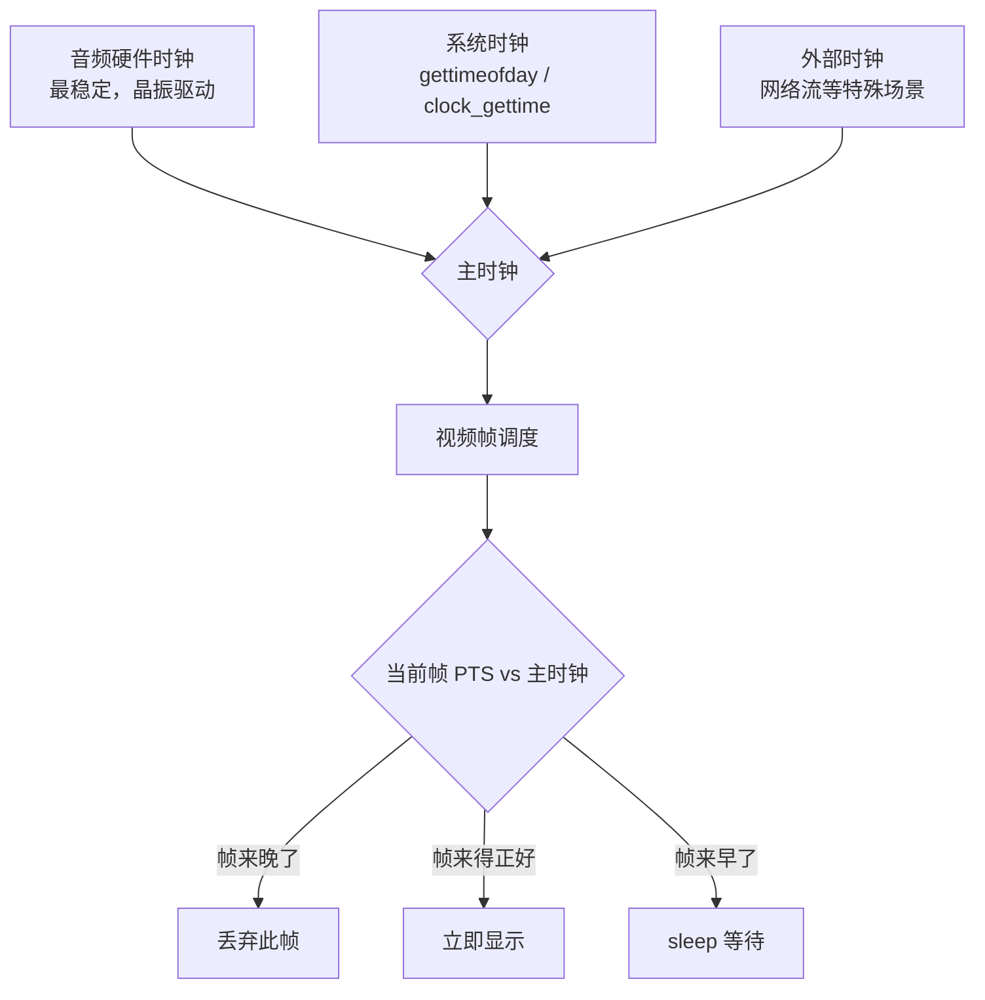
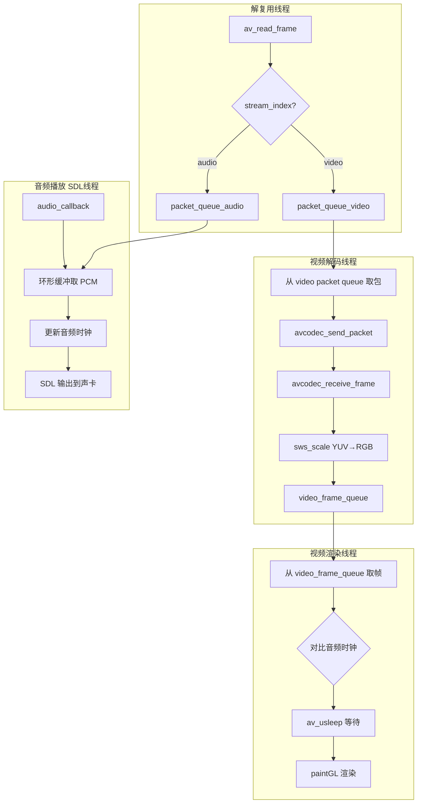

前三篇分别搞定了解复用、视频渲染、音频播放——三条独立的流水线。这篇把它们拧成一股绳：**让画面和声音对齐，再加上暂停、拖动进度条和倍速播放**。

<!-- more -->

# 为什么需要同步：两个独立的时钟

视频和音频各跑各的：解码、渲染、播放都在不同线程里。没有任何同步机制的话，画面和声音就会"渐行渐远"——可能画面快半秒，也可能声音先到。几秒钟的偏差足以毁掉观影体验。

同步的核心问题可以归结为一句话：**视频帧有一个"应该在什么时候显示"的时间戳（PTS），播放器需要一个统一的时钟来判断"现在是什么时候"，然后把帧在正确的时间点画出来。**



# 选主时钟：为什么用音频

三种可选方案：

| 方案 | 优点 | 缺点 |
|------|------|------|
| 视频时钟 | 不需要处理音频 | 画面可能抖动；无声视频才用 |
| 外部时钟 | 可精确控制 | 网络流才有意义 |
| **音频时钟** | 硬件晶振驱动，极其稳定 | 无音轨时需要降级到外部时钟 |

选音频时钟几乎是行业标准——声卡以恒定速率消费采样点，由硬件晶振保证节奏，不会因为 CPU 负载而漂移。视频时钟的问题在于帧率不稳定（可变帧率、解码耗时波动），用它做主时钟画面会一顿一顿的。

**无音频时怎么办？** 降级到系统时钟。很多播放器把这叫做"外部时钟"模式，实际上就是用 `av_gettime_relative()` 或 `clock_gettime()` 作为时间基准。

# 音频时钟的实现

音频时钟不是一个简单的变量——它活在两个世界里：解码世界和硬件世界。解码器知道"已经解了第 N 个采样点"，声卡知道"已经播了第 M 个采样点"。真正的时钟是两者的结合。

```c
typedef struct {
    double pts;           // 当前播到的 PTS（秒）
    double pts_drift;     // PTS 和系统时间的漂移量
    double last_updated;  // 上次更新时间（系统时间，秒）
    SDL_mutex *mutex;
} AudioClock;

// 声卡每消费一批数据，更新时钟
void audio_clock_update(AudioClock *c, double pts, double pts_drift) {
    SDL_LockMutex(c->mutex);
    c->pts = pts;
    c->pts_drift = pts_drift;
    c->last_updated = av_gettime_relative() / 1000000.0;
    SDL_UnlockMutex(c->mutex);
}

// 任意时刻查询"音频现在播到哪了"
double audio_clock_get(AudioClock *c) {
    SDL_LockMutex(c->mutex);
    double pts = c->pts;
    double pts_drift = c->pts_drift;
    double last = c->last_updated;
    SDL_UnlockMutex(c->mutex);
    
    // 补偿：从上次更新到现在又过去了多长时间
    double now = av_gettime_relative() / 1000000.0;
    double elapsed = now - last;
    
    return pts + pts_drift + elapsed;
}
```

**`pts_drift` 是什么？** 音频设备的实际播放速率和 PTS 的时间基之间可能存在细微偏差。`pts_drift` 用来补偿这个误差：每次 SDL 回调时，用实际消费的采样点数反算"应该推进了多少 PTS 时间"，和系统时间做差得到漂移量。

更精确的做法是在 SDL 音频回调中直接更新：

```c
// SDL 音频回调体内，每次消费采样点后更新时钟
void audio_callback(void *userdata, Uint8 *stream, int len) {
    PlayerState *ps = (PlayerState *)userdata;
    
    // ... 环形缓冲拷贝逻辑（第三篇）...
    
    int bytes_consumed = len;  // 实际写入 stream 的字节数
    
    // 根据消费的字节数，推算推进了多少 PTS 时间
    double pts_advanced = (double)bytes_consumed 
        / (ps->audio_sample_rate * ps->audio_channels 
           * av_get_bytes_per_sample(ps->audio_sample_fmt));
    
    audio_clock_update(&ps->audio_clock,
        ps->audio_clock.pts + pts_advanced,   // 新 PTS
        ps->audio_clock.pts_drift);           // 保持原漂移量
}
```

# 视频帧的调度：早等、正好、晚丢

有了音频时钟，视频帧的显示策略就很清晰了：

```c
void video_display_thread(PlayerState *ps) {
    double frame_delay = 0.0;   // 上一帧的持续时长
    
    while (ps->running) {
        VideoFrame *vf = video_queue_pop(&ps->video_queue);
        if (!vf) continue;
        
        // 1. 计算这一帧应该在什么时候显示
        double pts = vf->pts * av_q2d(ps->video_stream->time_base);
        
        // 2. 查音频时钟：现在播到哪了？
        double audio_time = audio_clock_get(&ps->audio_clock);
        
        // 3. 计算还需要等多久
        double delay = pts - audio_time;
        
        if (delay > 1.0) {
            // 偏差超过 1 秒，可能是 seek 后的跳跃，不等待
            delay = 0.0;
        }
        
        if (delay <= 0) {
            // 这帧来晚了（或者刚刚好），直接丢弃
            video_frame_free(vf);
            continue;
        }
        
        if (delay > 0.1) {
            // 偏差超过 100ms，做小步快跑——微调 frame_delay
            delay = frame_delay * 0.9;  // 加速追赶
        }
        
        // 4. 等比到
        av_usleep((unsigned int)(delay * 1000000));
        
        // 5. 渲染这一帧
        video_render(ps->video_widget, vf->rgb_data, vf->width, vf->height);
        
        // 6. 更新 frame_delay（用于下一帧的微调参考）
        frame_delay = delay;
        video_frame_free(vf);
    }
}
```

这里的设计细节值得展开：

**偏差超过 1 秒怎么处理？** 不做任何等待，直接跳到当前帧。这通常发生在 seek 操作后——用户拖到新位置后音频时钟立刻跳变，不会要求视频追赶中间几百帧。

**偏差在 0~100ms 之间怎么处理？** 精确等待 `delay` 秒。100ms 以内人眼和人耳无法察觉不同步，直接 sleep 到点再渲染即可。

**偏差超过 100ms 怎么处理？** 不能 sleep 一整段——100ms 的卡顿用户会感觉明显。正确做法是"小步快跑"：每帧少等一点点（乘以 0.9），让视频在几帧内平滑追上音频。

# 音视频同步的完整线程模型

一个实际可用的播放器至少四个线程：



关键的数据结构是各线程间的队列：

```c
// 包队列（解复用 → 解码，线程安全）
typedef struct {
    AVPacketList *first, *last;
    int nb_packets;
    int size;
    SDL_mutex *mutex;
    SDL_cond  *cond;       // 条件变量，阻塞等待
} PacketQueue;

// 帧队列（解码 → 渲染，线程安全）
typedef struct {
    VideoFrame *frames[MAX_FRAME_QUEUE];
    int rindex, windex;    // 读/写索引（环形）
    int size;
    SDL_mutex *mutex;
    SDL_cond  *cond;
} FrameQueue;
```

`SDL_cond` 条件变量在这里很关键——解码线程取包时如果队列空了，不是忙等（CPU 100%），而是 `SDL_CondWait` 阻塞，等解复用线程 `SDL_CondSignal` 唤醒。

# 暂停/恢复

暂停的本质：**停止更新音频时钟，停止渲染视频帧。** 音频硬件在暂停时也停止消费数据（`SDL_PauseAudioDevice(dev, 1)`），所以时钟自然冻结。

```c
void player_toggle_pause(PlayerState *ps) {
    ps->paused = !ps->paused;
    
    if (ps->paused) {
        SDL_PauseAudioDevice(ps->audio_dev, 1);  // 暂停声卡
    } else {
        // 恢复时需要修正 pts_drift
        // 暂停期间系统时间在走，PTS 没变
        // 修正漂移量 = 暂停前的漂移 - 暂停时长
        double pause_duration = av_gettime_relative() / 1000000.0 
                                - ps->pause_start_time;
        ps->audio_clock.pts_drift -= pause_duration;
        SDL_PauseAudioDevice(ps->audio_dev, 0);
    }
}
```

恢复时 `pts_drift` 为什么要减掉暂停时长？暂停期间虽然音频时钟冻结了，但系统时间照走不误。如果不修正，恢复后 `audio_clock_get()` 会以为自己比实际多跑了 `pause_duration` 秒，导致视频帧全部判断为"来晚了"而被丢弃。

# Seek：跳到任意位置

seek 是最容易写出 bug 的操作——解复用、解码、音视频缓冲、时钟，四个环节都要同步重置。

```c
void player_seek(PlayerState *ps, double target_seconds) {
    // 1. 清空所有缓冲队列
    packet_queue_flush(&ps->video_packet_queue);
    packet_queue_flush(&ps->audio_packet_queue);
    frame_queue_flush(&ps->video_frame_queue);
    
    // 2. 计算目标位置（在不同流的时间基下）
    int64_t seek_target = (int64_t)(target_seconds * AV_TIME_BASE);
    
    // 3. seek 到目标位置
    // AVSEEK_FLAG_BACKWARD: 定位到 target 之前最近的关键帧
    av_seek_frame(ps->fmt_ctx, -1, seek_target, AVSEEK_FLAG_BACKWARD);
    
    // 4. 清空解码器内部缓冲
    avcodec_flush_buffers(ps->video_codec_ctx);
    avcodec_flush_buffers(ps->audio_codec_ctx);
    
    // 5. 重置音频时钟
    audio_clock_update(&ps->audio_clock, target_seconds, 0.0);
    
    // 6. 设置 seek 标志位
    //   解复用线程看到这个标志，会丢弃 seek 前的残留包
    ps->seek_req = 1;
    ps->seek_pos  = seek_target;
}
```

一步步解释：

**1. 清空队列**：旧的包和帧还在队列里，带着旧的 PTS，必须全部清掉，否则会短暂地播一段 seek 之前的内容。

**2. `AVSEEK_FLAG_BACKWARD`**：`av_seek_frame` 只能 seek 到关键帧。如果用户拖到 30.2 秒位置，而最近的关键帧在 28 秒，这帧到 30.2 之间还有几个 P/B 帧需要丢弃。flags 告诉 FFmpeg"往左找最近的关键帧"。

**3. `avcodec_flush_buffers`**：清空解码器的内部缓冲。解码器里可能还扣着几帧数据（B 帧延迟、多线程解码缓冲），不清理的话会和解复用那边新的包混在一起。

**4. 重置音频时钟**：直接将音频时钟跳到目标位置，下一帧视频对比音频时钟时发现 PTS 接近，正常渲染。

# 倍速播放

倍速播放有两种实现层次：

**方案一：改 PTS。** 把视频帧的 PTS 除以倍数，帧的显示间隔变短。简单粗暴，但不改音频的话会音画不同步。

**方案二（推荐）：改音频采样率 + 改视频帧显示间隔。** 让声卡以 2x 速率消费采样点，同时视频帧的参考时钟也以 2x 速度走。

```c
void player_set_speed(PlayerState *ps, double speed) {
    if (speed < 0.25) speed = 0.25;   // 0.25x 最低
    if (speed > 4.0)  speed = 4.0;    // 4x 最高
    
    ps->playback_speed = speed;
    
    // 音频：通过 atempo filter 处理变速不变调
    // 或者简单粗暴地用 swr 时不做 tempo 修正（会变调但简单）
    
    // 视频：修改 frame_delay 的计算基准
    // video_display_thread 中 delay 除以 speed 即可
}
```

在一个更实际的实现里，音频变速用 FFmpeg 的 `atempo` filter。但如果接受变速变调（像老式磁带快进），可以用简单的重采样实现：

```c
// 方式一：用 atempo filter（变速不变调，需要 FFmpeg filter graph）
// 适合正式播放器

// 方式二：直接丢给 swr_convert，调播放速率（变速变调）
// 足够简单，Demo 够用
swr_convert(swr_ctx, out_buf, out_samples,
            frame->data, frame->nb_samples / speed);  // 输入采样点变少了
```

对于视频，倍速只需要改视频渲染线程中的等待时间：

```c
// 在 video_display_thread 中
double delay = pts - audio_clock_get(&ps->audio_clock);
delay /= ps->playback_speed;   // 2x 速度，等待时间减半

if (delay > 0)
    av_usleep((unsigned int)(delay * 1000000));
```

音频时钟需要相应调整——让它以 `speed` 倍速率推进：

```c
// 音频回调中
double pts_advanced = (double)bytes_consumed 
    / (ps->audio_sample_rate * ps->audio_channels 
       * av_get_bytes_per_sample(ps->audio_sample_fmt));
pts_advanced *= ps->playback_speed;  // 2x 时时钟跑 2x 快

audio_clock_update(&ps->audio_clock,
    ps->audio_clock.pts + pts_advanced,
    ps->audio_clock.pts_drift);
```

这样音频时钟跑得更快，视频帧也以更快的节奏显示，整体 2x 速度就实现了。

# 完整的 PlayerState 结构

把四篇博客攒起来的播放器，核心状态都在这个结构体里：

```c
typedef struct {
    // ──── 解复用 ────
    AVFormatContext *fmt_ctx;
    int video_stream_idx;
    int audio_stream_idx;
    
    // ──── 解码 ────
    AVCodecContext *video_codec_ctx;
    AVCodecContext *audio_codec_ctx;
    
    // ──── 转换 ────
    SwsContext  *sws_ctx;
    SwrContext  *swr_ctx;
    
    // ──── 队列 ────
    PacketQueue video_packet_queue;
    PacketQueue audio_packet_queue;
    FrameQueue  video_frame_queue;
    
    // ──── 音频 ────
    SDL_AudioDeviceID audio_dev;
    AudioClock audio_clock;
    
    // ──── 渲染 ────
    VideoWidget *video_widget;
    
    // ──── 线程 ────
    SDL_Thread *demux_thread;
    SDL_Thread *video_decode_thread;
    SDL_Thread *video_display_thread;
    
    // ──── 控制 ────
    int running;
    int paused;
    int seek_req;
    int64_t seek_pos;
    double playback_speed;
    double pause_start_time;
} PlayerState;
```

# 小结

四篇文章串起来，一个本地播放器的完整骨架就出来了：

| 模块 | 核心技术 |
|------|----------|
| 容器与解复用 | `avformat_open_input` / `av_read_frame` |
| 视频解码 | `avcodec_send_packet` / `receive_frame` / `sws_scale` |
| 视频渲染 | QOpenGLWidget / OpenGL 纹理 / GPU YUV 转换 |
| 音频解码 | `avcodec_receive_frame` / planar→packed |
| 音频播放 | `swr_convert` / SDL2 回调 / 环形缓冲 |
| **音视频同步** | **音频主时钟 / PTS 对比 / sleep 调度** |
| **交互控制** | **暂停恢复 / seek 跳转 / 倍速播放** |

当然，和 VLC / mpv 相比，这个实现还有很多可优化的地方：硬解、字幕、多音轨切换、播放列表、拖拽打开文件……但核心流程你已经掌握了。剩下的都是"加功能"，不是"搞懂原理"。这四篇博客的代码拼起来，就是一个能看视频、有声音、能拖进度条、能倍速的播放器——虽然简陋，但每行代码都是你写的，每条链路你都理解。
