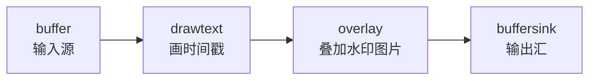

前四篇把本地播放器从解复用到音视频同步完整走了一遍。接下来换个方向——从"消费"端转到"生产"端：采集、处理、录制、推流。第一篇从两个高频实用需求切入：**给视频加水印/时间戳**，以及**批量生成缩略图**。

<!-- more -->

# libavfilter：FFmpeg 的滤镜引擎

`libavfilter` 是 FFmpeg 里最被低估的库。大部分人只知道命令行的 `-vf`，写代码时很少碰。但它其实提供了一套强大且统一的"滤镜图"（filter graph）框架——水印、缩放、裁剪、去噪、调色，全都是滤镜节点，可以像搭积木一样串联。

核心概念只有两个：

**滤镜（Filter）**：做一件具体的事，比如 `drawtext` 画文字、`scale` 缩放、`overlay` 叠加。

**滤镜图（Filter Graph）**：多个滤镜串联起来的流水线。数据从一个滤镜流向下一个，像一条加工流水线。



输入节点叫 `buffer`，输出节点叫 `buffersink`。中间你想串多少个滤镜都行。

# 基础滤镜图：画时间戳

先从一个最简单的例子开始——给视频的每一帧加上播放时间戳。

```c
#include <libavfilter/avfilter.h>
#include <libavfilter/buffersrc.h>
#include <libavfilter/buffersink.h>

// 构建滤镜图：输入 → drawtext → 输出
AVFilterGraph *init_filter_graph(AVFilterContext **src, AVFilterContext **sink,
                                  AVCodecContext *dec_ctx) {
    AVFilterGraph *graph = avfilter_graph_alloc();
    const AVFilter *buffersrc  = avfilter_get_by_name("buffer");
    const AVFilter *buffersink = avfilter_get_by_name("buffersink");
    
    // 1. 输入节点参数
    char args[512];
    snprintf(args, sizeof(args),
        "video_size=%dx%d:pix_fmt=%d:time_base=%d/%d:pixel_aspect=1/1",
        dec_ctx->width, dec_ctx->height, dec_ctx->pix_fmt,
        dec_ctx->time_base.num, dec_ctx->time_base.den);
    
    avfilter_graph_create_filter(src, buffersrc, "in", args, NULL, graph);
    
    // 2. 输出节点
    avfilter_graph_create_filter(sink, buffersink, "out", NULL, NULL, graph);
    
    // 3. 中间滤镜：drawtext
    AVFilterContext *drawtext_ctx;
    const AVFilter *drawtext = avfilter_get_by_name("drawtext");
    
    char text_args[512];
    snprintf(text_args, sizeof(text_args),
        "text='Time: %{pts\\:hms}':"          // 画当前帧的 PTS（时:分:秒格式）
        "x=10:y=10:"                           // 左上角 10,10 位置
        "fontsize=24:fontcolor=white:"         // 字体大小和颜色
        "box=1:boxcolor=black@0.5:boxborderw=5"); // 半透明黑色背景
    
    avfilter_graph_create_filter(&drawtext_ctx, drawtext, "drawtext",
                                  text_args, NULL, graph);
    
    // 4. 串联：buffer → drawtext → buffersink
    avfilter_link(src, 0, drawtext_ctx, 0);
    avfilter_link(drawtext_ctx, 0, sink, 0);
    
    // 5. 配置并生效
    avfilter_graph_config(graph, NULL);
    
    return graph;
}
```

滤镜配置好之后，只要把解码出来的 `AVFrame` 塞进去，出来的就是带时间戳的画面了：

```c
// 推一帧进去
av_buffersrc_add_frame_flags(src_ctx, input_frame, AV_BUFFERSRC_FLAG_KEEP_REF);

// 拉一帧出来
av_buffersink_get_frame(sink_ctx, output_frame);

// output_frame 就是加上时间戳后的帧，可以直接拿去渲染或编码
```

`AV_BUFFERSRC_FLAG_KEEP_REF` 让 `buffersrc` 内部增加帧引用计数而不是拷贝数据——在滤镜图里，一帧可能被多个滤镜节点同时引用，引用计数机制避免了不必要的内存拷贝。

# 进阶：叠加水印图片

画时间戳只是 `drawtext` 一个滤镜的事。叠加水印需要两个滤镜：一个 `movie` 滤镜加载水印图片，一个 `overlay` 滤镜把它叠到视频上。

```c
// 滤镜图结构：buffer → [overlay] ← movie（水印图片源）→ buffersink
void add_watermark_filter(AVFilterGraph *graph, AVFilterContext *src,
                          AVFilterContext *sink) {
    // 1. movie 滤镜：从文件加载水印图片
    AVFilterContext *movie_ctx;
    const AVFilter *movie = avfilter_get_by_name("movie");
    
    avfilter_graph_create_filter(&movie_ctx, movie, "watermark",
        "filename=logo.png:format_name=image2", NULL, graph);
    
    // 2. overlay 滤镜：把水印叠到右上角
    AVFilterContext *overlay_ctx;
    const AVFilter *overlay = avfilter_get_by_name("overlay");
    
    avfilter_graph_create_filter(&overlay_ctx, overlay, "overlay",
        "x=main_w-overlay_w-10:y=10",  // 右上角，留 10px 边距
        NULL, graph);
    
    // 3. 连线
    //    overlay 有两个输入：in0=主视频，in1=水印层
    avfilter_link(src, 0, overlay_ctx, 0);       // 主视频 → overlay:in0
    avfilter_link(movie_ctx, 0, overlay_ctx, 1);  // 水印   → overlay:in1
    avfilter_link(overlay_ctx, 0, sink, 0);       // overlay → 输出
}
```

理解多输入滤镜的关键是"pad"概念。每个滤镜可以有多个输入 pad 和多个输出 pad。`overlay` 有两个输入 pad——`in0` 是底层（主视频），`in1` 是上层（水印）——`avfilter_link` 的第二个参数就是 pad 编号。

**如果水印是一张透明 PNG（RGBA），需要在 movie 滤镜里设置像素格式：**

```c
"filename=logo.png:format_name=image2:format=pix_fmts=rgba"
```

否则 `overlay` 没法正确处理透明通道。

# 完整的滤镜处理流水线

把滤镜图嵌入解码→渲染的流水线中：

```c
// 在解码循环中
AVFilterGraph *graph = init_filter_graph(&src_ctx, &sink_ctx, dec_ctx);

AVFrame *filtered_frame = av_frame_alloc();

while (1) {
    // ... 解码出 frame ...
    
    // 推入滤镜图
    av_buffersrc_add_frame_flags(src_ctx, frame, AV_BUFFERSRC_FLAG_KEEP_REF);
    
    // 拉出处理后的帧
    while (av_buffersink_get_frame(sink_ctx, filtered_frame) >= 0) {
        // filtered_frame 就是加水印/时间戳后的画面
        // 拿去 sws_scale 转 RGB → 渲染
        render_frame(filtered_frame);
        av_frame_unref(filtered_frame);
    }
}
```

# 批量缩略图生成服务

另一个常见需求：给一个视频文件自动生成若干张缩略图（就像 YouTube 的预览条）。原理很简单——seek 到不同的时间点，解码一帧，缩放保存。

```c
/**
 * 生成缩略图
 * @param filename    视频文件路径
 * @param thumb_count 生成几张缩略图
 * @param thumb_width 缩略图宽度
 * @param output_dir  输出目录
 */
int generate_thumbnails(const char *filename, int thumb_count,
                        int thumb_width, const char *output_dir) {
    AVFormatContext *fmt_ctx = NULL;
    avformat_open_input(&fmt_ctx, filename, NULL, NULL);
    avformat_find_stream_info(fmt_ctx, NULL);
    
    // 找到视频流
    int video_idx = av_find_best_stream(fmt_ctx, AVMEDIA_TYPE_VIDEO, -1, -1, NULL, 0);
    AVStream *video_stream = fmt_ctx->streams[video_idx];
    AVCodecParameters *codecpar = video_stream->codecpar;
    
    // 初始化解码器
    const AVCodec *codec = avcodec_find_decoder(codecpar->codec_id);
    AVCodecContext *codec_ctx = avcodec_alloc_context3(codec);
    avcodec_parameters_to_context(codec_ctx, codecpar);
    avcodec_open2(codec_ctx, codec, NULL);
    
    // 计算缩略图的高度（保持宽高比）
    int thumb_height = codec_ctx->height * thumb_width / codec_ctx->width;
    
    // 初始化缩放上下文（解码后的帧 → 缩略图大小）
    SwsContext *sws = sws_getContext(
        codec_ctx->width, codec_ctx->height, codec_ctx->pix_fmt,
        thumb_width, thumb_height, AV_PIX_FMT_RGB24,
        SWS_BICUBIC, NULL, NULL, NULL);
    
    double duration = (double)fmt_ctx->duration / AV_TIME_BASE;
    double interval = duration / (thumb_count + 1);  // 均匀分布
    
    AVPacket *pkt = av_packet_alloc();
    AVFrame *frame = av_frame_alloc();
    AVFrame *rgb_frame = av_frame_alloc();
    
    // 分配 RGB 缓冲
    int rgb_size = av_image_get_buffer_size(AV_PIX_FMT_RGB24, thumb_width, thumb_height, 1);
    uint8_t *rgb_buf = av_malloc(rgb_size);
    av_image_fill_arrays(rgb_frame->data, rgb_frame->linesize, rgb_buf,
                          AV_PIX_FMT_RGB24, thumb_width, thumb_height, 1);
    
    for (int i = 1; i <= thumb_count; i++) {
        double target_sec = i * interval;
        
        // Seek 到目标时间
        int64_t target_ts = av_rescale_q(
            (int64_t)(target_sec * AV_TIME_BASE), AV_TIME_BASE_Q,
            video_stream->time_base);
        av_seek_frame(fmt_ctx, video_idx, target_ts, AVSEEK_FLAG_BACKWARD);
        avcodec_flush_buffers(codec_ctx);
        
        // 解码到第一个关键帧后的画面
        int got_frame = 0;
        while (!got_frame && av_read_frame(fmt_ctx, pkt) >= 0) {
            if (pkt->stream_index != video_idx) {
                av_packet_unref(pkt);
                continue;
            }
            
            avcodec_send_packet(codec_ctx, pkt);
            av_packet_unref(pkt);
            
            if (avcodec_receive_frame(codec_ctx, frame) >= 0) {
                // 缩放并转换
                sws_scale(sws, frame->data, frame->linesize, 0,
                          codec_ctx->height, rgb_frame->data, rgb_frame->linesize);
                
                // 保存为 BMP（简单；生产环境用 libpng 或 stb_image_write）
                char out_path[512];
                snprintf(out_path, sizeof(out_path), "%s/thumb_%02d.bmp", output_dir, i);
                save_as_bmp(rgb_frame, out_path);
                
                got_frame = 1;
            }
        }
    }
    
    // 清理
    av_free(rgb_buf);
    av_frame_free(&rgb_frame);
    av_frame_free(&frame);
    av_packet_free(&pkt);
    sws_freeContext(sws);
    avcodec_free_context(&codec_ctx);
    avformat_close_input(&fmt_ctx);
    
    return 0;
}
```

# 包装成 HTTP 服务

把缩略图生成能力暴露为 HTTP API，用 CivetWeb 这个单头文件库（或你熟悉的任何 HTTP 库）：

```c
#include "civetweb.h"

// POST /api/thumbnails
// Body: { "file": "/videos/test.mp4", "count": 10, "width": 320 }
static int thumb_api_handler(struct mg_connection *conn, void *cbdata) {
    char post_data[4096];
    int post_len = mg_read(conn, post_data, sizeof(post_data) - 1);
    post_data[post_len] = '\0';
    
    // 解析 JSON（用 cJSON 或自己写的简单解析器）
    char file[512]; int count = 10, width = 320;
    parse_thumb_request(post_data, file, &count, &width);
    
    // 创建临时输出目录
    char tmp_dir[256];
    snprintf(tmp_dir, sizeof(tmp_dir), "/tmp/thumbs_%lld",
             (long long)time(NULL));
    mkdir(tmp_dir);
    
    // 生成缩略图
    generate_thumbnails(file, count, width, tmp_dir);
    
    // 返回结果 JSON
    mg_printf(conn,
        "HTTP/1.1 200 OK\r\n"
        "Content-Type: application/json\r\n"
        "Access-Control-Allow-Origin: *\r\n"
        "\r\n"
        "{\"code\":0, \"count\":%d, \"dir\":\"%s\"}", count, tmp_dir);
    
    return 200;
}

int main() {
    struct mg_context *ctx;
    const char *options[] = {
        "listening_ports", "8080",
        "num_threads", "4",
        NULL
    };
    
    ctx = mg_start(NULL, 0, options);
    mg_set_request_handler(ctx, "/api/thumbnails", thumb_api_handler, NULL);
    
    printf("缩略图服务运行在 http://localhost:8080\n");
    getchar();  // 按任意键退出
    
    mg_stop(ctx);
    return 0;
}
```

# 滤镜图调试技巧

滤镜链复杂了之后，很容易出现参数不对、滤镜不兼容导致黑屏。`avfilter_graph_config` 失败时会打印错误信息，但不够直观。可以用 `avfilter_graph_dump` 把滤镜图打印出来：

```c
// 在 avfilter_graph_config 之前调用
avfilter_graph_dump(graph, "filter_graph.dot");

// 这会生成一个 Graphviz DOT 文件，可以用 dot 命令转成图片：
// dot -Tpng filter_graph.dot -o filter_graph.png
// 或者在 VSCode 装 Graphviz 插件直接预览
```

另一个常见坑：**滤镜修改了像素格式**。比如 `drawtext` 在某些情况下会把 `yuv420p` 转成 `yuv444p`，后续如果按原格式处理会出错。从 `buffersink` 拉出来的帧，用 `frame->format` 而非原始 `codec_ctx->pix_fmt`：

```c
// 错误：用解码器的像素格式初始化 sws
sws = sws_getContext(w, h, codec_ctx->pix_fmt, ...);

// 正确：用滤镜输出帧的实际格式
sws = sws_getContext(w, h, filtered_frame->format, ...);
```

# 小结

| 内容 | 核心技术 |
|------|----------|
| 滤镜图 | `avfilter_graph_create_filter` + `avfilter_link` |
| 时间戳水印 | `drawtext` 滤镜，`%{pts:hms}` 格式化 |
| 图片水印 | `movie` + `overlay` 组合，处理透明通道 |
| 批量缩略图 | `av_seek_frame` + 解码一帧 + `sws_scale` 缩放 |
| HTTP 服务 | CivetWeb / libmicrohttpd，JSON API |

滤镜引擎是 FFmpeg 最灵活的子系统之一，几十个内置滤镜可以组合出各种效果。下一篇切入真正的"生产端"——从摄像头和麦克风采集数据，编码封装成本地文件。
