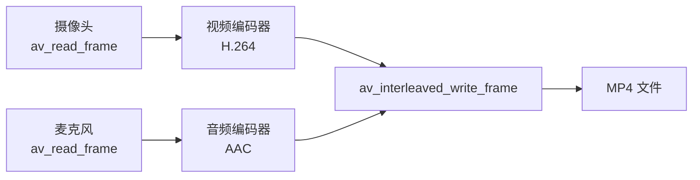
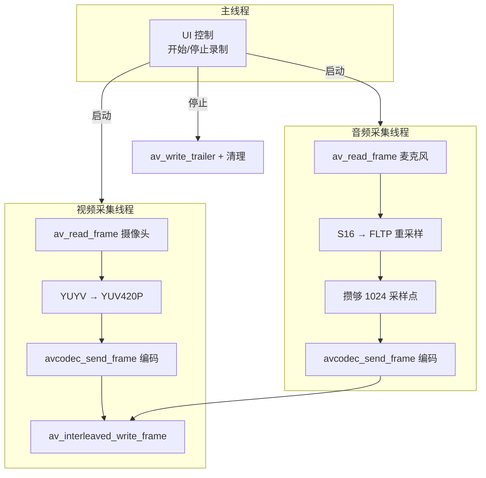

[上一篇](/2026/07/21/音视频采集与推流（1）：滤镜与缩略图/) 还在跟文件打交道。这篇真正走向"实时采集"——**从摄像头拿画面、从麦克风拿声音，实时编码封装成一个 MP4 文件**。这就是一个最简单的本地录屏工具。

<!-- more -->

# 采集方案选型

Windows 下做音视频采集，主要有三条路：

| 方案 | 难度 | 灵活性 | 适用场景 |
|------|------|--------|----------|
| **FFmpeg libavdevice** | 低 | 中 | 快速原型，命令有参数可控 |
| **Qt Multimedia** | 中 | 中 | 已有 Qt UI，想少写平台代码 |
| **Windows Media Foundation** | 高 | 高 | 需要精细控制硬件编码器 |
| **DirectShow** | 中 | 高 | 兼容老旧设备，但逐渐过时 |

FFmpeg 的 `libavdevice` 方案最省事——它本身就是跨平台的采集层，Windows 上底层用的就是 DirectShow 或 dshow，Linux 用 v4l2，macOS 用 avfoundation。用一套 API 搞定三个平台。

# libavdevice 采集摄像头

FFmpeg 把设备也抽象成了"文件"——摄像头和麦克风本质上就是一个不断产出数据包的"输入设备"。打开方式和打开 MP4 文件几乎一样：

```c
#include <libavdevice/avdevice.h>

// 注册所有采集设备
avdevice_register_all();

// ──── 采集摄像头 ────
AVFormatContext *cam_ctx = NULL;
AVInputFormat *dshow_fmt = av_find_input_format("dshow");  // Windows
// Linux 用 "v4l2"，macOS 用 "avfoundation"

AVDictionary *options = NULL;
av_dict_set(&options, "video_size",  "1280x720",  0);
av_dict_set(&options, "framerate",   "30",         0);
av_dict_set(&options, "pixel_format","yuyv422",    0);  // 多数摄像头原生格式

int ret = avformat_open_input(&cam_ctx, 
    "video=Integrated Camera",  // 设备名，用 ffmpeg -list_devices 查看
    dshow_fmt, &options);
av_dict_free(&options);

if (ret < 0) {
    fprintf(stderr, "无法打开摄像头: %s\n", av_err2str(ret));
    return -1;
}
```

**设备名怎么看？** 命令行跑一下：

```bash
# Windows (dshow)
ffmpeg -list_devices true -f dshow -i dummy

# Linux (v4l2)  
ffmpeg -list_devices true -f v4l2 -i /dev/video0

# macOS (avfoundation)
ffmpeg -list_devices true -f avfoundation -i dummy
```

输出会列出所有可用的摄像头名称。Windows 下通常叫 `"Integrated Camera"` 或 `"USB Camera"`。

# 采集麦克风

同一套 API，换设备名就行：

```c
AVFormatContext *mic_ctx = NULL;

av_dict_set(&options, "sample_rate", "44100", 0);
av_dict_set(&options, "sample_size", "16",     0);  // 16bit

avformat_open_input(&mic_ctx,
    "audio=Microphone (Realtek High Definition Audio)",
    dshow_fmt, &options);
```

这里有个关键问题：**摄像头和麦克风是两个独立的设备，各自的时钟独立运行。** 如果直接录制，音视频会逐渐漂移。正确做法是用一个统一的参考时钟来做时间戳对齐。

# 时间戳对齐：统一时钟源

音视频采集各有各的 PTS 时间基，录下来之后不同步的根本原因是时间戳在不同时间基下不对齐。解决方法是**所有帧的 PTS 都以系统单调时钟为基准重新打标**。

```c
// 全局统一的时钟基准（以毫秒为单位方便理解）
static int64_t capture_start_time = 0;

// 采集初始化时记录起始时间
void capture_init() {
    capture_start_time = av_gettime();  // 微秒
}

// 每拿到一帧，用当前系统时间减去起始时间作为 PTS
int64_t get_unified_pts() {
    return av_gettime() - capture_start_time;  // 返回微秒
}

// 然后转换到目标容器的 time_base
// 假设目标用 1/1000 (毫秒) 作为 time_base
int64_t unified_ms = get_unified_pts() / 1000;
AVRational target_tb = {1, 1000};
```

这样无论是摄像头帧还是麦克风采样，PTS 都基于同一面"墙钟"，封装后天然同步。

# 实时编码

采集到的原始数据体量巨大——1280×720 YUYV @30fps 一秒钟就是约 55MB。不压缩没法存。所以采集 → 编码 → 封装必须是一根实时流水线。



关键代码：

```c
// ──── 1. 初始化视频编码器（H.264） ────
AVCodecContext *video_enc = NULL;

void init_video_encoder(int width, int height, int fps) {
    const AVCodec *codec = avcodec_find_encoder(AV_CODEC_ID_H264);
    video_enc = avcodec_alloc_context3(codec);
    
    video_enc->width      = width;
    video_enc->height     = height;
    video_enc->time_base  = (AVRational){1, fps};
    video_enc->framerate  = (AVRational){fps, 1};
    video_enc->pix_fmt    = AV_PIX_FMT_YUV420P;  // H.264 标准格式
    video_enc->bit_rate   = 2000000;              // 2 Mbps
    video_enc->gop_size   = fps * 2;              // GOP = 2 秒
    video_enc->max_b_frames = 1;
    
    // 实测时建议用 preset 和 tune 平衡速度和质量
    av_opt_set(video_enc->priv_data, "preset",    "ultrafast", 0);
    av_opt_set(video_enc->priv_data, "tune",      "zerolatency", 0);
    av_opt_set(video_enc->priv_data, "profile",   "baseline", 0);
    
    avcodec_open2(video_enc, codec, NULL);
}

// ──── 2. 初始化音频编码器（AAC） ────
AVCodecContext *audio_enc = NULL;

void init_audio_encoder(int sample_rate, int channels) {
    const AVCodec *codec = avcodec_find_encoder(AV_CODEC_ID_AAC);
    audio_enc = avcodec_alloc_context3(codec);
    
    audio_enc->sample_rate    = sample_rate;
    audio_enc->ch_layout      = (AVChannelLayout)AV_CHANNEL_LAYOUT_STEREO;
    audio_enc->sample_fmt     = AV_SAMPLE_FMT_FLTP;  // AAC 用 float planar
    audio_enc->bit_rate       = 128000;
    audio_enc->time_base      = (AVRational){1, sample_rate};
    
    avcodec_open2(audio_enc, codec, NULL);
}
```

编码器配置里的几个关键选择：

**`preset = ultrafast` + `tune = zerolatency`**：实时编码场景（不是离线转码），延迟优先于压缩率。`ultrafast` 会牺牲约 20%~30% 的压缩效率，但编码延迟降到毫秒级，不会让采集流水线积压。

**`profile = baseline`**：最兼容的 H.264 profile。不用 B 帧，编码延迟最小。如果目标播放器都支持 high profile，可以切过去提升压缩率。

**`pix_fmt = YUV420P`**：绝大多数摄像头输出的是 YUYV（也叫 YUY2），和 H.264 编码器要求的 YUV420P 不匹配。需要一步像素格式转换。

# 像素格式转换：YUYV → YUV420P

摄像头常见的 YUYV 是 4:2:2 采样（每两个像素共享一组 UV 分量），而 H.264 编码器要的是 YUV420P（每 2×2 像素共享一组 UV）。用 `sws_scale` 做一次快速转换：

```c
// 采集帧 → 编码帧
SwsContext *yuyv_to_yuv420 = sws_getContext(
    cam_width, cam_height, AV_PIX_FMT_YUYV422,   // 源
    cam_width, cam_height, AV_PIX_FMT_YUV420P,   // 目标
    SWS_FAST_BILINEAR, NULL, NULL, NULL);

AVFrame *enc_frame = av_frame_alloc();
enc_frame->format = AV_PIX_FMT_YUV420P;
enc_frame->width  = cam_width;
enc_frame->height = cam_height;
av_frame_get_buffer(enc_frame, 0);

// 在每一帧处理时
sws_scale(yuyv_to_yuv420,
    captured_frame->data, captured_frame->linesize,
    0, cam_height,
    enc_frame->data, enc_frame->linesize);
```

# 封装到 MP4 文件

音视频编码后都是独立的 `AVPacket`，需要一个 `AVFormatContext`（输出容器）和 `av_interleaved_write_frame` 把它们交错写入文件：

```c
AVFormatContext *out_ctx = NULL;
avformat_alloc_output_context2(&out_ctx, NULL, "mp4", "output.mp4");

// 创建视频流
AVStream *video_st = avformat_new_stream(out_ctx, NULL);
avcodec_parameters_from_context(video_st->codecpar, video_enc);
video_st->time_base = video_enc->time_base;

// 创建音频流
AVStream *audio_st = avformat_new_stream(out_ctx, NULL);
avcodec_parameters_from_context(audio_st->codecpar, audio_enc);
audio_st->time_base = audio_enc->time_base;

// 打开输出文件，写入头部
avio_open(&out_ctx->pb, "output.mp4", AVIO_FLAG_WRITE);
avformat_write_header(out_ctx, NULL);

// ──── 主循环：采集 → 编码 → 写入 ────
while (recording) {
    // 从摄像头读一帧
    if (av_read_frame(cam_ctx, cam_pkt) >= 0) {
        // 转换像素格式
        sws_scale(yuyv_to_yuv420, ...);
        
        // 打统一时间戳
        enc_frame->pts = get_unified_pts();
        
        // 编码
        avcodec_send_frame(video_enc, enc_frame);
        while (avcodec_receive_packet(video_enc, video_pkt) >= 0) {
            // 重新映射到输出流的时间基
            av_packet_rescale_ts(video_pkt, video_enc->time_base, video_st->time_base);
            video_pkt->stream_index = video_st->index;
            av_interleaved_write_frame(out_ctx, video_pkt);
            av_packet_unref(video_pkt);
        }
    }
    
    // 从麦克风读一帧（类似逻辑）
    if (av_read_frame(mic_ctx, mic_pkt) >= 0) {
        // ... 重采样 + 编码 + 写入（逻辑同上）
    }
}

// 写入尾部，关闭文件
av_write_trailer(out_ctx);
avio_closep(&out_ctx->pb);
```

**`av_interleaved_write_frame` vs `av_write_frame`**：前者会自动处理音视频包的**交错**（interleave）排序，确保按 DTS 递增写入文件。如果用 `av_write_frame`，你必须自己保证包的顺序，否则生成的 MP4 可能在某些播放器上花屏或卡顿。

**`av_packet_rescale_ts`**：每个编码器有自己的 `time_base`，输出流又有自己的 `time_base`。这个函数在同一时间点做无损换算。每次写入前调一下，别指望时间基天然一致。

# 音频重采样（麦克风 → AAC）

和播放篇的 `swr_convert` 用场不同但 API 完全一样——这次是采集端重采样：

```c
// 麦克风原始格式（通常是 S16 packed）→ AAC 编码器需要的 FLTP（float planar）
SwrContext *swr = swr_alloc();
av_opt_set_int(swr, "in_channel_count", 2, 0);
av_opt_set_int(swr, "in_sample_rate", 44100, 0);
av_opt_set_sample_fmt(swr, "in_sample_fmt", AV_SAMPLE_FMT_S16, 0);
av_opt_set_int(swr, "out_channel_count", 2, 0);
av_opt_set_int(swr, "out_sample_rate", 44100, 0);
av_opt_set_sample_fmt(swr, "out_sample_fmt", AV_SAMPLE_FMT_FLTP, 0);
swr_init(swr);

// AAC 编码器需要固定大小的帧（1024 采样点）
AVFrame *audio_enc_frame = av_frame_alloc();
audio_enc_frame->format      = AV_SAMPLE_FMT_FLTP;
audio_enc_frame->ch_layout   = (AVChannelLayout)AV_CHANNEL_LAYOUT_STEREO;
audio_enc_frame->sample_rate = 44100;
audio_enc_frame->nb_samples  = 1024;  // AAC 一帧固定 1024 采样点
av_frame_get_buffer(audio_enc_frame, 0);

// 重采样
swr_convert(swr,
    audio_enc_frame->data, audio_enc_frame->nb_samples,
    captured_audio_frame->data, captured_audio_frame->nb_samples);
```

AAC 编码器严格按 1024 个采样点一帧（HE-AAC 是 2048）。不满一帧不能送编码，多余的采样点要缓存起来攒够再送。这就是为什么音频编码需要一个小缓冲：

```c
// 缓冲不足 1024 个采样点的残余数据
static int audio_buffer_samples = 0;
static uint8_t *audio_buffer = NULL;  // 预先分配足够大

// 每次重采样后：
if (audio_buffer_samples + resampled_samples >= 1024) {
    // 凑够一帧了，送编码
    memcpy(audio_enc_frame->data[0], audio_buffer, 
           (1024 - audio_buffer_samples) * sample_bytes);
    // ... 编码 ...
    audio_buffer_samples = 0;
} else {
    // 还不够，继续攒
    memcpy(audio_buffer + audio_buffer_samples * sample_bytes,
           resampled_data, resampled_samples * sample_bytes);
    audio_buffer_samples += resampled_samples;
}
```

# 完整录制器的线程模型



视频采集和音频采集是两个独立线程，但共享同一个输出 `AVFormatContext`。`av_interleaved_write_frame` 内部是线程安全的（有 mutex），但前提是同一个输出 context 不要同时被两个线程操作——所以用同一个 `out_ctx` 写入时最好加锁：

```c
static SDL_mutex *write_mutex = SDL_CreateMutex();

// 每个线程写文件时
SDL_LockMutex(write_mutex);
av_interleaved_write_frame(out_ctx, pkt);
SDL_UnlockMutex(write_mutex);
```

# 小结

一条本地录制的完整流水线：**设备采集 → 格式转换 → 实时编码 → 交错封装**。

| 步骤 | API | 备注 |
|------|-----|------|
| 打开设备 | `avformat_open_input` + device name | 和打开文件完全一样的接口 |
| 像素转换 | `sws_scale` | 摄像头 YUYV → 编码器 YUV420P |
| 音频重采样 | `swr_convert` | 麦克风 S16 → AAC FLTP |
| 视频编码 | `avcodec_send_frame` / `receive_packet` | preset=ultrafast 降延迟 |
| 写入文件 | `av_interleaved_write_frame` | 自动交错排序 |

已经能把音视频录成文件了。下一篇更进一步——不写磁盘，直接推到网络上，做一个直播推流端。
