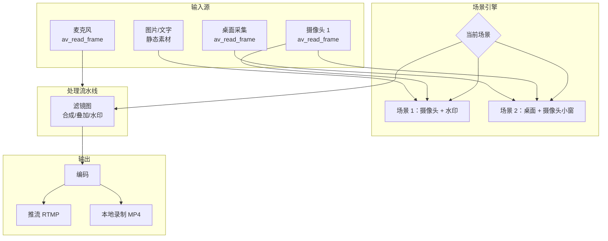
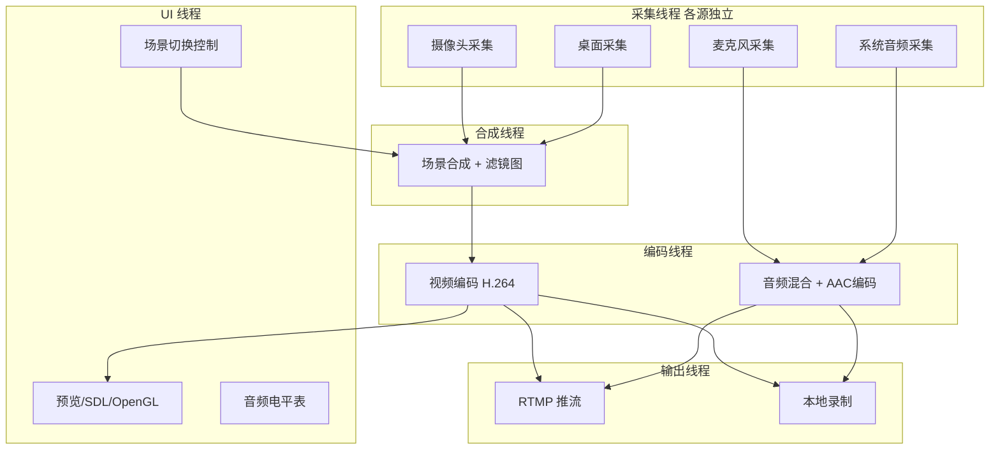

[上一篇](/2026/07/21/音视频采集与推流（3）：RTMP直播推流/) 实现了单路摄像头的推流。但真正的直播场景远不止"摄像头怼脸"——你需要切换画面源、叠图层、混音。这篇把前面所有知识汇到一个完整工具里。

<!-- more -->

# 一个直播推流工具需要什么

打开 OBS，你会看到它的核心能力：

1. **多场景**：每个场景是一组画面源的组合（摄像头 + 截屏 + 图片 + 文字）
2. **场景切换**：点一下切换按钮，无缝切到另一个场景
3. **图层叠加**：摄像头小窗叠在全屏截屏上，再加个文字水印
4. **混音**：麦克风 + 系统声音 + 背景音乐，音量独立可调

我们不用做到 OBS 的程度，但把核心机制搭出来——理解了这些，OBS 对你就不再是"黑盒"。

# 整体架构



# 多源管理：统一的输入源抽象

不管是摄像头、桌面采集还是静态图片，在推流工具里都抽象为"源"（Source）：

```c
typedef enum {
    SOURCE_CAMERA,      // 摄像头
    SOURCE_DESKTOP,     // 屏幕采集
    SOURCE_IMAGE,       // 静态图片
    SOURCE_TEXT,        // 文字叠加
    SOURCE_AUDIO_IN,    // 音频输入
} SourceType;

typedef struct Source {
    char name[64];
    SourceType type;
    int enabled;        // 是否启用
    
    // 视频源相关
    AVFormatContext *fmt_ctx;    // 采集设备上下文
    int stream_index;
    int width, height;
    
    // 画面合成参数
    int x, y;           // 在合成画布上的位置
    int dst_w, dst_h;   // 缩放后的大小
    float opacity;      // 透明度 (0.0 ~ 1.0)
    int z_order;        // 图层顺序（数值越大越靠前）
    
    // 音频源相关
    float volume;       // 音量 (0.0 ~ 1.0)
    
    // 帧缓冲（最新一帧）
    AVFrame *current_frame;
    SDL_mutex *frame_mutex;
} Source;
```

每个源独立采集，把最新一帧存到 `current_frame` 里。合成线程根据场景配置从各源头取帧、叠加、输出。

# 场景引擎：场景 = 一组源的组合 + 合成参数

```c
typedef struct {
    char name[64];
    Source *sources[MAX_SOURCES_PER_SCENE];
    int source_count;
    
    int canvas_width;   // 画布尺寸（合成画面的分辨率）
    int canvas_height;
} Scene;

typedef struct {
    Scene scenes[MAX_SCENES];
    int scene_count;
    int active_scene;   // 当前活跃的场景索引
    SDL_mutex *mutex;
} SceneManager;

// 切换场景
void scene_switch(SceneManager *sm, int scene_idx) {
    SDL_LockMutex(sm->mutex);
    sm->active_scene = scene_idx;
    SDL_UnlockMutex(sm->mutex);
}
```

切换场景的代价几乎为零——只是改了一个索引。所有源一直在后台采集中，切换时不需要重新初始化任何硬件。这就是 OBS 切换场景丝滑的原因。

# 画面合成：用滤镜图做图层叠加

合成的核心是一个大的滤镜图。每个源作为一个 `buffer` 输入节点，经过缩放（`scale`）、裁剪（`crop`）后，用多个 `overlay` 滤镜层层叠加：

```c
// 场景：桌面（全屏） + 摄像头（右下角 1/4 大小） + 水印文字

AVFilterGraph *build_scene_graph(Scene *scene, 
                                  AVFilterContext **final_sink,
                                  int canvas_w, int canvas_h) {
    AVFilterGraph *graph = avfilter_graph_alloc();
    
    // 1. 桌面源 → scale 到画布尺寸 → 作为底层
    AVFilterContext *bg_src, *bg_scale, *bg_out;
    avfilter_graph_create_filter(&bg_src, avfilter_get_by_name("buffer"),
        "bg", "width=1920:height=1080:pix_fmt=0...", NULL, graph);
    avfilter_graph_create_filter(&bg_scale, avfilter_get_by_name("scale"),
        "bg_scale", "1920:1080", NULL, graph);
    avfilter_link(bg_src, 0, bg_scale, 0);
    bg_out = bg_scale;  // bg_out 是当前"画布"的输出末端
    
    // 2. 摄像头源 → scale 到 480×270 → overlay 到右下角
    AVFilterContext *cam_src, *cam_scale;
    avfilter_graph_create_filter(&cam_src, avfilter_get_by_name("buffer"),
        "cam", "width=1280:height=720...", NULL, graph);
    avfilter_graph_create_filter(&cam_scale, avfilter_get_by_name("scale"),
        "cam_scale", "480:270", NULL, graph);
    avfilter_link(cam_src, 0, cam_scale, 0);
    
    // overlay: 把摄像头叠到桌面右上角
    AVFilterContext *overlay1;
    avfilter_graph_create_filter(&overlay1, avfilter_get_by_name("overlay"),
        "cam_overlay", "x=W-w-20:y=H-h-20", NULL, graph);
    avfilter_link(bg_out, 0, overlay1, 0);    // 桌面 → overlay:in0
    avfilter_link(cam_scale, 0, overlay1, 1);  // 摄像头 → overlay:in1
    bg_out = overlay1;
    
    // 3. 水印文字 → overlay 到左上角
    AVFilterContext *text_src;
    avfilter_graph_create_filter(&text_src, avfilter_get_by_name("drawtext"),
        "watermark", "text='LIVE':fontsize=36:fontcolor=red@0.8:"
        "x=10:y=10:box=1:boxcolor=black@0.5", NULL, graph);
    
    AVFilterContext *overlay2;
    avfilter_graph_create_filter(&overlay2, avfilter_get_by_name("overlay"),
        "text_overlay", "x=0:y=0", NULL, graph);
    avfilter_link(bg_out, 0, overlay2, 0);
    avfilter_link(text_src, 0, overlay2, 1);
    bg_out = overlay2;
    
    // 4. 最终输出 → buffersink
    avfilter_graph_create_filter(final_sink, avfilter_get_by_name("buffersink"),
        "out", NULL, NULL, graph);
    avfilter_link(bg_out, 0, *final_sink, 0);
    
    avfilter_graph_config(graph, NULL);
    return graph;
}
```

每次向各个 `buffer` 源推入最新帧：

```c
// 视频合成线程主循环
void compositor_thread(SceneManager *sm) {
    AVFrame *composited = av_frame_alloc();
    
    while (streaming) {
        Scene *scene = &sm->scenes[sm->active_scene];
        
        // 向每个 buffer 源推入对应源的最新帧
        for (int i = 0; i < scene->source_count; i++) {
            Source *src = scene->sources[i];
            if (!src->enabled) continue;
            
            SDL_LockMutex(src->frame_mutex);
            if (src->current_frame) {
                av_buffersrc_add_frame_flags(
                    scene->buffer_srcs[i], src->current_frame,
                    AV_BUFFERSRC_FLAG_KEEP_REF);
            }
            SDL_UnlockMutex(src->frame_mutex);
        }
        
        // 拉出合成后的画面
        av_buffersink_get_frame(scene->sink, composited);
        
        // 送入编码器 → 推流
        composited->pts = av_gettime() - start_time;
        avcodec_send_frame(video_enc, composited);
        // ... 编码并推流（同上一篇）...
        
        av_frame_unref(composited);
    }
}
```

# 桌面采集

Windows 下桌面采集（录屏）推荐两种方案：

**方案一：FFmpeg gdigrab（简单，性能一般）**

```c
AVInputFormat *gdigrab = av_find_input_format("gdigrab");
avformat_open_input(&desk_ctx, "desktop", gdigrab, NULL);
```

一行代码采集整个桌面，但 CPU 开销大，不适合高帧率游戏直播。

**方案二：Windows Desktop Duplication API（高性能）**

通过 DXGI 直接从 GPU 显存拿桌面纹理，零拷贝。但这个 API 是纯 Windows 的，不在 FFmpeg 封装范围内。可以用 [screen_capture_lite](https://github.com/smasherprog/screen_capture_lite) 或自己调 `IDXGIOutputDuplication`。

对于非游戏场景的直播（编程教学、PPT 演示），gdigrab 够了。

# 混音：多路音频合成

多个音频源怎么合？最简单的做法——逐采样点相加然后限幅：

```c
void audio_mixer(int16_t *output, int samples, Source **audio_sources, int count) {
    memset(output, 0, samples * 2 * sizeof(int16_t));  // 立体声
    
    for (int i = 0; i < count; i++) {
        Source *src = audio_sources[i];
        if (!src->enabled || !src->current_audio) continue;
        
        SDL_LockMutex(src->frame_mutex);
        int16_t *src_data = (int16_t *)src->current_audio;
        
        for (int s = 0; s < samples * 2; s++) {
            int32_t mixed = output[s] + (int32_t)(src_data[s] * src->volume);
            // 硬限幅：防止溢出
            if (mixed > 32767)  mixed = 32767;
            if (mixed < -32768) mixed = -32768;
            output[s] = (int16_t)mixed;
        }
        
        SDL_UnlockMutex(src->frame_mutex);
    }
}
```

逐采样点相加是最基础但最直观的混音方式。真实产品会用 `libspeexdsp` 或平台原生的 WASAPI Audio Graph 做混音，支持采样率对齐、延迟补偿。

# 场景切换的平滑过渡

直接切场景虽然快，但画面会"跳"一下。简单加个淡入淡出过渡：

```c
typedef struct {
    int transitioning;       // 是否正在过渡
    int from_scene, to_scene;
    double duration;         // 过渡时长（秒）
    double start_time;
} TransitionState;

// 过渡期间，同时从两个场景取合成帧，按权重混合
void transition_composite(TransitionState *ts, AVFrame *result,
                          AVFrame *from_frame, AVFrame *to_frame) {
    double elapsed = (av_gettime() / 1000000.0) - ts->start_time;
    double t = elapsed / ts->duration;
    if (t > 1.0) t = 1.0;
    
    // 逐像素混合：result = from*(1-t) + to*t
    uint8_t *d = result->data[0];
    uint8_t *f = from_frame->data[0];
    uint8_t *tbuf = to_frame->data[0];
    
    for (int i = 0; i < result->width * result->height * 3; i++) {
        d[i] = (uint8_t)(f[i] * (1.0 - t) + tbuf[i] * t);
    }
}
```

# 完整的多线程架构

一个能用的多源推流工具至少需要这些线程：



所有线程间通过锁保护队列或最新帧缓冲传递数据。

# 控制接口：websocket 或 HTTP API

给推流工具加一个 HTTP 控制接口，让外部程序（浏览器控制面板、快捷键工具）可以操控：

```c
// GET  /api/status          → 返回当前推流状态
// POST /api/scene/switch    → {"scene": "main"}
// POST /api/source/toggle   → {"source": "camera1", "enabled": true}
// POST /api/source/move     → {"source": "camera1", "x": 100, "y": 200}
// POST /api/stream/start    → 开始推流
// POST /api/stream/stop     → 停止推流
// GET  /api/scenes          → 返回所有场景配置

static int api_scene_switch(struct mg_connection *conn, void *cbdata) {
    char body[1024];
    mg_read(conn, body, sizeof(body));
    
    char scene_name[64];
    json_get_string(body, "scene", scene_name, sizeof(scene_name));
    
    SceneManager *sm = (SceneManager *)cbdata;
    int idx = scene_find_by_name(sm, scene_name);
    if (idx >= 0) {
        scene_switch(sm, idx);
        mg_printf(conn, "HTTP/1.1 200 OK\r\n\r\n{\"ok\":true}");
    } else {
        mg_printf(conn, "HTTP/1.1 404\r\n\r\n{\"ok\":false}");
    }
    return 200;
}

// 注册路由
mg_set_request_handler(ctx, "/api/scene/switch", api_scene_switch, &scene_mgr);
```

这样你可以写一个 HTML 控制面板，放在浏览器里控制推流软件的每一个操作——换个皮肤、加个动画，甚至写小程序的直播间管理后台。

# 小结

把一个推流工具拆开，发现核心零部件都是前面文章覆盖过的：

| 功能 | 技术基础 | 涉及文章 |
|------|----------|----------|
| 设备采集 | libavdevice dshow/gdigrab | 第（2）篇 |
| 画面合成 | libavfilter 滤镜图 + overlay | 第（1）篇 |
| 音频混合 | 采样点相加 + 限幅 + swr_convert | 第（3）篇 |
| 实时编码 | H.264 ultrafast + AAC | 第（2）篇 |
| RTMP 推流 | FLV 封装 + avio_open 网络地址 | 第（3）篇 |
| 控制接口 | CivetWeb HTTP API | 第（1）篇 |

八篇文章串下来，你手中已经有了一个完整播放器 + 一个完整推流工具的骨架代码。每篇文章的代码拼在一起，就是一套可以跑起来的系统。剩下的——硬解、美颜滤镜、虚拟背景、WebRTC——都是在这套骨架上的增量迭代。基础打好了，往哪走都快。
