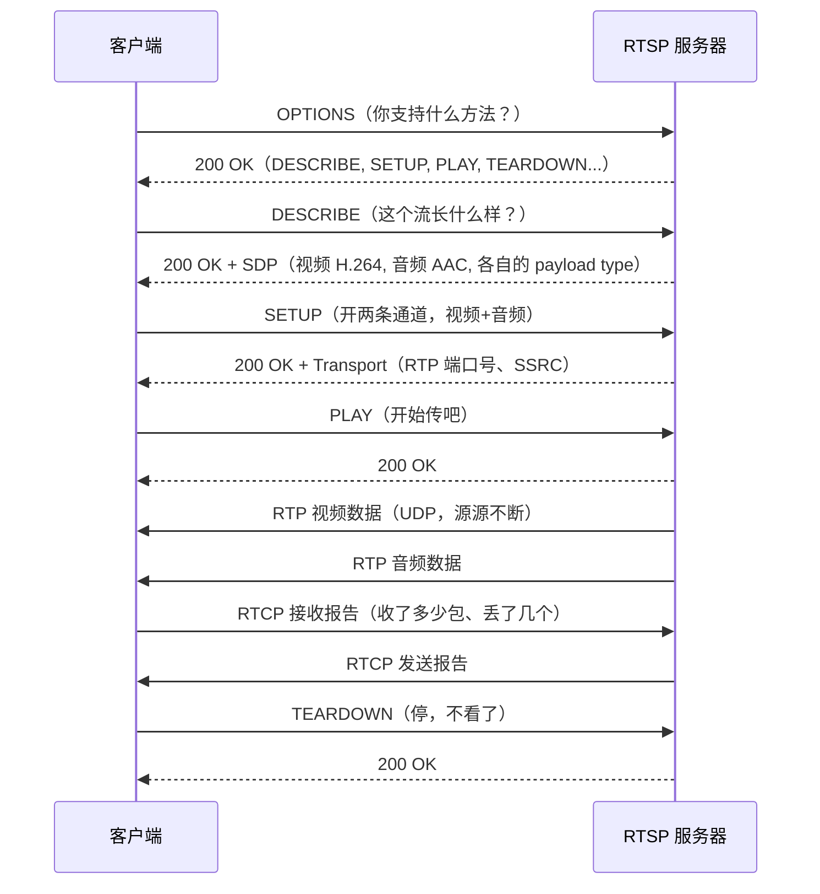

RTSP 是安防监控领域的"普通话"——市面上几乎所有网络摄像头都通过 RTSP 输出视频流。这篇文章从零搭建一个 RTSP 客户端，把摄像头的画面拉到本地显示。同时搞懂 RTSP 的信令流程、RTP/RTCP 的分工，以及对抗网络抖动的核心机制：Jitter Buffer。

<!-- more -->

# RTSP 不是传输协议

很多人以为 RTSP 是"推视频数据的协议"——它其实是**信令协议**，只负责告诉两端"怎么传"，不负责"传什么"。"传什么"是 RTP 和 RTCP 的工作。

打个比方：RTSP 相当于一个导演，RTP 是搬道具的工人，RTCP 是场记（记录每个道具搬了多少、有没有掉地上）。



# 第一步：建立 RTSP 会话

RTSP 是基于文本的协议，长得像 HTTP/1.1。客户端发文本命令，服务器回文本响应。用一个 TCP socket 就可以搞定——但不能用 `write` / `read` 一把梭，因为 `DESCRIBE` 回复的 SDP 信息要解析，`SETUP` 回复的传输参数（RTP 端口）要提取。

幸运的是，FFmpeg 把这一切都封装好了，打开一个 RTSP 流和打开一个本地文件**只需要改 URL**：

```c
AVFormatContext *rtsp_ctx = NULL;

// TCP 传输（穿透防火墙，丢包率低，但延迟略高）
AVDictionary *opts = NULL;
av_dict_set(&opts, "rtsp_transport", "tcp", 0);

// 打开 RTSP 流
int ret = avformat_open_input(&rtsp_ctx,
    "rtsp://192.168.1.100:554/stream1",   // 典型的海康/大华摄像头地址
    NULL, &opts);
av_dict_free(&opts);

avformat_find_stream_info(rtsp_ctx, NULL);

// 后面的逻辑和播放本地文件一模一样
// av_read_frame → 解码 → 渲染
```

RTSP 的传输层有两种模式：

| 模式 | 原理 | 优点 | 缺点 |
|------|------|------|------|
| **TCP 交错** | RTP 包通过 RTSP 的 TCP 连接传输 | 穿透防火墙、不丢包 | 延迟略高（TCP 重传） |
| **UDP** | RTP 包走独立 UDP 端口 | 延迟最低 | 防火墙可能拦截、会丢包 |

监控场景通常用 TCP（稳定性优先），直播和互动场景用 UDP（延迟优先）。用 FFmpeg 只需要改 `rtsp_transport` 参数：

```c
av_dict_set(&opts, "rtsp_transport", "udp", 0);   // UDP 模式
av_dict_set(&opts, "rtsp_transport", "tcp", 0);   // TCP 模式
```

# 第二步：解析 SDP——流里到底有什么

FFmpeg 在内部已经帮你解析了 SDP，但了解 SDP 的结构对理解整个协议栈有帮助。SDP 是 `DESCRIBE` 回复的负载，描述这条 RTSP 流的所有媒体信息：

```
v=0
o=- 0 0 IN IP4 192.168.1.100
s=Live Stream
c=IN IP4 192.168.1.100
t=0 0
m=video 0 RTP/AVP 96          ← 视频流，payload type 96
a=rtpmap:96 H264/90000        ← H.264 编码，时钟频率 90kHz
a=fmtp:96 packetization-mode=1;profile-level-id=42001f
m=audio 0 RTP/AVP 97          ← 音频流，payload type 97
a=rtpmap:97 MPEG4-GENERIC/44100/2  ← AAC, 44.1kHz, 立体声
```

从 SDP 中可以提取出：

- **每条流的编码格式**（`rtpmap` 行）
- **RTP payload type**——RTP 包头里用一个 7 位数字标识编码类型
- **时钟频率**——H.264 的 90kHz 是固定值，用于将 RTP 时间戳换算成真实时间
- **H.264 的打包模式**（`packetization-mode=1` 表示使用 NAL unit 模式）

# RTP 和 RTCP 的分工

RTP 只负责"送数据"，每一帧视频被拆成多个 RTP 包。包头结构：

```
 0                   1                   2                   3
 0 1 2 3 4 5 6 7 8 9 0 1 2 3 4 5 6 7 8 9 0 1 2 3 4 5 6 7 8 9 0 1
+-+-+-+-+-+-+-+-+-+-+-+-+-+-+-+-+-+-+-+-+-+-+-+-+-+-+-+-+-+-+-+-+
|V=2|P|X|  CC   |M|     PT      |       序列号 (16 bits)        |
+-+-+-+-+-+-+-+-+-+-+-+-+-+-+-+-+-+-+-+-+-+-+-+-+-+-+-+-+-+-+-+-+
|                          时间戳 (32 bits)                      |
+-+-+-+-+-+-+-+-+-+-+-+-+-+-+-+-+-+-+-+-+-+-+-+-+-+-+-+-+-+-+-+-+
|                          SSRC (32 bits)                        |
+-+-+-+-+-+-+-+-+-+-+-+-+-+-+-+-+-+-+-+-+-+-+-+-+-+-+-+-+-+-+-+-+
|                          负载数据...                           |
```

关键字段：

| 字段 | 含义 | 怎么用 |
|------|------|--------|
| **序列号** | 包的发送顺序 | 检测丢包和乱序 |
| **时间戳** | 采样时刻（单位=时钟频率） | 换算 PTS |
| **SSRC** | 流标识符 | 区分同一会话中的不同流 |
| **PT** | Payload Type | 标识编码格式（96=H.264） |
| **M** | Marker bit | 视频帧最后一包的标记 |

RTCP 不传媒体数据，而是传**统计报告**。每隔一定时间（通常是 5 秒），接收方向发送方发送 RTCP 报告：

- **SR（Sender Report）** ：发送方报告——发了多少包、发了多少字节
- **RR（Receiver Report）** ：接收方报告——收了多少包、丢了多少包、抖动多大

RTCP 的"抖动"（jitter）值是 Jitter Buffer 的核心输入参数。

# Jitter Buffer：对抗网络抖动

网络不是匀速管道，每个包的到达时间有波动——这就是"抖动"（jitter）。如果不做任何处理，画面会一顿一顿的：前一帧的包来得快、后一帧的包堵在路上。

**Jitter Buffer 的核心思想：收到的包不立即送去解码，先在缓冲池里排一会儿队，等后面的包也到了，按 RTP 序列号和时间戳排好序，再匀速地吐给解码器。**


Jitter Buffer 有两个关键参数：

**缓冲深度（buffer depth）** ：缓冲多少毫秒的数据。设太大 → 延迟高。设太小 → 丢包多、卡顿。

**动态调整策略**：根据 RTCP 报告的 jitter 值，自动调节缓冲深度。

```c
typedef struct {
    // 包缓冲（按序列号排序）
    RtpPacket *packets[MAX_JITTER_BUFFER];
    int packet_count;
    
    // 统计
    int64_t first_packet_arrival;  // 第一个包的到达时间
    int64_t target_delay_ms;       // 目标缓冲延迟（动态调整）
    int min_delay_ms;              // 最小延迟
    int max_delay_ms;              // 最大延迟
    
    SDL_mutex *mutex;
} JitterBuffer;

// 每收到一个 RTCP 报告，更新目标延迟
void jitter_buffer_update_target(JitterBuffer *jb, double rtcp_jitter_ms) {
    // jitter 大 → 增加缓冲深度
    if (rtcp_jitter_ms > jb->target_delay_ms * 0.8) {
        jb->target_delay_ms = (int)(rtcp_jitter_ms * 1.5);
    } else {
        jb->target_delay_ms = (int)(jb->target_delay_ms * 0.9 + rtcp_jitter_ms * 0.1);
    }
    
    // 钳位
    if (jb->target_delay_ms < jb->min_delay_ms) jb->target_delay_ms = jb->min_delay_ms;
    if (jb->target_delay_ms > jb->max_delay_ms) jb->target_delay_ms = jb->max_delay_ms;
}

// 从 Jitter Buffer 取帧：只有缓冲时间够了才吐出
int jitter_buffer_pop_frame(JitterBuffer *jb, uint8_t *out, int max_size) {
    SDL_LockMutex(jb->mutex);
    
    if (jb->packet_count == 0) {
        SDL_UnlockMutex(jb->mutex);
        return 0;
    }
    
    int64_t now = av_gettime_relative() / 1000;  // 毫秒
    int64_t buffer_age = now - jb->first_packet_arrival;
    
    // 缓冲时间不够，再等等
    if (buffer_age < jb->target_delay_ms) {
        SDL_UnlockMutex(jb->mutex);
        return AVERROR(EAGAIN);
    }
    
    // 缓冲够了，组装一帧并移除已消费的包
    int frame_size = assemble_and_dequeue(jb, out, max_size);
    
    SDL_UnlockMutex(jb->mutex);
    return frame_size;
}
```

在实际使用中，Jitter Buffer 的延迟通常设置为 100~500ms。UDP 模式下网络抖动大的场景宁可多缓冲一点（500ms），稳定的局域网可以压到 50ms。

# RTSP 客户端完整骨架

把 FFmpeg 的 `avformat_open_input` 和 Jitter Buffer 结合起来，拉流->解码->渲染：

```c
int main(int argc, char *argv[]) {
    const char *url = "rtsp://192.168.1.100:554/stream1";
    
    // 1. 打开 RTSP 流（用 TCP 传输）
    AVDictionary *opts = NULL;
    av_dict_set(&opts, "rtsp_transport", "tcp", 0);
    av_dict_set(&opts, "buffer_size", "1048576", 0);  // 1MB 接收缓冲
    
    AVFormatContext *ctx = NULL;
    avformat_open_input(&ctx, url, NULL, &opts);
    avformat_find_stream_info(ctx, NULL);
    av_dict_free(&opts);
    
    // 2. 找到视频流并打开解码器
    int video_idx = av_find_best_stream(ctx, AVMEDIA_TYPE_VIDEO, -1, -1, NULL, 0);
    AVCodecContext *dec_ctx = alloc_and_open_decoder(ctx, video_idx);
    
    // 3. 主循环
    AVPacket *pkt = av_packet_alloc();
    AVFrame *frame = av_frame_alloc();
    
    while (running) {
        ret = av_read_frame(ctx, pkt);
        if (ret == AVERROR_EOF) {
            printf("流结束\n");
            break;
        }
        if (ret < 0) {
            fprintf(stderr, "读包失败: %s，尝试重连...\n", av_err2str(ret));
            av_usleep(1000000);  // 等 1 秒重试
            continue;
        }
        
        // FFmpeg 已经在内部处理了 RTP 解包、Jitter Buffer、帧重组
        // 所以我们直接取到的就是完整的压缩帧
        if (pkt->stream_index == video_idx) {
            avcodec_send_packet(dec_ctx, pkt);
            while (avcodec_receive_frame(dec_ctx, frame) >= 0) {
                // 渲染 frame
                render_yuv_frame(frame);
            }
        }
        
        av_packet_unref(pkt);
    }
    
    avformat_close_input(&ctx);
    return 0;
}
```

注意 FFmpeg 在做 RTSP 时已经在 `av_read_frame` 内部集成了 RTP 解包、重排序和 Jitter Buffer——你直接拿到的是按序列排好的完整帧。这也是为什么用 FFmpeg 做 RTSP 客户端省心的地方：协议栈的脏活累活都帮你干了。

# 连接管理：超时与重连

网络摄像头有时会断开，RTSP 客户端必须处理。RTSP 有一种内置的保活机制——`GET_PARAMETER` 或 `OPTIONS`，定时发送（通常 30 秒），服务器不回就认为断线了。

```c
// 使用 av_dict_set 设置超时和重连
av_dict_set(&opts, "stimeout",     "3000000", 0);  // socket 超时（微秒）
av_dict_set(&opts, "reconnect",    "1", 0);         // 启用自动重连
av_dict_set(&opts, "reconnect_at_eof", "1", 0);     // EOF 时重连
av_dict_set(&opts, "reconnect_streamed", "1", 0);   // 流式数据也重连
av_dict_set(&opts, "reconnect_delay_max", "5", 0);  // 最多重试 5 秒
```

如果 FFmpeg 内置的重连逻辑不满足需求，可以自己实现：

```c
int reconnect_loop(const char *url, AVFormatContext **ctx) {
    int retry = 0;
    const int max_retries = 10;
    
    while (retry < max_retries) {
        int ret = avformat_open_input(ctx, url, NULL, NULL);
        if (ret >= 0) return 0;
        
        fprintf(stderr, "连接失败 (%d/%d): %s\n",
                retry + 1, max_retries, av_err2str(ret));
        
        retry++;
        av_usleep(2000000 * retry);  // 递增等待：2s, 4s, 6s...
    }
    
    return -1;
}
```

# 小结

RTSP 协议栈的核心分三层：

| 层 | 协议 | 职责 |
|----|------|------|
| 信令层 | RTSP | OPTIONS/DESCRIBE/SETUP/PLAY/TEARDOWN |
| 传输层 | RTP | 媒体数据打包传输（序列号+时间戳） |
| 控制层 | RTCP | 统计报告（丢包率+抖动），驱动 Jitter Buffer 调整 |

FFmpeg 把三层都藏在 `av_read_frame` 后面，所以接入 RTSP 流的代码和播本地文件几乎一样——改个 URL、配个传输模式就行。真正理解协议栈的价值在于：当你需要做极低延迟（< 100ms）播放、或者要直接操作 RTP 包做转发/转码时，你不会被 FFmpeg 的"黑盒"限制住。

下一篇往下钻一层——不依赖 FFmpeg，手写 RTP 打包和解包代码，从字节级别理解 H.264 的 FU-A 分片机制。
