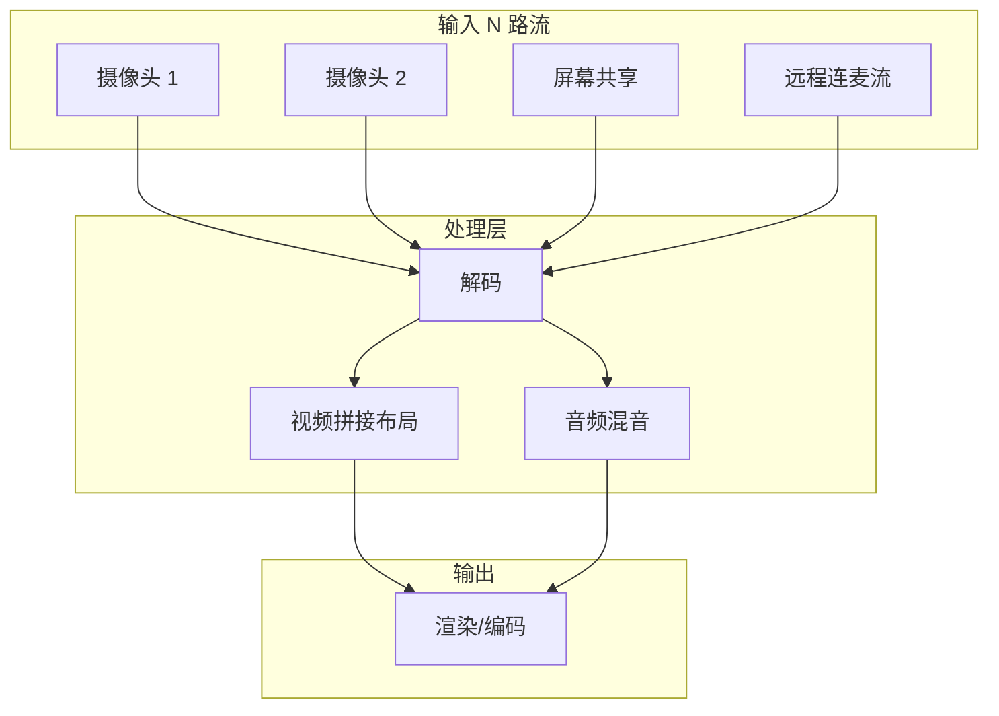

视频会议、监控大屏、直播连麦——这些场景的共同特征是：同时处理多路音视频流。把这 N 路画面拼在一起（视频拼接）和把 N 路声音合在一起（混音），就是这篇要解决的核心问题。

<!-- more -->

# 多路流的典型场景



# 视频拼接：多种布局模式

最常见的需求是把多路视频拼到一张大画布上。布局模式取决于路数：

```
2 路（左右分屏）：         3 路（品字形）：         4 路（田字形）：
┌──────┬──────┐          ┌──────┬──────┐          ┌──────┬──────┐
│   A  │  B   │          │   A  │  B   │          │  A   │  B   │
│      │      │          │      ├──────┤          ├──────┼──────┤
│      │      │          │      │  C   │          │  C   │  D   │
└──────┴──────┘          └──────┴──────┘          └──────┴──────┘
```

用 `libavfilter` 的 `scale` + `overlay` 组合完成。核心思想：每个输入源作为一个独立的 `buffer` 源，缩放到对应位置的大小，用 `overlay` 按坐标叠到画布上。

```c
AVFilterGraph *build_layout_4grid(
    int canvas_w, int canvas_h,
    AVFilterContext **srcs,   // 4 个 buffer 输入源
    AVFilterContext **sink) {
    
    AVFilterGraph *graph = avfilter_graph_alloc();
    int cell_w = canvas_w / 2;  // 2×2 网格，每格大小
    int cell_h = canvas_h / 2;
    
    // 第一步：四个源都 scale 到格子大小
    AVFilterContext *scaled[4];
    char name[16], args[128];
    
    for (int i = 0; i < 4; i++) {
        snprintf(name, sizeof(name), "scale%d", i);
        snprintf(args, sizeof(args), "%d:%d", cell_w, cell_h);
        avfilter_graph_create_filter(&scaled[i], avfilter_get_by_name("scale"),
            name, args, NULL, graph);
        avfilter_link(srcs[i], 0, scaled[i], 0);
    }
    
    // 第二步：创建背景画布（黑色）
    AVFilterContext *bg_src;
    avfilter_graph_create_filter(&bg_src, avfilter_get_by_name("color"),
        "background", "color=black:size=1920x1080:rate=30", NULL, graph);
    
    // 第三步：逐层 overlay
    AVFilterContext *last = bg_src;
    int positions[4][2] = {
        {0, 0},            // 左上
        {cell_w, 0},       // 右上
        {0, cell_h},       // 左下
        {cell_w, cell_h},  // 右下
    };
    
    for (int i = 0; i < 4; i++) {
        AVFilterContext *overlay;
        snprintf(name, sizeof(name), "overlay%d", i);
        snprintf(args, sizeof(args), "x=%d:y=%d",
                 positions[i][0], positions[i][1]);
        
        avfilter_graph_create_filter(&overlay, avfilter_get_by_name("overlay"),
            name, args, NULL, graph);
        avfilter_link(last, 0, overlay, 0);       // 上一个结果 → overlay in0
        avfilter_link(scaled[i], 0, overlay, 1);   // 当前源     → overlay in1
        last = overlay;
    }
    
    // 最终输出
    avfilter_graph_create_filter(sink, avfilter_get_by_name("buffersink"),
        "out", NULL, NULL, graph);
    avfilter_link(last, 0, *sink, 0);
    
    avfilter_graph_config(graph, NULL);
    return graph;
}
```

更灵活的做法是用 `hstack` / `vstack` / `xstack` 滤镜，它们是专门为拼接设计的：

```c
// 水平拼接两路：A | B
// xstack 按坐标排布，fill=black 填充空隙
"xstack=inputs=2:fill=black:"
"layout=0_0|w0_0"  // A 在 (0,0)，B 在 (A的宽度, 0)

// 田字形 4 路
"xstack=inputs=4:fill=black:"
"layout=0_0|w0_0|0_h0|w0_h0"
```

# 混音器：N 路 PCM 音频合为一路

混音比视频拼接简单——逐采样点相加 + 限幅。但做好混音有几个细节：

**1. 采样率对齐**：各路音频源可能采样率不同（一路 44.1kHz，一路 48kHz），混音前必须用 `swr_convert` 统一到同一个采样率。

**2. 音量归一化**：N 路直接相加，音量叠加会使输出爆表。两种策略：

- **降增益**：每路乘以 `1/N`，保证永不溢出但整体音量偏小
- **软限幅**：相加后过软限幅器（soft clipper），动态范围更好

```c
// 方案一：降增益混音
void audio_mixer_gain(int16_t *output, int samples,
                      int16_t **inputs, int *input_samples,
                      int num_inputs) {
    float gain = 1.0f / sqrtf(num_inputs);  // 能量归一化
    
    for (int s = 0; s < samples; s++) {
        float mixed = 0;
        for (int i = 0; i < num_inputs; i++) {
            if (s < input_samples[i])
                mixed += inputs[i][s] * gain;
        }
        // 硬限幅
        if (mixed > 32767) mixed = 32767;
        if (mixed < -32768) mixed = -32768;
        output[s] = (int16_t)mixed;
    }
}

// 方案二：带软限幅的混音（更自然的动态范围）
void audio_mixer_softclip(int16_t *output, int samples,
                          int16_t **inputs, int *input_samples,
                          int num_inputs) {
    for (int s = 0; s < samples; s++) {
        int32_t mixed = 0;
        for (int i = 0; i < num_inputs; i++) {
            if (s < input_samples[i])
                mixed += inputs[i][s];
        }
        
        // tanh 软限幅：把大信号平滑压缩到 [-32768, 32767]
        float normalized = (float)mixed / 32768.0f;
        float soft = tanhf(normalized * 0.7f);  // 0.7 控制压缩程度
        output[s] = (int16_t)(soft * 32767.0f);
    }
}
```

**3. 各路音量独立控制**：给每路加一个音量系数：

```c
float volumes[MAX_INPUTS] = {1.0, 0.8, 0.5, 0.3};  // 4 路不同音量

for (int i = 0; i < num_inputs; i++) {
    for (int s = 0; s < samples; s++) {
        inputs[i][s] = (int16_t)(inputs[i][s] * volumes[i]);
    }
}
// ... 然后混音 ...
```

# 处理多路流的时间同步

多路流混在一起，除了空间排布（画面拼接）和信号叠加（混音），还有一个更深的问题：**各路流的时间可能不同步**。一路摄像头延迟 50ms、另一路延迟 200ms，不处理的话混出来的效果会很割裂。

解决方案是给每一路加独立的 Jitter Buffer，统一到一个参考时钟下"对齐"后再混音/拼接：

```c
typedef struct {
    AVFrame *frame_queue[MAX_QUEUE];
    int head, tail, count;
    
    double target_delay_ms;  // 目标对齐延迟
    SDL_mutex *mutex;
} StreamBuffer;

// 从某一流的缓冲取帧时，用 PTS 和时间基算"这帧应该什么时候播"
int stream_pop_aligned(StreamBuffer *sb, double clock_ms, AVFrame **out) {
    SDL_LockMutex(sb->mutex);
    
    if (sb->count == 0) {
        SDL_UnlockMutex(sb->mutex);
        return 0;
    }
    
    AVFrame *frame = sb->frame_queue[sb->head];
    double frame_pts_ms = frame->pts * 1000 / 90000;  // 假设 90kHz 时钟
    
    // 只有 PTS <= 当前参考时钟时才吐出
    if (frame_pts_ms <= clock_ms + 10) {  // 10ms 容差
        sb->head = (sb->head + 1) % MAX_QUEUE;
        sb->count--;
        *out = frame;
        SDL_UnlockMutex(sb->mutex);
        return 1;
    }
    
    SDL_UnlockMutex(sb->mutex);
    return AVERROR(EAGAIN);  // 帧还"在路上"，等一下
}
```

# 完整的多路混流管线

```c
typedef struct {
    int num_streams;
    
    // 每路流的解码器
    AVCodecContext *decoders[MAX_STREAMS];
    
    // 每路流的最新帧（原始 YUV）
    AVFrame *raw_frames[MAX_STREAMS];
    
    // 滤镜图：多路 → 拼接布局
    AVFilterGraph *layout_graph;
    AVFilterContext *layout_srcs[MAX_STREAMS];
    AVFilterContext *layout_sink;
    
    // 混音器状态
    SwrContext *swr_ctxs[MAX_STREAMS];  // 各路重采样器
    int16_t *audio_bufs[MAX_STREAMS];    // 各路 PCM 缓冲
    
    // 输出
    AVCodecContext *video_enc;
    AVFrame *composited_frame;           // 拼好的画面
} MultiStreamMixer;

// 每一轮合成
int mix_one_frame(MultiStreamMixer *m) {
    // 1. 各路解码，拿到最新帧
    for (int i = 0; i < m->num_streams; i++) {
        avcodec_receive_frame(m->decoders[i], m->raw_frames[i]);
    }
    
    // 2. 视频拼接：每路帧推入滤镜图
    for (int i = 0; i < m->num_streams; i++) {
        if (m->raw_frames[i])
            av_buffersrc_add_frame(m->layout_srcs[i], m->raw_frames[i]);
    }
    
    // 3. 拉出拼接后的画面
    av_buffersink_get_frame(m->layout_sink, m->composited_frame);
    
    // 4. 音频混音：各路重采样到统一格式，然后相加
    // ... mixer code ...
    
    // 5. 编码输出
    return encode_and_output(m->composited_frame, mixed_audio);
}
```

# 性能考量：N 路解码的开销

多路流的 CPU 消耗近似线性增长——4 路 1080p 软解约等于 4 × 单路解码开销。几个优化方向：

**1. 降低分辨率**：拼接后格子只有画布的 1/4（2×2 布局），解码 720p 就够了，没必要解 1080p。在解码前用 `avcodec` 的 `width/height` 参数限制解码分辨率：

```c
// 解码时就缩放（利用解码器内部的缩放能力，比解码后再 sws_scale 省一半开销）
dec_ctx->width  = 640;
dec_ctx->height = 360;
dec_ctx->flags |= AV_CODEC_FLAG_LOW_DELAY;
```

**2. 关键帧对齐后只解差异帧**：如果各路流的关键帧对齐，很多 P/B 帧的解码结果可以复用。不过这对输入源有要求，一般不现实。

**3. 硬件解码**：用 `h264_cuvid` 或 `h264_d3d11va` 把解码卸载到 GPU。多路场景下 GPU 的并行优势非常明显。

# 小结

多路混流的核心就三个组件：

| 组件 | 方案 | 关键 API |
|------|------|----------|
| 视频拼接 | scale + overlay / xstack | `avfilter_graph` 滤镜链 |
| 音频混音 | 降增益逐采样相加 / 软限幅 | `swr_convert` 先对齐采样率 |
| 时间对齐 | 每路独立 Jitter Buffer + 统一参考时钟 | PTS 比较 + 缓冲队列 |

这三个组合在一起，就构成了视频会议、监控大屏、直播连麦等场景的技术底座。下一篇收尾——把这些技术用在一个明确的目标上：把端到端延迟压到 500ms 以内。
