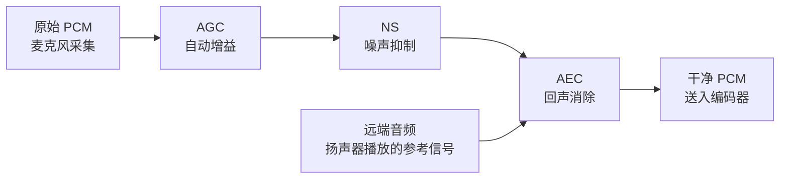

实时通话最怕三件事：回声（对方听到自己的声音）、背景噪音（键盘声、风扇声）、音量忽大忽小。WebRTC 把这三种问题的解决方案内置在了一个独立的库里——`AudioProcessingModule`（APM）。这篇文章把它单独抽出来用：**回声消除（AEC）、噪声抑制（NS）、自动增益控制（AGC）**。不需要建 WebRTC 连接，就用 APM 处理本地麦克风采集的 PCM 数据。

<!-- more -->

# WebRTC 的音频处理模块独立使用

WebRTC 的 APM 是一个纯 C++ 库，没有网络依赖，可以独立编译和使用。它的定位是：**在 PCM 数据进入编码器之前，做一轮"清洗"**——去掉回声、压住噪音、统一音量。



注意数据流向：AEC 需要**两路输入**——一路是麦克风采集的近端信号（近端说话声 + 回声 + 噪音），一路是扬声器正在播放的远端信号（纯参考）。AEC 用参考信号去"抵消"近端信号里的回声成分。

# 编译 WebRTC 的 APM 模块

WebRTC 全量编译耗时且臃肿，只需要音频处理部分的话可以直接用 `google-webrtc` 的独立封装，或者从 Chromium 源码中只抽 `modules/audio_processing` 目录。

最省事的方式——用 vcpkg 或 conan 安装：

```bash
# vcpkg（推荐）
vcpkg install webrtc-audio-processing

# 或直接下载预编译包
# https://github.com/webrtc-uwp/webrtc-audio-processing
```

编译链接后，头文件在 `<webrtc/modules/audio_processing/include/audio_processing.h>`。

# 初始化 APM

APM 需要知道音频流的格式——采样率、声道数，以及是否按流式（实时处理）还是批处理模式：

```cpp
#include <webrtc/modules/audio_processing/include/audio_processing.h>

using namespace webrtc;

AudioProcessing *apm = AudioProcessingBuilder().Create();

// 配置音频流参数
AudioProcessing::Config config;

// 设置处理流水线：AGC → NS → AEC
// 注意 APM 内部的处理顺序和你 Call 的顺序可能不同，它有内置的最优顺序

// ──── 回声消除（AEC）────
config.echo_canceller.enabled = true;
config.echo_canceller.mobile_mode = false;  // false=桌面 AEC，true=移动端 AEC

// ──── 噪声抑制（NS）────
config.noise_suppression.enabled = true;
config.noise_suppression.level = config.noise_suppression.kHigh;

// ──── 自动增益（AGC）────
config.gain_controller1.enabled = true;
config.gain_controller1.mode = config.gain_controller1.kAdaptiveAnalog;
// kAdaptiveAnalog: 模拟硬件 AGC，适合实时通话
// kAdaptiveDigital:  数字 AGC，适合后处理
// kFixedDigital:     固定增益，不推荐

// 可选：高通滤波器（滤除直流分量和低频噪音）
config.high_pass_filter.enabled = true;

apm->ApplyConfig(config);

// 设置音频流参数
const int sample_rate = 48000;
const int channels    = 1;  // APM 默认处理单声道，立体声需要逐声道处理或拆为两个流

// 每帧处理 10ms 的数据（APM 内部帧长是 10ms 的倍数）
// 48kHz × 0.01s = 480 采样点/帧
apm->Initialize(sample_rate, sample_rate, sample_rate,
    webrtc::AudioProcessing::kMono);
// 三个采样率参数分别是：process rate, reverse rate, output rate
// 通常都设相同值
```

APM 的帧长是 10ms 的倍数（WebRTC 音频处理的内部时钟）。这意味着你喂进去的数据必须是 10ms 的整数倍——480 采样点 @48kHz，或 441 采样点 @44.1kHz（取整到 10ms）。

# AEC 的处理逻辑

回声消除要用 BufferedFrameFifo 来保证近端和远端帧对齐：

```cpp
// 全局状态
const int samples_per_10ms = sample_rate / 100;  // 480 @48kHz
StreamConfig near_config(sample_rate, channels);
StreamConfig far_config(sample_rate, channels);

// ──── 处理远端信号（扬声器正在播放的内容）────
void process_far_end(const int16_t *far_data) {
    // 远端信号送入 APM 作为参考
    // APM 内部会缓存一段远端信号用于后续的回声匹配
    apm->ProcessReverseStream(
        far_data, near_config, near_config,
        const_cast<int16_t *>(far_data));  // 同进同出，APM 不修改远端数据
}

// ──── 处理近端信号（麦克风采集的内容）────
void process_near_end(const int16_t *near_data, int16_t *output) {
    // 每 10ms 的 PCM 数据送入 APM
    // APM 用缓存好的远端参考信号来消除回声
    apm->ProcessStream(
        near_data, near_config, near_config,
        output);  // output 就是处理后的干净音频
    
    // output 可以直接送入编码器 AEC → 编码 → 发送
}
```

完整的集成代码——把 APM 嵌入到之前的采集 → 编码流水线中：

```cpp
class AudioPreprocessor {
public:
    AudioPreprocessor(int sample_rate, int channels)
        : sample_rate_(sample_rate), channels_(channels) {
        
        apm_ = AudioProcessingBuilder().Create();
        
        AudioProcessing::Config config;
        config.echo_canceller.enabled = true;
        config.noise_suppression.enabled = true;
        config.noise_suppression.level = config.noise_suppression.kHigh;
        config.gain_controller1.enabled = true;
        config.gain_controller1.mode = config.gain_controller1.kAdaptiveAnalog;
        config.high_pass_filter.enabled = true;
        apm_->ApplyConfig(config);
        
        apm_->Initialize(sample_rate_, sample_rate_, sample_rate_,
            channels_ == 1 ? AudioProcessing::kMono : AudioProcessing::kStereo);
        
        samples_per_frame_ = sample_rate_ / 100;  // 10ms
    }
    
    // 每 10ms 调用一次
    void process(const int16_t *near_pcm, const int16_t *far_pcm,
                 int16_t *output) {
        // 1. 先送远端参考（如果有的话）
        if (far_pcm) {
            apm_->ProcessReverseStream(
                far_pcm,
                StreamConfig(sample_rate_, channels_),
                StreamConfig(sample_rate_, channels_),
                const_cast<int16_t *>(far_pcm));
        }
        
        // 2. 处理近端
        apm_->ProcessStream(
            near_pcm,
            StreamConfig(sample_rate_, channels_),
            StreamConfig(sample_rate_, channels_),
            output);
    }

private:
    AudioProcessing *apm_;
    int sample_rate_, channels_, samples_per_frame_;
};
```

# 无需 AEC 的场景

不是所有场景都需要 AEC。如果用户戴耳机（没有扬声器到麦克风的回声路径），可以关掉 AEC 省下 CPU：

```cpp
// 自适应检测：如果当前是耳机模式，禁用 AEC
if (headset_plugged_in) {
    config.echo_canceller.enabled = false;
} else {
    config.echo_canceller.enabled = true;
}
apm->ApplyConfig(config);
```

NS 和 AGC 几乎总是需要开着——麦克风都有底噪，说话距离也经常变化。

# 实测效果对比

把 APM 处理前后的 PCM 保存下来，用 Audacity 看波形：

```
处理前（原始麦克风）：
  - 键盘敲击声清晰可见（短促的高振幅尖峰）
  - 环境底噪分布在整段信号中
  - 远端回声叠加在近端说话信号上

处理后（APM 输出）：
  - 键盘声被大幅抑制
  - 底噪降低约 15~20dB
  - 回声消失，近端语音清晰
  - 音量均匀，不会忽大忽小
```

APM 的降噪是**单通道**的——它不需要多个麦克风，仅靠频域分析就能区分语音和噪音。立竿见影。

# CPU 开销

APM 的处理开销取决于配置：

| 模块 | 每 10ms 帧的 CPU (48kHz 单声道) |
|------|-------------------------------|
| AEC | ~0.3ms |
| NS (High) | ~0.2ms |
| AGC | ~0.1ms |
| HPF | ~0.05ms |
| **合计** | **~0.65ms** |

48kHz 下每帧 10ms 时长，APM 只用 0.65ms 就处理完了，占比 6.5%。对实时通话几乎无影响。

# 小节

WebRTC APM 的三件套：

| 模块 | 解决问题 | 配置要点 |
|------|----------|----------|
| AEC | 扬声器回声 | 需要远端参考信号；耳机模式建议关闭 |
| NS | 背景噪音 | kHigh 效果好；单通道，不依赖多麦 |
| AGC | 音量忽大忽小 | kAdaptiveAnalog 适合实时场景 |

这三样处理是所有实时音视频产品的标配。下一篇把 APM 放回它原本的归宿——和 WebRTC Native SDK 一起，搭建一个完整的点对点音视频通话。
