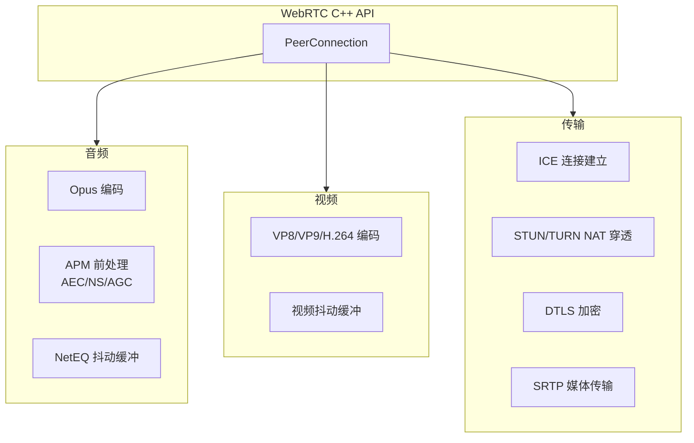
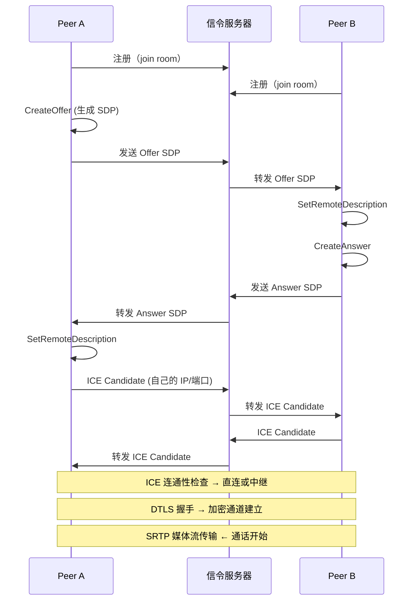
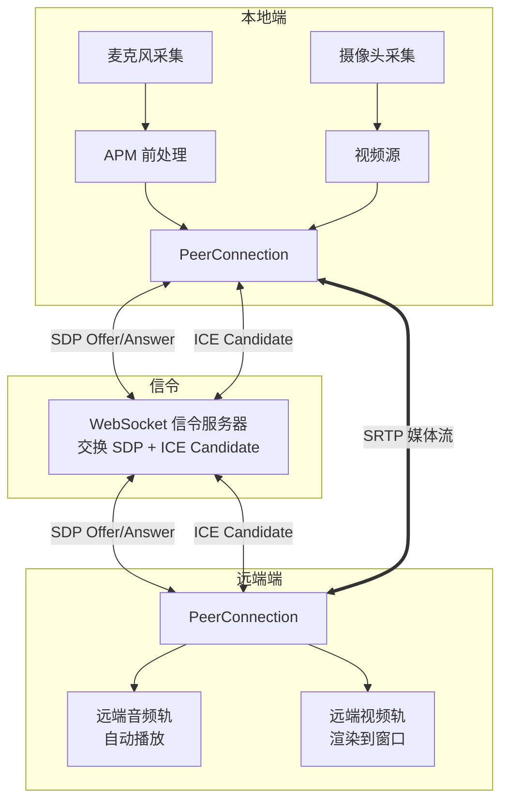

WebRTC 是浏览器里能跑实时音视频的基石，但它的 Native SDK 同样强大。这篇文章用 WebRTC C++ SDK 搭建一个完整的一对一音视频通话，从信令到 ICE 穿透，每一步都把原理和代码对上。

<!-- more -->

# WebRTC 不是"一个协议"

WebRTC 是一个庞大的技术栈，至少包含：



你不需要分别调用编码器、打包 RTP、处理 ICE——这些全被 `PeerConnection` 封装好了。你需要做的事只有三件：

1. **建立信令通道**（交换 SDP 和 ICE Candidate）
2. **创建 PeerConnection** + 添加媒体流
3. **处理回调**（远端流到达、ICE 状态变化）

# 信令：WebRTC 的"电话本"

WebRTC 只管媒体传输，不管"怎么找到对方"。信令（Signaling）就是这个"电话本"——两个 Peer 通过信令服务器交换彼此的 IP 地址、端口、编解码能力。



信令服务器可以用 WebSocket 实现，最简单的一个版本：

```javascript
// signaling_server.js (Node.js)
const WebSocket = require('ws');
const wss = new WebSocket.Server({ port: 8080 });

const rooms = {};

wss.on('connection', (ws) => {
    let currentRoom = null;

    ws.on('message', (data) => {
        const msg = JSON.parse(data);

        switch (msg.type) {
        case 'join':
            currentRoom = msg.room;
            if (!rooms[currentRoom]) rooms[currentRoom] = [];
            rooms[currentRoom].push(ws);
            console.log(`Peer joined room: ${currentRoom}`);
            break;

        case 'offer':
        case 'answer':
        case 'ice-candidate':
            // 转发给房间里的另一个 peer
            rooms[currentRoom].forEach(client => {
                if (client !== ws && client.readyState === WebSocket.OPEN) {
                    client.send(JSON.stringify(msg));
                }
            });
            break;
        }
    });

    ws.on('close', () => {
        if (currentRoom && rooms[currentRoom]) {
            rooms[currentRoom] = rooms[currentRoom].filter(c => c !== ws);
        }
    });
});

console.log('信令服务器运行在 ws://localhost:8080');
```

# 创建 PeerConnection

WebRTC Native SDK 的初始化比较冗长，但核心逻辑很清晰：

```cpp
#include <webrtc/api/peer_connection_interface.h>
#include <webrtc/rtc_base/ssl_adapter.h>
#include <webrtc/media/engine/webrtc_media_engine.h>

class WebRTCManager : public webrtc::PeerConnectionObserver,
                      public webrtc::CreateSessionDescriptionObserver {
public:
    WebRTCManager() {
        rtc::InitializeSSL();  // 必须，否则 DTLS 握手失败
        
        // 1. 创建线程
        signaling_thread_ = rtc::Thread::Create();
        signaling_thread_->Start();
        worker_thread_ = rtc::Thread::Create();
        worker_thread_->Start();
        network_thread_ = rtc::Thread::CreateWithSocketServer();
        network_thread_->Start();
        
        // 2. 创建 PeerConnectionFactory
        webrtc::PeerConnectionFactoryDependencies factory_deps;
        factory_deps.signaling_thread = signaling_thread_.get();
        factory_deps.worker_thread = worker_thread_.get();
        factory_deps.network_thread = network_thread_.get();
        
        // 配置音频处理（上一篇的 APM）
        webrtc::AudioProcessing::Config apm_config;
        apm_config.echo_canceller.enabled = true;
        apm_config.noise_suppression.enabled = true;
        apm_config.gain_controller1.enabled = true;
        
        factory_deps.audio_processing = 
            webrtc::AudioProcessingBuilder().SetConfig(apm_config).Create();
        
        factory_ = webrtc::CreateModularPeerConnectionFactory(
            std::move(factory_deps));
        
        // 3. 配置 ICE 服务器（STUN/TURN）
        webrtc::PeerConnectionInterface::RTCConfiguration config;
        
        webrtc::PeerConnectionInterface::IceServer stun_server;
        stun_server.uri = "stun:stun.l.google.com:19302";  // 免费 STUN
        config.servers.push_back(stun_server);
        
        webrtc::PeerConnectionInterface::IceServer turn_server;
        turn_server.uri = "turn:turn.example.com:3478";
        turn_server.username = "user";
        turn_server.password = "password";
        config.servers.push_back(turn_server);
        
        config.ice_candidate_pool_size = 1;
        
        // 4. 创建 PeerConnection
        peer_connection_ = factory_->CreatePeerConnection(
            config, nullptr, nullptr, this);
    }
    
    // 添加本地音视频轨
    void addLocalTracks() {
        // 音频轨（默认从系统麦克风采集）
        auto audio_track = factory_->CreateAudioTrack(
            "audio", factory_->CreateAudioSource(cricket::AudioOptions()));
        peer_connection_->AddTrack(audio_track, {"stream0"});
        
        // 视频轨（需要先打开摄像头。简化示例，实际需要创建 VideoCapturer）
        // auto video_track = factory_->CreateVideoTrack("video", video_source);
        // peer_connection_->AddTrack(video_track, {"stream0"});
    }

private:
    rtc::scoped_refptr<webrtc::PeerConnectionInterface> peer_connection_;
    rtc::scoped_refptr<webrtc::PeerConnectionFactoryInterface> factory_;
    std::unique_ptr<rtc::Thread> signaling_thread_;
    std::unique_ptr<rtc::Thread> worker_thread_;
    std::unique_ptr<rtc::Thread> network_thread_;
};
```

WebRTC 有三个独立线程，各自有明确的职责：

| 线程 | 职责 |
|------|------|
| Signaling Thread | 信令操作（CreateOffer/Answer、SetRemoteDescription） |
| Worker Thread | 媒体处理（编解码、加密） |
| Network Thread | 网络 I/O（收发 SRTP、ICE 探测） |

# 发起通话：CreateOffer → SetLocalDescription → 发送信令

```cpp
void WebRTCManager::startCall() {
    webrtc::PeerConnectionInterface::RTCOfferAnswerOptions options;
    options.offer_to_receive_audio = true;
    options.offer_to_receive_video = true;
    
    peer_connection_->CreateOffer(this, options);
    // 结果在 OnSuccess(SessionDescriptionInterface*) 回调
}

// CreateSessionDescriptionObserver 回调
void WebRTCManager::OnSuccess(webrtc::SessionDescriptionInterface *desc) override {
    // 1. 设为本地描述
    peer_connection_->SetLocalDescription(
        DummySetSessionDescriptionObserver::Create(), desc);
    
    // 2. 序列化 SDP 并通过信令发送给对方
    std::string sdp;
    desc->ToString(&sdp);
    
    std::string type = (desc->GetType() == webrtc::SdpType::kOffer) 
                        ? "offer" : "answer";
    
    send_signaling_message(type, sdp);
}

void WebRTCManager::onSignalingMessage(const std::string &type,
                                        const std::string &sdp) {
    // 解析对端发来的 SDP
    webrtc::SdpType sdp_type = (type == "offer") 
        ? webrtc::SdpType::kOffer : webrtc::SdpType::kAnswer;
    
    auto desc = webrtc::CreateSessionDescription(sdp_type, sdp);
    
    peer_connection_->SetRemoteDescription(
        DummySetSessionDescriptionObserver::Create(), desc.release());
    
    // 如果是 offer，需要回复 answer
    if (sdp_type == webrtc::SdpType::kOffer) {
        peer_connection_->CreateAnswer(this, webrtc::PeerConnectionInterface::RTCOfferAnswerOptions());
    }
}
```

# ICE Candidate：找到对端地址

SDP 交换完后，两个 Peer 互相知道了对方的编解码能力，但还不知道对方的网络地址。ICE（Interactive Connectivity Establishment）就是用来做这件事的——通过 STUN/TURN 服务器，找到两个 Peer 之间最优的通信路径。

```cpp
// PeerConnectionObserver 回调：本地 ICE Candidate 收集完成
void WebRTCManager::OnIceCandidate(
    const webrtc::IceCandidateInterface *candidate) override {
    
    std::string sdp;
    candidate->ToString(&sdp);
    
    // 通过信令发送给对方
    json msg;
    msg["type"] = "ice-candidate";
    msg["sdp_mid"] = candidate->sdp_mid();
    msg["sdp_mline_index"] = candidate->sdp_mline_index();
    msg["candidate"] = sdp;
    
    send_signaling_message(msg.dump());
}

// 收到对端的 ICE Candidate
void WebRTCManager::onRemoteIceCandidate(const std::string &sdp_mid,
                                          int sdp_mline_index,
                                          const std::string &candidate_sdp) {
    webrtc::SdpParseError error;
    auto candidate = webrtc::CreateIceCandidate(sdp_mid, sdp_mline_index,
                                                 candidate_sdp, &error);
    peer_connection_->AddIceCandidate(std::move(candidate));
}
```

# ICE / STUN / TURN：NAT 穿透三部曲

WebRTC 在 NAT 后的两个端点如何建立直连？分三步走，复杂度递增：

```
Step 1: Host Candidate（本地地址）
   Peer A --192.168.1.5--------> Peer B
   同一局域网，直接连。
   ❌ 双方不在同一网络 → 进入 Step 2

Step 2: Server Reflexive Candidate（STUN 反射地址）
   Peer A --STUN 服务器--> 获取公网 IP:Port
   Peer A --公网 IP:Port-----> Peer B
   STUN 告诉 Peer A 它在公网上看起来是什么地址。
   ❌ NAT 类型是对称型 → 进入 Step 3

Step 3: Relay Candidate（TURN 中继）
   Peer A --TURN 服务器--中继---> Peer B
   TURN 服务器做数据中转。
   ✅ 只要 TURN 可达，通话就能通（但带宽成本高）
```

免费的 STUN 服务器（Google 维护）：

```
stun:stun.l.google.com:19302
stun:stun1.l.google.com:19302
```

TURN 需要自己部署——`coturn` 是最常用的开源 TURN 服务器：

```bash
# 安装 coturn
apt install coturn

# /etc/turnserver.conf
listening-port=3478
fingerprint
lt-cred-mech
user=username:password
realm=example.com
```

# 接收远端流

当对方的媒体流到达时，`PeerConnectionObserver` 的回调会触发：

```cpp
void WebRTCManager::OnAddTrack(
    rtc::scoped_refptr<webrtc::RtpReceiverInterface> receiver,
    const std::vector<rtc::scoped_refptr<webrtc::MediaStreamInterface>> &streams)
    override {
    
    auto track = receiver->track();
    
    if (track->kind() == webrtc::MediaStreamTrackInterface::kVideoKind) {
        // 远端视频轨到达
        auto video_track = static_cast<webrtc::VideoTrackInterface *>(track.get());
        
        // 将视频渲染到 Qt/OpenGL widget
        video_track->AddOrUpdateSink(video_renderer_.get(), rtc::VideoSinkWants());
    }
    
    if (track->kind() == webrtc::MediaStreamTrackInterface::kAudioKind) {
        // 远端音频轨到达——WebRTC 内部会自动播放
        // 如果需要自定义处理（如混音、录音），在这里拿到 PCM 数据
    }
}
```

# 连接状态监控

通话过程中需要感知连接状态的变化：

```cpp
void WebRTCManager::OnIceConnectionChange(
    webrtc::PeerConnectionInterface::IceConnectionState state) override {
    switch (state) {
    case webrtc::PeerConnectionInterface::kIceConnectionConnected:
        printf("ICE 连接成功！通话建立\n");
        break;
    case webrtc::PeerConnectionInterface::kIceConnectionDisconnected:
        printf("ICE 断开，尝试重连...\n");
        break;
    case webrtc::PeerConnectionInterface::kIceConnectionFailed:
        printf("ICE 连接失败，检查 TURN 配置\n");
        break;
    }
}
```

# WebRTC 客户端完整架构

把信令、PeerConnection、采集、渲染拼在一起：



# 小结

WebRTC Native 通话的关键：**理解各组件的关系，而不是记住每一行 API**。

| 概念 | 一句话解释 |
|------|-----------|
| PeerConnection | WebRTC 的"总控"，管理编解码+传输+加密 |
| SDP Offer/Answer | 交换双方支持的编解码能力 |
| ICE Candidate | 收集本地网络地址，发给对方尝试连通 |
| STUN | 帮你在 NAT 后找到公网地址 |
| TURN | 打不通就中继——保底方案 |
| 信令 | WebSocket 或其他通道，负责交换 SDP 和 ICE |

WebRTC 的代码量不小，但一旦跑通第一次，后续加功能（屏幕共享、数据通道、多人通话）都是在这个骨架上的增量。下一篇换个方向——不去做实时通话，而是把已有的视频做成点播服务，让用户像看在线视频一样随时点播。
