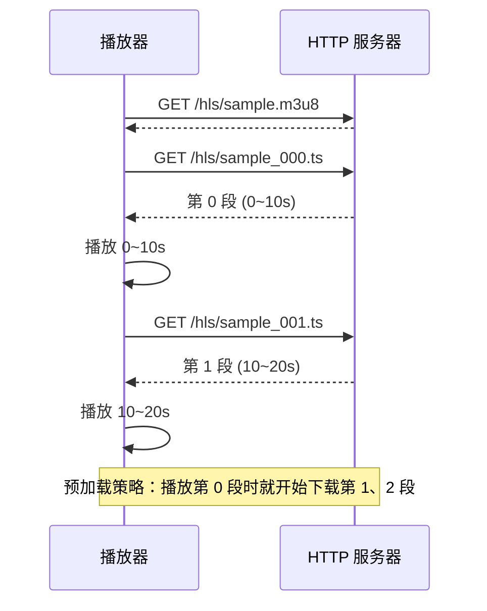

在线视频网站（B站、YouTube）并非直接把整个 MP4 文件扔给浏览器——它们用 HLS 或 DASH 协议将视频切成小片段，浏览器按需拉取播放。这篇文章用 FFmpeg 做切片 + Nginx 做静态文件服务，搭一个完整的 HLS 点播服务。

<!-- more -->

# HLS 的工作原理

HLS（HTTP Live Streaming）是 Apple 提出的流媒体协议，核心思想很朴素：**把一个长视频切成几百个 10 秒的小 ts 文件，浏览器按顺序逐个下载播放**。

```
sample.mp4  (2 小时长视频)
    │
    ├── ffmpeg 切片
    │
    ├── sample.m3u8        ← 索引文件（播放列表）
    ├── sample_000.ts      ← 第 0 个 10 秒片段
    ├── sample_001.ts      ← 第 1 个 10 秒片段
    ├── sample_002.ts      ← ...
    └── sample_NNN.ts      ← 最后一个片段
```

播放器先下载 `m3u8` 索引文件，知道有哪些 ts 片段和时长，然后按顺序拉取播放。每个片段都是独立的、可以单独解码的（以关键帧开头）。



好处显而易见：不需要等整个文件下载完就能播、拖动进度条直接跳到对应 ts 文件、自适应码率（多份不同码率的 m3u8 并列）。

# FFmpeg 切片

用 FFmpeg 把任意视频切成 HLS 格式：

```bash
ffmpeg -i input.mp4 \
  -c:v libx264 -c:a aac \
  -b:v 2000k -b:a 128k \
  -hls_time 10 \           # 每个 ts 片段的时长（秒）
  -hls_list_size 0 \       # m3u8 中保留所有片段（0=不限制）
  -hls_segment_filename "output_%03d.ts" \
  -hls_key_info_file key_info.txt \  # 可选：加密
  output.m3u8
```

生成的 `m3u8` 内容：

```
#EXTM3U
#EXT-X-VERSION:3
#EXT-X-TARGETDURATION:10
#EXT-X-MEDIA-SEQUENCE:0
#EXTINF:10.000,
output_000.ts
#EXTINF:10.000,
output_001.ts
#EXTINF:8.500,
output_002.ts
#EXT-X-ENDLIST
```

每个片段的关键帧开头的保证——`-hls_time 10` 告诉 `hls` muxer："每个片段以关键帧作为分割点"，所以片段的实际时长会在 10 秒左右浮动（取决于 GOP 大小）。

关键参数说明：

| 参数 | 含义 | 建议值 |
|------|------|--------|
| `-hls_time` | 片段目标时长 | 6~10 秒，太短请求太多，太长首帧延迟高 |
| `-hls_list_size` | m3u8 中保留的片段数 | 0 = 全部保留；直播场景设为 5~10 |
| `-hls_segment_type` | fmp4 或 mpegts | mpegts（默认，兼容性最好）/ fmp4 |
| `-hls_flags` | 选项 | `independent_segments` 每段独立可解码 |

# 用 C API 实现动态切片

直接用 FFmpeg C API 做切片，适合需要自定义切片策略的场景（比如按场景检测自动切分、实时录制边录边切）：

```c
int create_hls_segments(const char *input_file, const char *output_prefix) {
    // 1. 打开输入文件
    AVFormatContext *in_ctx = NULL;
    avformat_open_input(&in_ctx, input_file, NULL, NULL);
    avformat_find_stream_info(in_ctx, NULL);
    
    // 2. 创建 HLS 输出
    AVFormatContext *out_ctx = NULL;
    char m3u8_path[512];
    snprintf(m3u8_path, sizeof(m3u8_path), "%s.m3u8", output_prefix);
    
    avformat_alloc_output_context2(&out_ctx, NULL, "hls", m3u8_path);
    
    // 3. 复制流（不解码，直接封装级拷贝）
    //    这样不需要重新编码，极快
    for (int i = 0; i < in_ctx->nb_streams; i++) {
        AVStream *in_st = in_ctx->streams[i];
        AVStream *out_st = avformat_new_stream(out_ctx, NULL);
        avcodec_parameters_copy(out_st->codecpar, in_st->codecpar);
        out_st->time_base = in_st->time_base;
    }
    
    // 4. 配置 HLS 参数
    AVDictionary *opts = NULL;
    av_dict_set(&opts, "hls_time",        "10", 0);   // 10 秒一段
    av_dict_set(&opts, "hls_list_size",   "0",  0);   // 保留全部
    av_dict_set(&opts, "hls_segment_filename", 
                "segment_%03d.ts", 0);                 // 片段命名模板
    av_dict_set(&opts, "hls_flags", 
                "independent_segments", 0);            // 每段可独立解码
    
    // 5. 打开输出并写头
    avio_open(&out_ctx->pb, m3u8_path, AVIO_FLAG_WRITE);
    avformat_write_header(out_ctx, &opts);
    av_dict_free(&opts);
    
    // 6. 封装级拷贝（不解码不编码，纯转封装）
    AVPacket *pkt = av_packet_alloc();
    while (av_read_frame(in_ctx, pkt) >= 0) {
        AVStream *in_st  = in_ctx->streams[pkt->stream_index];
        AVStream *out_st = out_ctx->streams[pkt->stream_index];
        
        // 时间戳重映射
        pkt->pts = av_rescale_q_rnd(pkt->pts, in_st->time_base,
                                     out_st->time_base, AV_ROUND_NEAR_INF);
        pkt->dts = av_rescale_q_rnd(pkt->dts, in_st->time_base,
                                     out_st->time_base, AV_ROUND_NEAR_INF);
        pkt->duration = av_rescale_q(pkt->duration, in_st->time_base,
                                      out_st->time_base);
        
        av_interleaved_write_frame(out_ctx, pkt);
        av_packet_unref(pkt);
    }
    
    // 7. 收尾
    av_write_trailer(out_ctx);
    avio_closep(&out_ctx->pb);
    avformat_close_input(&in_ctx);
    avformat_free_context(out_ctx);
    
    return 0;
}
```

封装级拷贝的优点是**极快**——不需要重编码，一个 2 小时的视频几秒就能切完。缺点是不能改编码格式、不能加滤镜。如果需要加水印或转码，就得走解码→滤镜→编码的完整链路。

# 搭建点播服务

一个最简化的点播服务——Nginx 做静态文件服务器 + HTML 播放页面：

**Nginx 配置**：

```nginx
server {
    listen 80;
    server_name vod.example.com;
    
    # 视频目录
    location /hls {
        alias /data/videos/hls;
        
        # 允许跨域（播放器来自不同域名时需要）
        add_header Access-Control-Allow-Origin *;
        add_header Access-Control-Allow-Methods "GET, OPTIONS";
        
        # ts 文件缓存（内容不变，可以长缓存）
        location ~* \.ts$ {
            expires 30d;
            add_header Cache-Control "public, immutable";
        }
        
        # m3u8 文件不缓存（直播场景可能更新）
        location ~* \.m3u8$ {
            expires -1;
            add_header Cache-Control "no-cache";
        }
    }
}
```

**播放页**（用 hls.js 在浏览器播放 HLS）：

```html
<!DOCTYPE html>
<html>
<head>
    <meta charset="utf-8">
    <title>VOD Player</title>
    <script src="https://cdn.jsdelivr.net/npm/hls.js@latest"></script>
</head>
<body>
    <video id="player" controls style="width:80%;max-width:960px"></video>
    
    <script>
    const video = document.getElementById('player');
    
    if (Hls.isSupported()) {
        const hls = new Hls({
            maxBufferLength: 30,           // 缓冲 30 秒
            maxMaxBufferLength: 60,       // 最大不超过 60 秒
            startLevel: -1                // 自适应码率
        });
        
        hls.loadSource('/hls/sample.m3u8');
        hls.attachMedia(video);
        hls.on(Hls.Events.MANIFEST_PARSED, () => {
            console.log('HLS 就绪，时长:', hls.levels[0]?.details?.totalduration);
            // video.play();  // 如需自动播放
        });
    } else if (video.canPlayType('application/vnd.apple.mpegurl')) {
        // Safari 原生支持 HLS
        video.src = '/hls/sample.m3u8';
    }
    </script>
</body>
</html>
```

# 自适应多码率（ABR）

HLS 支持在一个 m3u8 下提供多份不同码率的流，播放器根据网络状况自动切换：

**master.m3u8（多码率索引）**：

```
#EXTM3U
#EXT-X-STREAM-INF:BANDWIDTH=800000,RESOLUTION=640x360
360p.m3u8
#EXT-X-STREAM-INF:BANDWIDTH=2000000,RESOLUTION=1280x720
720p.m3u8
#EXT-X-STREAM-INF:BANDWIDTH=5000000,RESOLUTION=1920x1080
1080p.m3u8
```

用 FFmpeg 一次性出多份：

```bash
ffmpeg -i input.mp4 \
  -filter_complex \
    "[0:v]split=3[v1][v2][v3]; \
     [v1]scale=640:360[v1out]; \
     [v2]scale=1280:720[v2out]; \
     [v3]scale=1920:1080[v3out]" \
  -map "[v1out]" -c:v:0 libx264 -b:v:0 800k \
  -map "[v2out]" -c:v:1 libx264 -b:v:1 2000k \
  -map "[v3out]" -c:v:2 libx264 -b:v:2 5000k \
  -map a:0 -c:a aac -b:a 128k \
  -f hls -hls_time 10 -hls_list_size 0 \
  -var_stream_map "v:0,a:0 v:1,a:1 v:2,a:2" \
  -master_pl_name master.m3u8 \
  -hls_segment_filename "stream_%v/segment_%03d.ts" \
  stream_%v.m3u8
```

`-var_stream_map` 指定了每个变体流使用哪个视频轨和音频轨。`%v` 在文件名中会替换为变体流编号（0、1、2）。

# 直播 HLS vs 点播 HLS

两者的 m3u8 有一个关键区别：

```diff
# 点播（VOD）
#EXT-X-ENDLIST          ← 有这个标记，播放器知道视频已经完整

# 直播（Live）
# 没有 EXT-X-ENDLIST    ← 播放器知道后面还有新片段，持续轮询 m3u8
```

直播场景下，FFmpeg 持续往 `hls` muxer 喂数据，`m3u8` 持续追加新片段，播放器每隔几秒拉一次 `m3u8` 检查有无新 ts 文件。直播的 `-hls_list_size` 通常设为 5~10（只保留最近的几个片段在索引中）。

# 内容加密（DRM-Lite）

付费点播可能需要对 ts 文件加密。HLS 支持 AES-128 加密：

```bash
# 生成加密密钥
openssl rand -hex 16 > enc.key

# key_info.txt 格式
# key URI, key file path, IV (可选)
echo "https://vod.example.com/keys/enc.key" > key_info.txt
echo "enc.key" >> key_info.txt

# 切片时加密
ffmpeg -i input.mp4 \
  -hls_key_info_file key_info.txt \
  -hls_time 10 \
  encrypted.m3u8
```

播放器在加载 m3u8 时会先向 `key URI` 请求密钥，解密后播放。实际生产环境还要结合 token 鉴权、DRM 方案（Widevine/FairPlay）等。

# 小结

HLS 点播服务的搭建四步走：

| 步骤 | 工具 | 产出 |
|------|------|------|
| 切片 | FFmpeg `-f hls` | m3u8 + N 个 ts 文件 |
| 编码 | 可封装级拷贝（快）或重编码（灵活） | — |
| 服务 | Nginx 静态文件 + CORS 头 | HTTP 可访问的 URL |
| 播放 | hls.js / video.js / 原生 Safari | 浏览器点播体验 |

HLS 简单、兼容性好（所有浏览器+移动端原生支持），但延迟高（片段时长 x N 倍的缓冲）。如果要做毫秒级的低延迟直播，HLS 不合适——得用 WebRTC 或 RTMP+WebRTC 混合方案。下一篇回到整体视角，对整个音视频学习路径做一次复盘。
