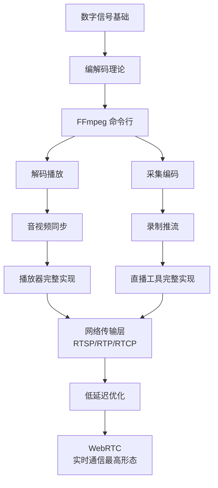

十六篇文章，从数字信号基础到 WebRTC 实时通话。这篇文章不做技术细节，而是站在整个音视频领域的高度，梳理知识骨架、回顾项目产出、总结架构模式，并指出可以继续深入的方向。

<!-- more -->

# 音视频开发的知识骨架

音视频开发不是学一堆零散的 API——它有一条贯穿始终的核心脉络：



这条链路上，每一层都在解决一种"距离"问题：

| 层 | 解决什么"距离" |
|----|---------------|
| 编解码 | 数据量和带宽的距离（压缩） |
| 解复用/封装 | 不同格式的距离（容器适配） |
| 音视频同步 | 画面和声音的距离（时钟对齐） |
| 传输协议 | 网络节点的距离（RTP/RTMP/HLS） |
| NAT 穿透 | 内网的墙（STUN/TURN/ICE） |
| 低延迟优化 | 时间的距离（编解码缓冲/传输缓冲） |

# 十六篇文章的项目产出

如果跟着这个系列把代码都写了一遍，你现在手里有这些可运行的产物：

**1. 播放器**
- 完整的本地视频播放器（支持 MP4/MKV、暂停/Seek/倍速）
- 核心技术：`avformat` → `avcodec` → `sws_scale` → QOpenGLWidget + SDL2 音频
- 文件量估计：~1500 行 C/C++

**2. 推流工具**
- 摄像头麦克风采集 → RTMP 推流 + 本地录制
- 多场景切换、图层叠加、混音
- 核心技术：`libavdevice` → `avfilter` → 编码 → `avio_open` 网络
- 文件量估计：~2000 行 C/C++

**3. RTSP 客户端**
- 拉取网络摄像头流
- Jitter Buffer 实现
- 可直接用于安防监控场景
- 文件量估计：~500 行 C

**4. RTP 协议栈**
- 手写 H.264 FU-A 打包/解包
- 独立的发送端和接收端
- 文件量估计：~600 行 C

**5. 音频预处理管线**
- WebRTC APM 模块独立使用
- AEC 回声消除 + NS 降噪 + AGC 自动增益
- 文件量估计：~300 行 C++

**6. WebRTC 通话终端**
- 点对点音视频通话
- 信令交互 + ICE 穿透
- 文件量估计：~1000 行 C++

**7. HLS 点播服务**
- 视频切片 + Nginx 静态服务 + hls.js 播放
- 文件量估计：~300 行 C + 配置文件

**8. 工具类**
- 滤镜处理（水印/时间戳）
- 批量缩略图生成 + HTTP API
- 多路混流混音
- 文件量估计：~800 行 C/C++

这些都是能写进简历、能展示给面试官的项目代码。

# 架构模式：音视频程序的骨架

写了这么多代码之后，会发现音视频程序有一种反复出现的**管道模式**：

```
输入源 → [格式转换] → 处理 → [格式转换] → 输出目标
```

无论是播放器、推流工具、还是 WebRTC 终端，本质上都是这个模式的变体：

| 程序类型 | 输入源 | 处理 | 输出目标 |
|----------|--------|------|----------|
| 播放器 | 文件 / RTSP URL | 解复用 + 解码 + 音视频同步 | 屏幕 + 声卡 |
| 推流工具 | 摄像头 + 麦克风 | 滤镜 + 编码 + 混音 | RTMP URL |
| RTP 客户端 | UDP Socket | FU-A 重组 + 解码 | 屏幕 + 声卡 |
| WebRTC | PeerConnection | APM + 编解码 + ICE | SRTP 加密通道 |
| HLS 点播 | MP4 文件 | 切片（可封装级拷贝） | HTTP 分段文件 |

**多线程模型**也有一个稳定的范式：

```
采集/解复用线程 (1个)
    ↓ [packet queue]
解码线程 (1~2个，视音频分离或合并)
    ↓ [frame queue]
渲染线程 (1个，GUI 线程)
    ↓
声卡回调线程 (1个，SDL/PortAudio 管理)
```

线程之间通过**带锁的队列**传递数据，每条队列的责任单一、方向固定。这套模型几乎适用于所有实时音视频程序。

# 性能优化清单

回顾整个系列涉及的优化点，按收益排序：

| 优化项 | 收益 | 场景 |
|--------|------|------|
| 硬解码（NVENC/QSV） | 编码延迟降低 50~80%；解码 CPU 降低 80% | 实时推流、多路流 |
| 无 B 帧编码 | 编码延迟降低 30~60ms | 低延迟场景 |
| Jitter Buffer 调优 | 端到端延迟降低 500~1000ms | 网络流播放 |
| GPU YUV 渲染 | 减少一次 CPU 侧色转 | 视频渲染 |
| 帧队列缩减（15→2） | 延迟降低 300~500ms | 低延迟播放 |
| 音频缓冲缩减（4096→512） | 音频延迟降低 70ms | 实时通话 |
| 封装级拷贝（不重编码） | 速度提升 50~100x | 文件转封装 |
| 多线程解码 | 解码吞吐翻倍 | 高分辨率播放 |

# 还可以深入的方向

这个系列覆盖了"能跑"的层面，但"跑得好"和"跑得稳"还有这些方向：

**1. 硬件编解码**
- NVIDIA NVENC/NVDEC、Intel QSV、AMD AMF
- DirectX Video Acceleration (DXVA2 / D3D11VA)
- 把 CPU 从编解码中解放出来

**2. 自适应码率（ABR）**
- 推流端实时检测带宽
- 动态调整编码码率和分辨率
- 网络波动时不卡顿

**3. SFU（Selective Forwarding Unit）**
- 多人视频通话的中转服务器
- 不对视频做合流，只做选择性转发
- 核心：转发策略 + 带宽估计 + Simulcast

**4. MCU（Multipoint Control Unit）**
- 比 SFU 更"重"的方案
- 服务端做多路混流，客户端只收一路
- 适合弱终端场景（IoT 设备）

**5. 弱网对抗**
- FEC（前向纠错）、RED（冗余编码）
- PACER（发送端平滑调速）
- GCC（Google Congestion Control）拥塞控制算法

**6. SRS / mediamtx / Janus**
- 成熟的流媒体服务器
- 替代手写的推流/拉流逻辑
- 提供 WebRTC ↔ RTMP ↔ HLS 协议转换

**7. AV1 编解码**
- 下一代开源编码标准
- 压缩率比 H.265 好约 30%
- 软编解码性能尚不成熟，硬编解码在路上

**8. 可观测性**
- 把帧率、码率、延迟、丢包率暴露为 Prometheus metrics
- 直播质量 dashboard 实时监控
- 问题排查从"猜"变成"看"

# 学习路径建议

如果你是第一次接触音视频开发，建议按以下优先级深入：

1. **先跑通代码**——把播放器和推流工具的骨架搭起来，看到画面、听到声音
2. **再理解协议**——RTP/RTMP/HLS 的字节级结构和交互时序
3. **然后看 WebRTC**——它是以上所有技术的集大成者
4. **最后看源码**——FFmpeg 的 `ffplay.c`、`ffmpeg.c`，WebRTC 的 `peer_connection.cc`

FFmpeg 源码中 `ffplay.c` 是一个约 3000 行的完整播放器实现，涵盖了本系列前四篇的全部内容。读完这些博客再去读 `ffplay.c`，你会发现每一行都能对应上你写过的代码。

# 最终总结

音视频开发是一门"难但值得"的技术。难的在于它横跨信号处理、编解码、网络传输、图形渲染、操作系统五个领域，API 繁多且文档分散。值得的在于它一旦掌握，几乎所有的流媒体场景你都能应对——从客户端到服务端、从点播到直播、从本地到云端。

代码在手，原理在脑，剩下的就是不断在实践中巩固和深入。
