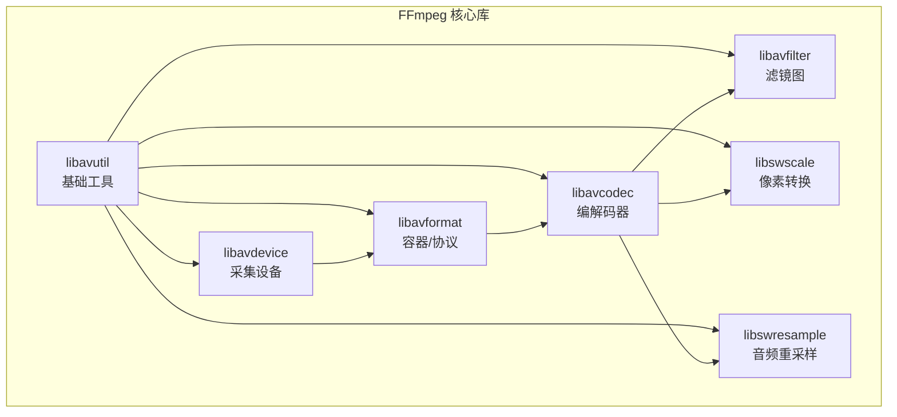

写了这么多代码之后，工具链的体验会直接影响开发效率。这篇文章梳理音视频开发中真正高频使用的工具——从构建系统到依赖管理，从核心库到调试利器。

<!-- more -->

# 构建工具：CMake + vcpkg/conan

音视频项目的依赖树极其复杂：FFmpeg 动辄 20+ 个子库，SDL2 和 Qt 各有自己的查找规则，WebRTC 的编译更是出了名的费劲。手动管理头文件路径和链接库 = 噩梦。CMake 是现代 C/C++ 项目的标配，搭配 vcpkg 或 conan 做包管理，能把依赖问题解决 90%。

## CMake 项目骨架

一个典型的音视频项目 `CMakeLists.txt`：

```cmake
cmake_minimum_required(VERSION 3.20)
project(av_player LANGUAGES C CXX)

set(CMAKE_C_STANDARD 11)
set(CMAKE_CXX_STANDARD 17)

# ──── FFmpeg ────
find_package(FFmpeg REQUIRED COMPONENTS
    avformat avcodec avutil swscale swresample avfilter avdevice)

# ──── SDL2 ────
find_package(SDL2 REQUIRED)

# ──── Qt6（渲染 + UI）────
find_package(Qt6 REQUIRED COMPONENTS Widgets OpenGLWidgets)

# ──── 可执行文件 ────
add_executable(av_player
    src/main.cpp
    src/demuxer.cpp
    src/decoder.cpp
    src/renderer.cpp
    src/audio_player.cpp
    src/sync_controller.cpp
)

target_include_directories(av_player PRIVATE
    ${FFmpeg_INCLUDE_DIRS}
    ${SDL2_INCLUDE_DIRS}
)

target_link_libraries(av_player PRIVATE
    FFmpeg::avformat FFmpeg::avcodec FFmpeg::avutil
    FFmpeg::swscale FFmpeg::swresample FFmpeg::avfilter
    SDL2::SDL2
    Qt6::Widgets Qt6::OpenGLWidgets
)
```

## vcpkg：微软的 C++ 包管理器

vcpkg 对 Windows 开发者最友好，和 Visual Studio / CMake 集成丝滑。FFmpeg、SDL2、Qt 全都有预编译包：

```bash
# 安装 vcpkg
git clone https://github.com/Microsoft/vcpkg.git
cd vcpkg && .\bootstrap-vcpkg.bat

# 安装核心依赖
vcpkg install ffmpeg[core,avcodec,avformat,swscale,swresample,avdevice,avfilter]:x64-windows
vcpkg install sdl2:x64-windows
vcpkg install qt6[widgets,openglwidgets]:x64-windows

# 以上全在 triplet x64-windows（VS 编译）

# CMake 配置时指定 vcpkg toolchain
cmake -B build -S . \
  -DCMAKE_TOOLCHAIN_FILE=D:/vcpkg/scripts/buildsystems/vcpkg.cmake
```

vcpkg 的 `ffmpeg` 包默认**不开启** `avdevice` 和 `avfilter`，需要显式指定 features。踩过坑的人都知道。

**vcpkg 的本质**：它把你的依赖库的源码下载下来，用你本地的编译器编译一遍，然后 CMake 像正常 `find_package` 一样找到它们。好处是编译选项和你项目的 ABI 完全一致，坏处是首次编译耗时（Qt6 在低配机器上可能要编译一小时）。好在有 binary caching，二次安装就快了。

## conan：更灵活的跨平台方案

conan 比 vcpkg 更灵活，支持自定义构建选项、交叉编译、远程私有仓库：

```python
# conanfile.py
from conan import ConanFile
from conan.tools.cmake import CMake, cmake_layout

class AVPlayer(ConanFile):
    settings = "os", "compiler", "build_type", "arch"
    generators = "CMakeDeps", "CMakeToolchain"
    
    def requirements(self):
        self.requires("ffmpeg/6.1")
        self.requires("sdl/2.30.0")
        self.requires("qt/6.6.0")
    
    def build(self):
        cmake = CMake(self)
        cmake.configure()
        cmake.build()
```

```bash
# 安装依赖并构建
conan install . --build=missing
conan build .
```

conan 的 `--build=missing` 会自动编译你的配置下不存在的预编译包。这对 FFmpeg 这种"每个人的需求不同"的库特别重要——你需要 `--enable-libx264` 而我需要 `--enable-libvpx`，conan 能分别编译出正确的包。

## 选型建议

| 场景 | 推荐 |
|------|------|
| Windows 为主 + VS 开发 | vcpkg |
| 跨平台（Win/Mac/Linux） | conan |
| CI/CD 流水线 | vcpkg（binary cache）或 conan（可复现） |
| 快速原型，不想管构建 | 直接用 MSYS2 的 pacman 装 FFmpeg/SDL2 |

# 核心库

## FFmpeg：音视频领域的瑞士军刀

FFmpeg 是一个包含 8 个核心库的集合，不是一个"库"：



每个库的定位和使用频率：

| 库 | 定位 | 你写的每一行代码都会用到它吗？ |
|----|------|-------------------------------|
| `libavformat` | 容器读写 + 网络协议 | 必用——读写文件、RTSP/RTMP 连接 |
| `libavcodec` | 编解码器 | 必用——所有编解码都在这里 |
| `libavutil` | 基础数据结构 | 隐式必用——AVFrame/AVPacket/时间基等 |
| `libswscale` | 像素格式转换 | 视频必用——YUV↔RGB |
| `libswresample` | 音频重采样 | 音频必用——planar↔packed、采样率转换 |
| `libavfilter` | 滤镜图 | 按需——加水印、多路拼接 |
| `libavdevice` | 采集设备 | 按需——摄像头、麦克风、桌面采集 |

FFmpeg 的版本兼容性是个大坑。API 在每个大版本（4.x→5.x→6.x→7.x）之间都可能有不兼容变更。参考官方 Migration Guide：

```
https://github.com/FFmpeg/FFmpeg/blob/master/doc/APIchanges
```

写代码时用 `#if LIBAVCODEC_VERSION_INT >= AV_VERSION_INT(60, 31, 102)` 这样的预处理宏做版本兼容，而不是直接绑定死一个版本。

## SDL2：音视频渲染的底座

SDL2 在音视频开发中主要承担两个角色：

**音频**：用回调模式驱动声卡。SDL 在后台起一个高优先级线程，每隔 N 个采样点回调一次要数据。你在回调里从环形缓冲取 PCM 填进去就行。

```c
// SDL2 音频的标准范式
void audio_callback(void *userdata, Uint8 *stream, int len) {
    // len: 声卡要的字节数
    // 从你的环形缓冲里取 len 字节，填到 stream
    ring_buffer_read(&audio_buf, stream, len);
}
```

**窗口+事件**：如果你不用 Qt，SDL2 自带窗口管理和事件循环，做简单的播放器完全够用。SDL2 的 `SDL_CreateWindow` + `SDL_CreateRenderer` 能直接在窗口上渲染纹理（SDL_Texture），省掉 OpenGL 样板代码。

```c
SDL_Texture *tex = SDL_CreateTexture(renderer,
    SDL_PIXELFORMAT_RGB24, SDL_TEXTUREACCESS_STREAMING,
    width, height);
SDL_UpdateTexture(tex, NULL, rgb_data, width * 3);
SDL_RenderCopy(renderer, tex, NULL, NULL);
SDL_RenderPresent(renderer);
```

但 SDL2 的渲染管线没有图层、没有布局、没有控件——只是个画布。如果做带 UI 的播放器/推流工具，选 Qt。

## Qt 6：工业级 UI 框架

Qt 在音视频项目里的角色不只是"画界面"：

| 模块 | 用途 |
|------|------|
| `Qt Widgets` | 按钮、滑动条、布局——标准桌面 UI |
| `QOpenGLWidget` | GPU 渲染——视频画面直接走 OpenGL 纹理 |
| `Qt Multimedia` | 摄像头/麦克风采集的跨平台封装（但灵活度不如 FFmpeg） |
| `Qt Network` | WebSocket 信令、HTTP API 控制 |
| `QThread` + `QMutex` | 解码线程、渲染线程管理 |
| `QSlider` + `QLabel` | 进度条、时间显示——播放器标配 |

做推流工具时，Qt 的 `QStackedWidget` 天然适配场景切换，`QSlider` 做音量推子，`QComboBox` 选输入源——不用从零造轮子。

Qt 6 的 CMake 集成比 Qt 5 好得多。不再需要 MOC 预处理步骤手动配置，`cmake` 的 `AUTOMOC` 自动处理一切：

```cmake
set(CMAKE_AUTOMOC ON)
set(CMAKE_AUTORCC ON)
set(CMAKE_AUTOUIC ON)

find_package(Qt6 REQUIRED COMPONENTS Widgets OpenGLWidgets Network)
```

# 调试工具

## Wireshark：网络层的显微镜

音视频开发一涉及网络（RTSP、RTP、RTMP、WebRTC），Wireshark 就是不可或缺的工具。它能解析这些协议的每一个字节：

**常用过滤表达式**：

```
rtsp          — 只看 RTSP 信令
rtp           — 只看 RTP 媒体包
rtcp          — 只看 RTCP 统计报告
rtmpt         — 只看 RTMP
stun          — 只看 STUN 包（ICE 穿透）
udp.port==5004 — 特定端口的 RTP 流
ip.addr==192.168.1.100 — 只看某个设备
```

**实战场景**：RTSP 摄像头不出画面，用 Wireshark 抓包。看 RTSP 信令（SETUP 有没有返回 200？Transport 里给的端口对不对？），再看 RTP 流的数据有没有到（序列号连续吗？有没有大量丢包？）。十分钟定位问题，比盯着代码瞎猜高效得多。

Wireshark 内置的解码支持：

- 右键 RTP 包 → "Decode As" → 选择 RTP → 自动解析 payload type 和序列号
- "Telephony" → "RTP" → "RTP Streams" → 查看丢包率、抖动、带宽
- "Statistics" → "IO Graph" → 带宽趋势图

## MediaInfo：媒体文件的"身份证"

拿到一个视频文件，第一步不是丢进播放器，而是用 MediaInfo 看它的"身份证"：

```bash
# 命令行
mediainfo sample.mp4

# 输出示例
General
Format: MPEG-4
Duration: 2 min 30 s
Overall bit rate: 5 123 kb/s

Video
Format: AVC (H.264)
Bit rate: 5 000 kb/s
Width: 1 920 pixels
Height: 1 080 pixels
Frame rate: 29.970 (30000/1001) FPS
Chroma subsampling: 4:2:0
Bit depth: 8 bits

Audio
Format: AAC LC
Bit rate: 192 kb/s
Channel(s): 2 channels
Sampling rate: 48.0 kHz
```

MediaInfo 能告诉你很多代码里难排查的信息：

- **为什么这个文件我的播放器播不了？** → MediaInfo 看编码格式是不是你的解码器支持的类型
- **为什么音视频不同步？** → 看帧率是不是 29.97（NTSC），而你的 time_base 按 30fps 算的
- **为什么码率异常？** → 看是不是 VBR（可变码率），而你的程序按固定码率处理的
- **为什么文件体积这么大？** → 看看是不是无意中选了 lossless 编码

MediaInfo 还提供 C++ 库（`libmediainfo`），可以直接在代码里调用：

```cpp
#include <MediaInfo/MediaInfo.h>

MediaInfoLib::MediaInfo mi;
mi.Open("sample.mp4");
std::string codec = mi.Get(MediaInfoLib::Stream_Video, 0, "Format");
std::string bitrate = mi.Get(MediaInfoLib::Stream_Video, 0, "BitRate");
mi.Close();
```

在批量处理视频的场景（比如上传服务要验证文件格式合规性），用库调用比正则解析命令行输出稳定得多。

## 其他顺手工具

| 工具 | 干什么用 | 一句话 |
|------|----------|--------|
| **ffprobe** | 命令行版 MediaInfo | `ffprobe -v quiet -print_format json -show_streams file.mp4` 输出 JSON，方便脚本解析 |
| **Audacity** | 音频波形查看 | 把 PCM 数据导出为 WAV 丢进去，看波形、频谱、回声残留 |
| **YUV Player** | 裸 YUV 数据查看 | 解码出 YUV 直接看，排除渲染层问题 |
| **Intel Video Pro Analyzer** | 编码流分析 | 逐帧分析 H.264/H.265 码流结构 |
| **Graphviz** | 滤镜图可视化 | `avfilter_graph_dump` 输出的 DOT 文件转图片 |
| **cloc** | 代码量统计 | 项目复盘时用，`cloc src/` 看自己写了多少行 |

# 开发环境建议

**Windows 开发者**：MSYS2（MinGW-w64）+ vcpkg + VS Code 或 CLion。

```bash
# MSYS2 装 FFmpeg 开发包（最快上手）
pacman -S mingw-w64-x86_64-ffmpeg
pacman -S mingw-w64-x86_64-SDL2

# 配合 vcpkg 的 CMake toolchain
# MSYS2 提供 GNU 工具链，vcpkg 提供 MSVC 或 MinGW 包
```

**macOS 开发者**：Homebrew + CLion。

```bash
brew install ffmpeg sdl2 qt@6
```

**Linux 开发者**：apt/dnf 系统包 + CMake。

```bash
sudo apt install libavcodec-dev libavformat-dev libavutil-dev \
  libswscale-dev libswresample-dev libavdevice-dev libavfilter-dev \
  libsdl2-dev qt6-base-dev
```

# 小结

| 类别 | 工具 | 选型理由 |
|------|------|----------|
| 构建 | CMake | 事实标准，所有 C/C++ 库都支持 |
| 包管理 | vcpkg（Win）/ conan（跨平台） | 自动处理依赖树、版本锁定 |
| 编解码 | FFmpeg | 唯一全能的音视频库 |
| 渲染+UI | Qt 6 + SDL2 | Qt 做 UI，SDL2 做音频/简单渲染 |
| 网络分析 | Wireshark | RTSP/RTP/RTCP/STUN 一键解析 |
| 媒体信息 | MediaInfo / ffprobe | 文件参数查看、格式合规验证 |

工具选对了，开发效率翻倍。这些工具各司其职，配合好了就是一条完整的开发流水线——从编译到运行、从开发到调试、从查 bug 到性能分析。
